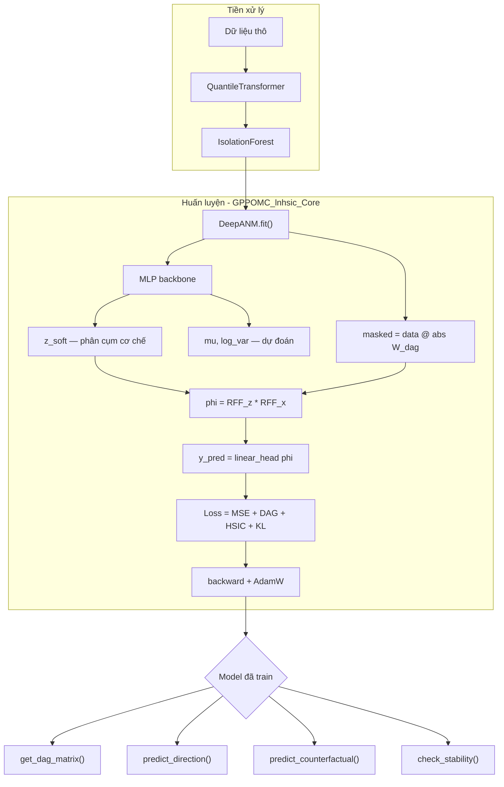
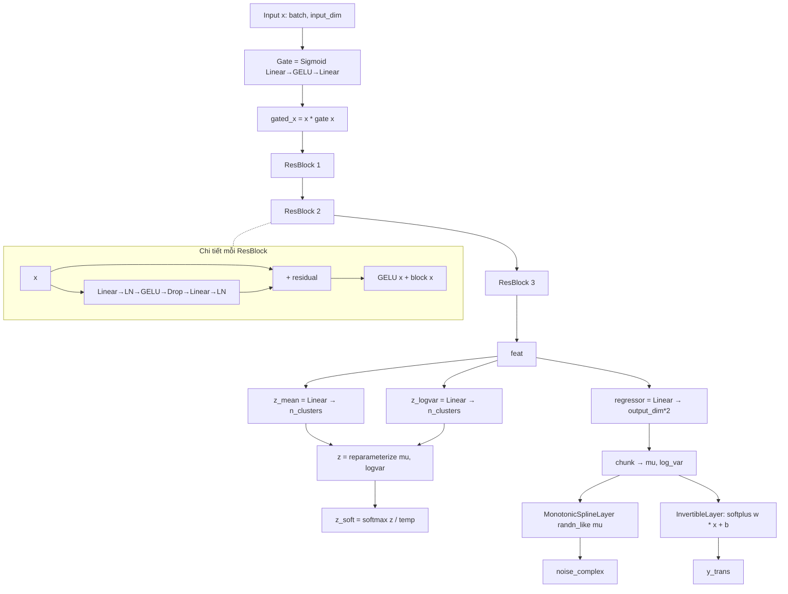
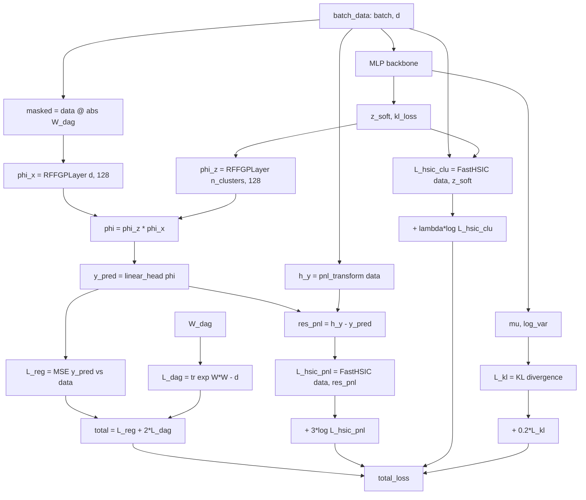
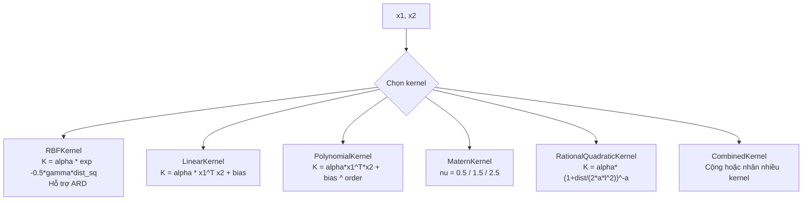
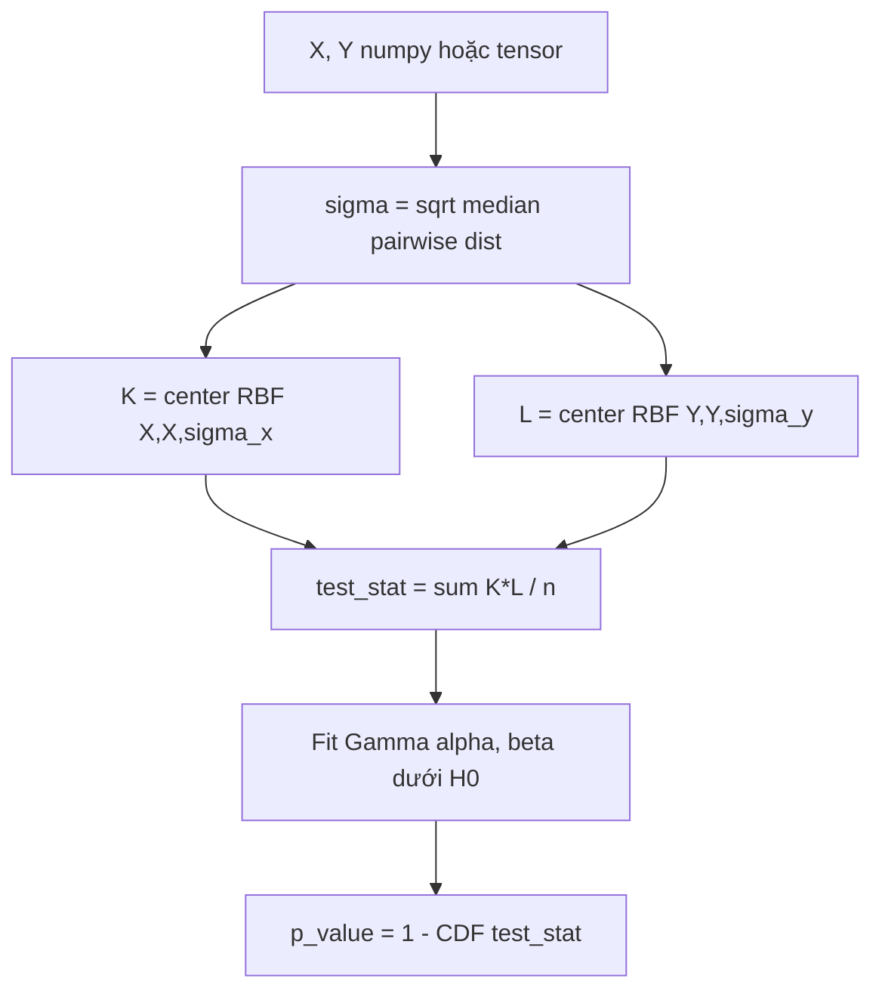
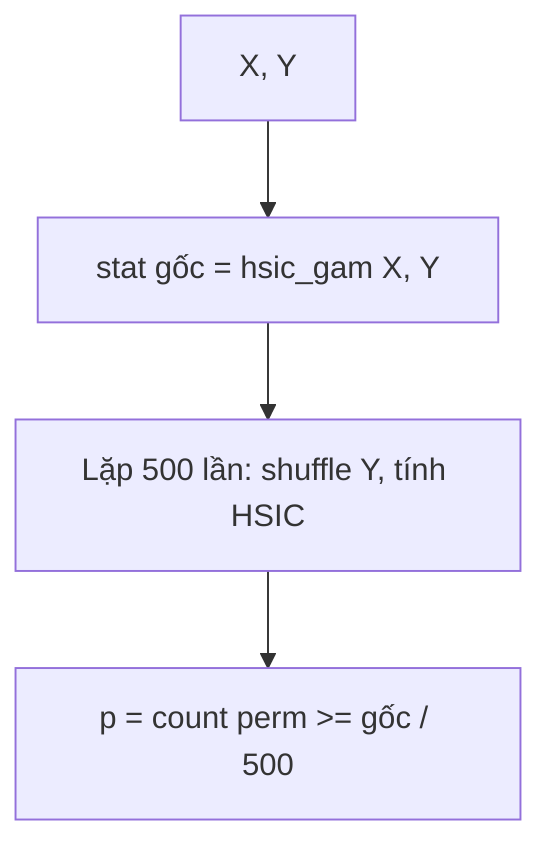
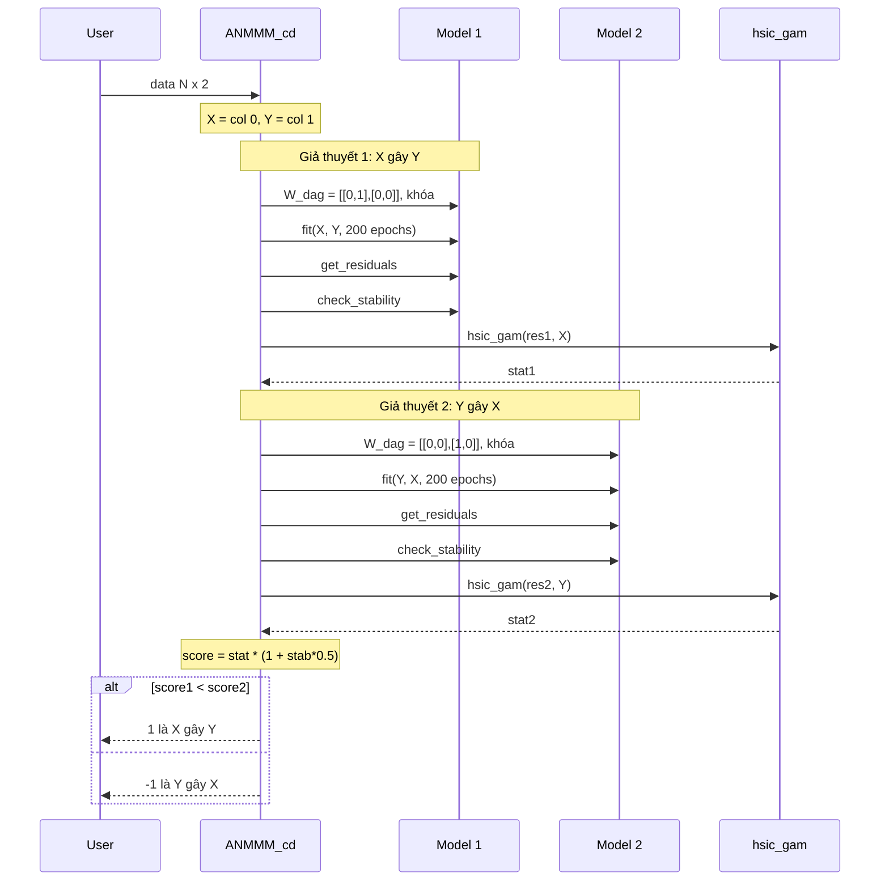
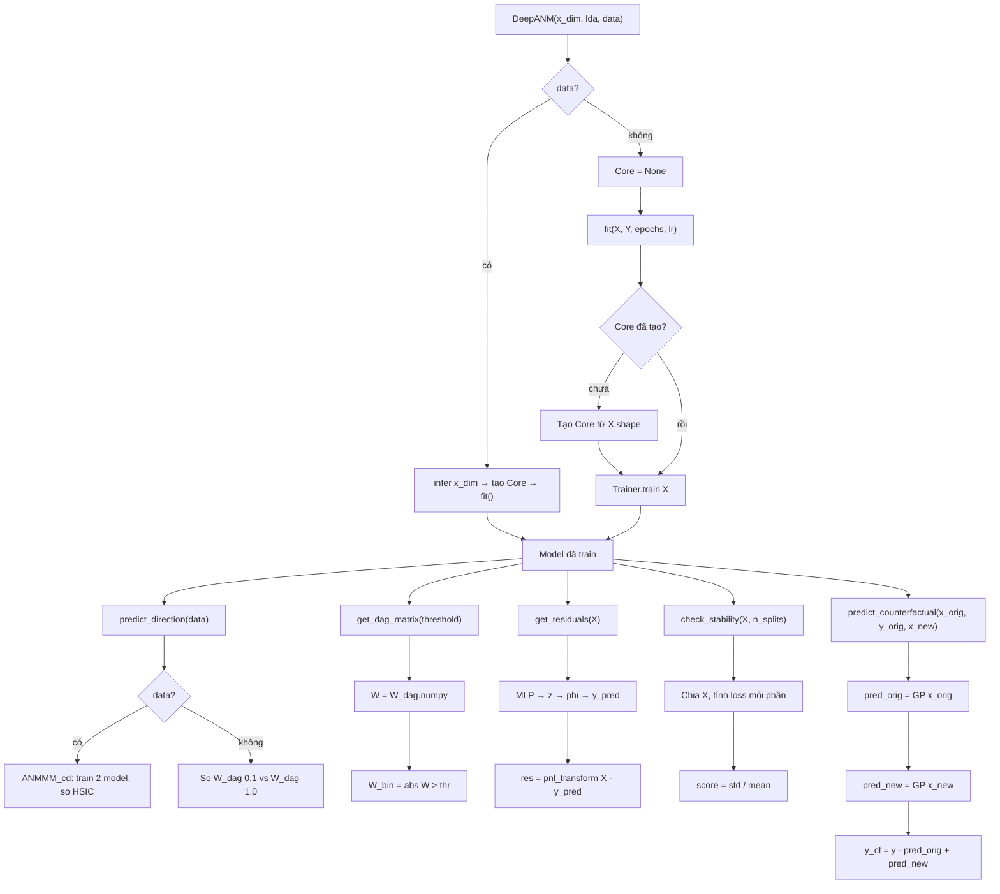

# DeepANM: Chi tiết Kiến trúc

Tài liệu mô tả luồng hoạt động bên trong của từng file và sơ đồ tổng thể của hệ thống.

---

## 1. Sơ đồ tổng thể hệ thống

---

## 2. `mlp.py` — Backbone mạng nơ-ron

---

## 3. `gppom_hsic.py` — Module tối ưu hóa DAG

---

## 4. `kernels.py` — Thư viện kernel khả vi

Tất cả kernel đều là `nn.Module` với `log_alpha`, `log_gamma` học được qua backprop.

---

## 5. `hsic.py` — Kiểm tra tính độc lập

### hsic_gam — Gamma Approximation

### hsic_perm — Permutation Test

---

## 6. `analysis.py` — Quy trình suy diễn hướng nhân quả

Hàm `ANMMM_cd` thực hiện Fixed-Structure Hypothesis Testing.

---

## 7. `trainer.py` — Vòng lặp huấn luyện

---

## 8. `DeepANM.py` — DeepANM class API

