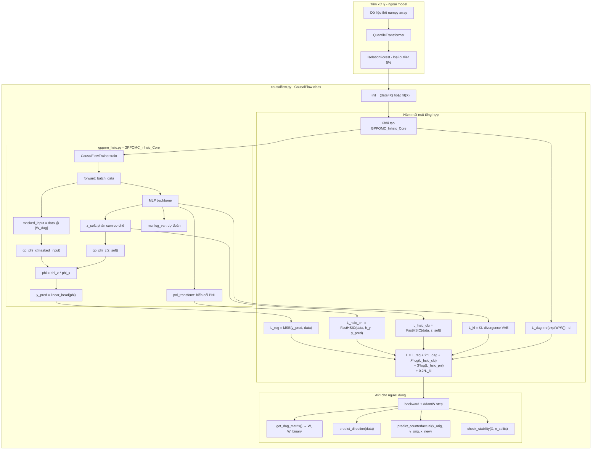
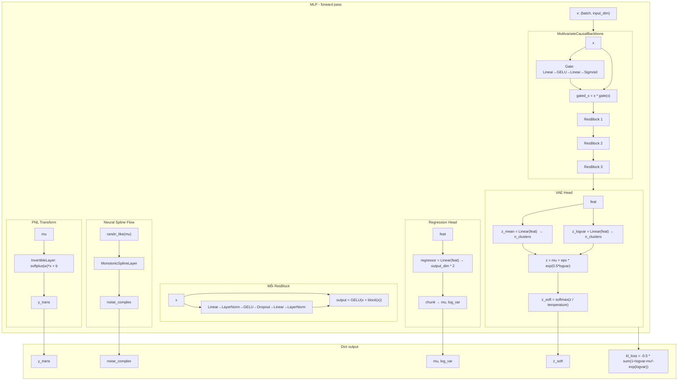
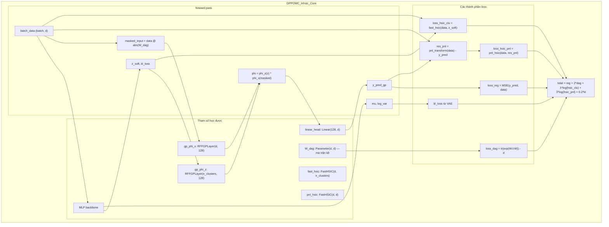
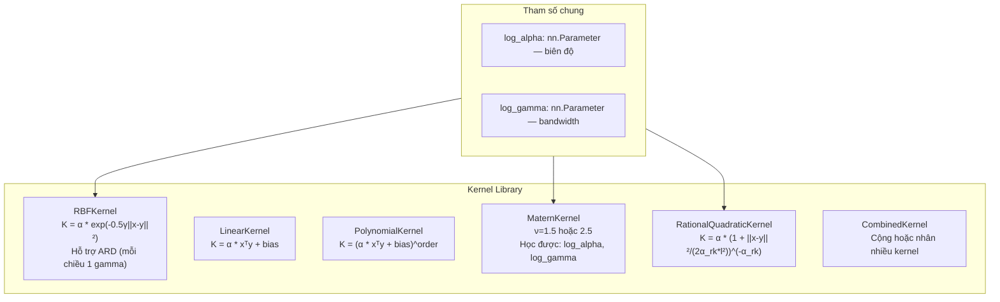
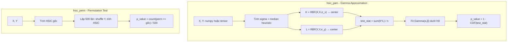
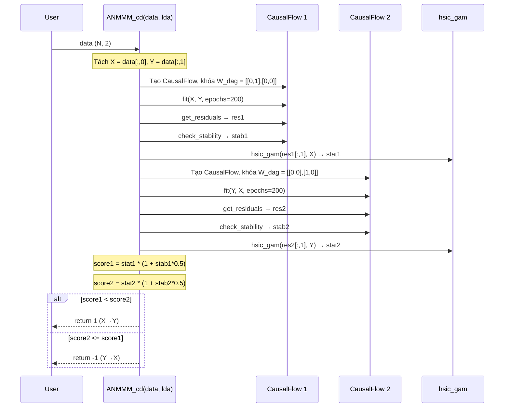
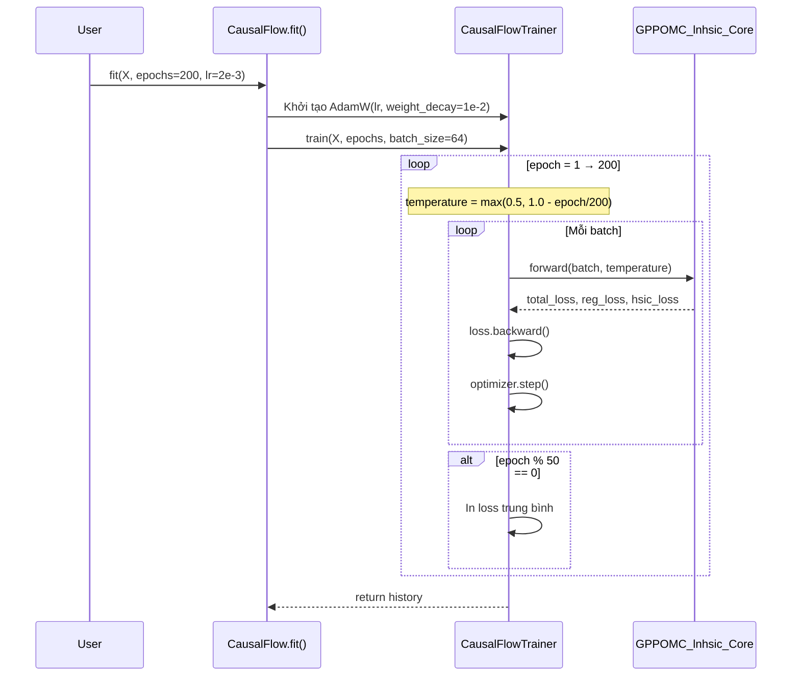
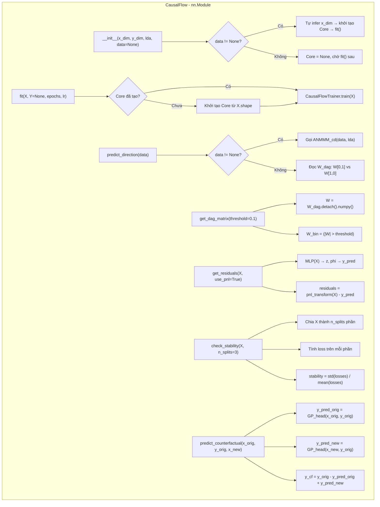

# CausalFlow: Chi tiết Kiến trúc

Tài liệu mô tả luồng hoạt động bên trong của từng file và sơ đồ tổng thể của hệ thống.

---

## 1. Sơ đồ tổng thể hệ thống

---

## 2. `mlp.py` — Backbone mạng nơ-ron

File này chứa toàn bộ kiến trúc trích xuất đặc trưng.

---

## 3. `gppom_hsic.py` — Module tối ưu hóa DAG

File này kết nối backbone MLP với các ràng buộc nhân quả.

---

## 4. `kernels.py` — Thư viện kernel khả vi

Các kernel dùng cho Gaussian Process, tất cả đều là `nn.Module` với tham số học được.

---

## 5. `hsic.py` — Kiểm tra tính độc lập

Dùng trong bước cuối của `ANMMM_cd` để so sánh HSIC giữa hai giả thuyết.

---

## 6. `analysis.py` — Quy trình suy diễn hướng nhân quả

Hàm `ANMMM_cd` thực hiện Fixed-Structure Hypothesis Testing.

---

## 7. `trainer.py` — Vòng lặp huấn luyện

---

## 8. `causalflow.py` — Giao diện CausalFlow class

