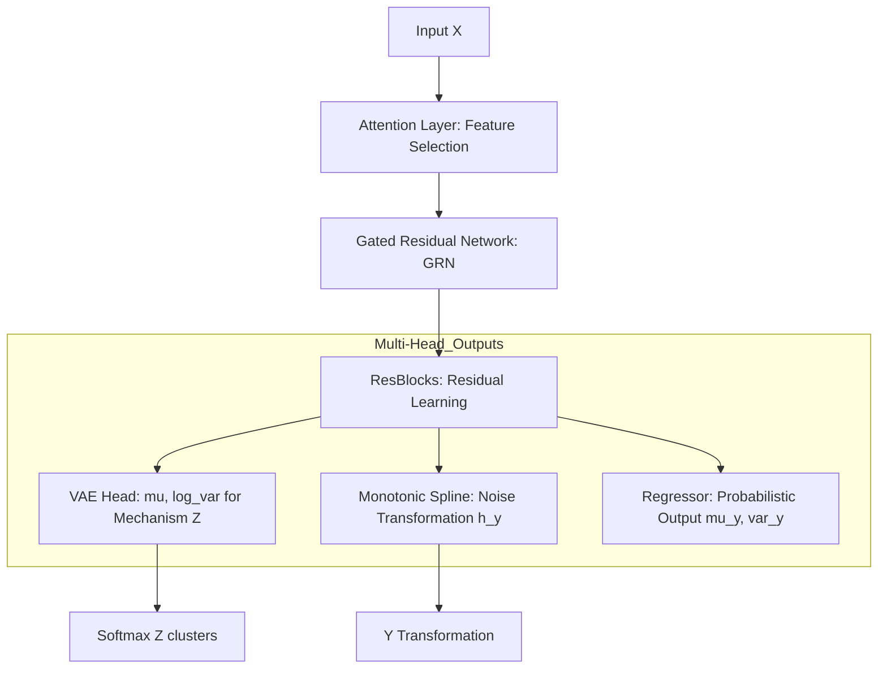
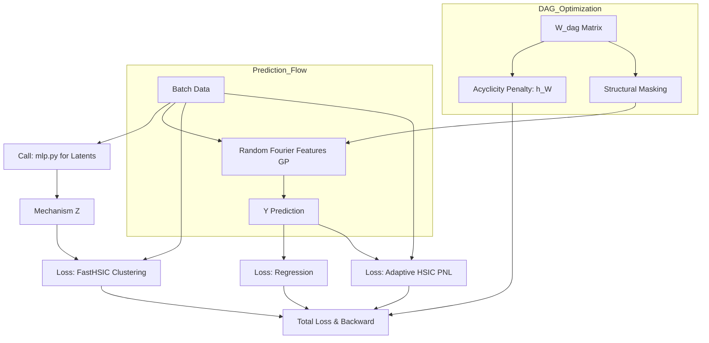
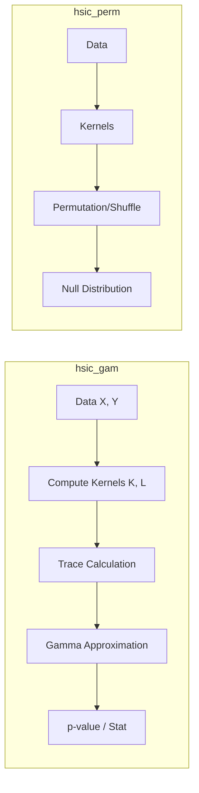
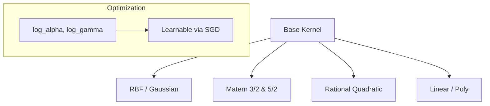
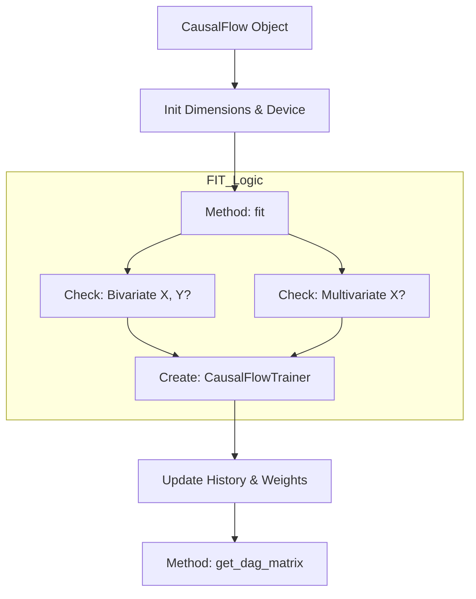
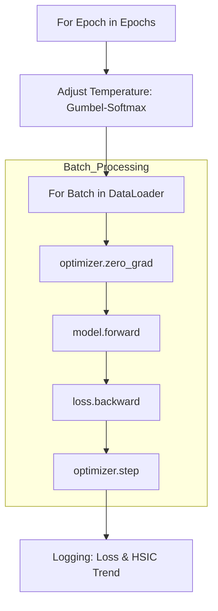

# CausalFlow Architecture

Tài liệu này cung cấp sơ đồ hoạt động chi tiết cho từng thành phần trong mã nguồn của framework CausalFlow.

---

## 📂 Thư mục `causalflow/core/` (Nền tảng thuật toán)

### 1. `mlp.py` - Ultimate Deep Learning Backbone
Đây là tệp phức tạp nhất, chịu trách nhiệm trích xuất thực thể và mô hình hóa nhiễu.



### 2. `gppom_hsic.py` - Core Engine & DAG Learning
Điều phối việc học đồ thị nhân quả và kết hợp các hàm mất mát.



### 3. `hsic.py` - Statistical Independence Testing
Triển khai các phép thử thống kê để xác nhận quan hệ nhân quả.



### 4. `kernels.py` - Differentiable Kernel Library
Sơ đồ phân cấp các hàm nhân có thể đạo hàm.



---

## 📂 Thư mục `causalflow/models/` (Giao diện & Ứng dụng)

### 5. `causalflow.py` - Sklearn-style Wrapper
Giao diện chính cho người dùng cuối.



### 6. `trainer.py` - Training Orchestrator
Quản lý vòng lặp huấn luyện và lịch trình (scheduling).



### 7. `analysis.py` - Causal Direction Discovery
Lô-gic phân tích nhân quả nâng cao (SOTA 70.6%).

```mermaid
graph TD
    DATA[Raw Data Pair] --> PRE[Standardize / Quantile Transform]
    PRE --> CLEAN[Isolation Forest: Remove Outliers]
    
    subgraph Hypothesis_Testing
        CLEAN --> H1[Test Hypothesis: X -> Y]
        H1 --> LOCK1[Lock W_dag: Force Direction]
        LOCK1 --> SCORE1[Compute HSIC Stability Score 1]
        
        CLEAN --> H2[Test Hypothesis: Y -> X]
        H2 --> LOCK2[Lock W_dag: Force Direction]
        LOCK2 --> SCORE2[Compute HSIC Stability Score 2]
    end
    
    SCORE1 & SCORE2 --> COMP[Compare Scores]
    COMP --> DECIDE[Final Decision: Min Score Wins]

---

## 8. Luồng hoạt động tổng thể (Overall System Workflow)

Sơ đồ dưới đây mô tả hành trình của dữ liệu từ khi bắt đầu cho đến khi trích xuất được tri thức nhân quả:

```mermaid
graph TD
    %% Input Stage
    DATA[Dữ liệu quan sát] --> PRE[Tiền xử lý: Quantile + Isolation Forest]
    
    %% Model Initialization
    PRE --> INIT[Khởi tạo mô hình CausalFlow]
    
    %% Training Loop
    subgraph Training_Phase [Giai đoạn Huấn luyện]
        INIT --> FORWARD[Forward Pass: MLP Backbone]
        FORWARD --> LATENT[VAE: Latent Mechanism Discovery]
        LATENT --> GP[Gaussian Process Prediction]
        GP --> REG[Tính MSE Loss]
        
        subgraph Constraints [Ràng buộc Nhân quả]
            W[W_dag Matrix] --> NT[NOTEARS Acyclicity Penalty]
            GP --> RES[Trích xuất Residuals]
            RES --> HSIC[HSIC Independence Penalty]
        end
        
        REG & NT & HSIC --> OPT[AdamW Optimizer Update]
        OPT -->|Lặp lại| FORWARD
    end
    
    %% Inference Phase
    Training_Phase --> INF[Giai đoạn Suy diễn / Trích xuất]
    
    subgraph Analysis_Phase [Phân tích & Kết luận]
        INF --> DAG_MAT[Lấy ma trận DAG từ W_dag]
        INF --> BIV_TEST[Kiểm tra hướng song biến Fixed-Structure]
    end
    
    DAG_MAT & BIV_TEST --> OUTPUT[Cấu trúc Nhân quả cuối cùng]
```
```
