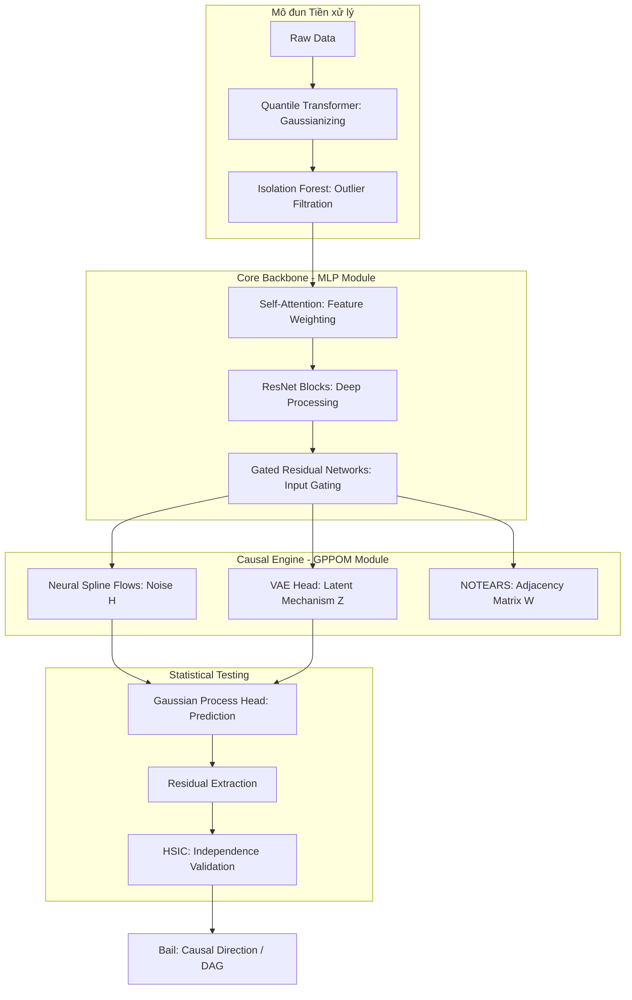
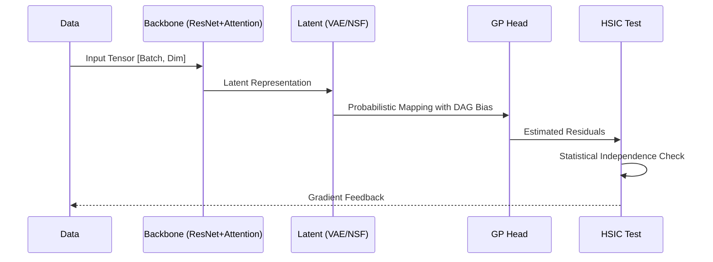

# CausalFlow Technical Specification & Architecture

Tài liệu này cung cấp cái nhìn chuyên sâu về kiến trúc nội bộ, các thành phần toán học và quy trình xử lý của framework **CausalFlow**.

---

## 1. Cấu trúc Mô hình Phân lớp (Layered Architecture)

CausalFlow được thiết kế theo cấu trục phân lớp để tách biệt giữa việc trích xuất đặc trưng, mô hình hóa nhiễu và tối ưu hóa cấu trúc đồ thị.

---

## 2. Chi tiết các thành phần SOTA (State-of-the-Art Components)

### 2.1. Neural Spline Flows (Mô hình hóa Nhiễu)
Thay vì giả định nhiễu là dạng Gaussian đơn giản, dự án sử dụng **Monotonic Spline Layers**.
*   **Cơ chế:** Sử dụng các hàm Spline đơn điệu bậc ba để thực hiện phép biến đổi $h(Y)$.
*   **Ưu điểm:** Cho phép mô hình hóa các phân phối nhiễu cực kỳ phức tạp (Multi-modal, Heavy-tailed) mà vẫn đảm bảo tính khả nghịch (invertibility) để trích xuất sạch nhiễu.

### 2.2. Differentiable DAG Learning (NOTEARS)
Sử dụng phương pháp tối ưu hóa liên tục trên ma trận trọng số $W$.
*   **Hàm ràng buộc:** $h(W) = Tr(e^{W \circ W}) - d = 0$.
*   **Mục tiêu:** Ép ma trận kề phải là đồ thị không vòng (Directed Acyclic Graph) thông qua Gradient Descent, giúp tránh việc phải tìm kiếm tổ hợp (combinatorial search) tốn kém.

### 2.3. Fast HSIC via Random Fourier Features (RFF)
Để tăng tốc phép thử độc lập thống kê từ $O(N^2)$ xuống $O(N)$:
*   **Cơ chế:** Ánh xạ dữ liệu vào không gian đặc trưng RKHS sử dụng các hàm Sine/Cosine ngẫu nhiên.
*   **Ứng dụng:** Tính toán sự độc lập giữa phần dư và nguyên nhân trong thời gian thực ngay khi huấn luyện.

---

## 3. Quy trình thực thi các Module (File-level Flow)

### 📂 `causalflow/core/`
*   **`mlp.py`**: Chứa lớp `MLP` đa đầu ra. Nó không chỉ dự báo giá trị mà còn trích xuất tham số của phân phối tiềm ẩn và thực hiện phép biến đổi PNL (Post-Nonlinear).
*   **`gppom_hsic.py`**: Quản lý `GPPOMC_lnhsic_Core`. Đây là nơi "hợp nhất" kết quả từ MLP với ràng buộc DAG NOTEARS. Nó tính toán mất mát tổng hợp để điều phối toàn bộ các thành phần khác.
*   **`kernels.py`**: Định nghĩa các Kernel đạo hàm. Khả năng tự học (Adaptive) của mô hình nằm ở việc tối ưu hóa `log_gamma` (băng thông) và `log_alpha` (biên độ) của các nhân này.

### 📂 `causalflow/models/`
*   **`analysis.py`**: Triển khai `ANMMM_cd_advanced`.
    1.  Khởi tạo 2 thực thể `CausalFlow`.
    2.  Khóa cứng cấu trúc: `W_dag[i,j]=1` cho hướng thuận và `W_dag[j,i]=1` cho hướng nghịch.
    3.  Đo đạc độ độc lập của phần dư để đưa ra kết luận cuối cùng.
*   **`trainer.py`**: Sử dụng bộ tối ưu **AdamW** với Weight Decay để tránh Overfitting, quản lý việc giảm nhiệt độ (temperature) cho lớp Gumbel-Softmax.

---

## 4. Đặc tả luồng dữ liệu (Data Flow Analysis)

---

## 5. Hàm mục tiêu tối ưu hóa (Comprehensive Objective)

Mô hình tối ưu hóa hàm toán học cực kỳ chặt chẽ:

$${\cal L}_{total} = {\cal L}_{MSE} + \lambda_{dag} h(W) + \lambda_{hsic} \log(HSIC(X, \hat{\epsilon})) + \lambda_{kl} D_{KL}(q(z)||p(z))$$

*   **MSE:** Đảm bảo khả năng giải thích dữ liệu.
*   **h(W):** Đảm bảo tính hợp lệ của đồ thị nhân quả.
*   **log(HSIC):** Đảm bảo tính đúng đắn của giả thuyết "Nguyên nhân độc lập với Nhiễu".
*   **KL:** Đảm bảo cấu trúc tiềm ẩn của cơ chế nhân quả không bị sụp đổ.
