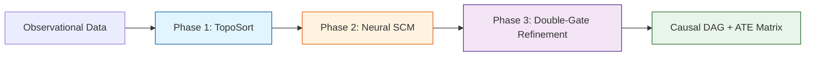
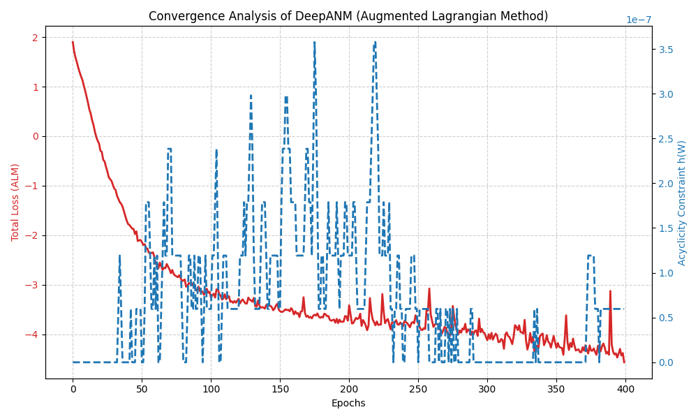
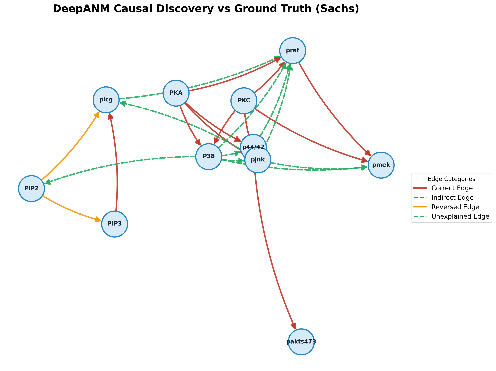
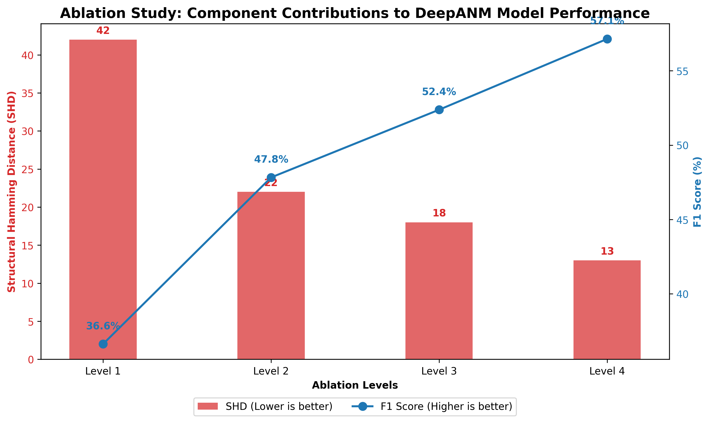
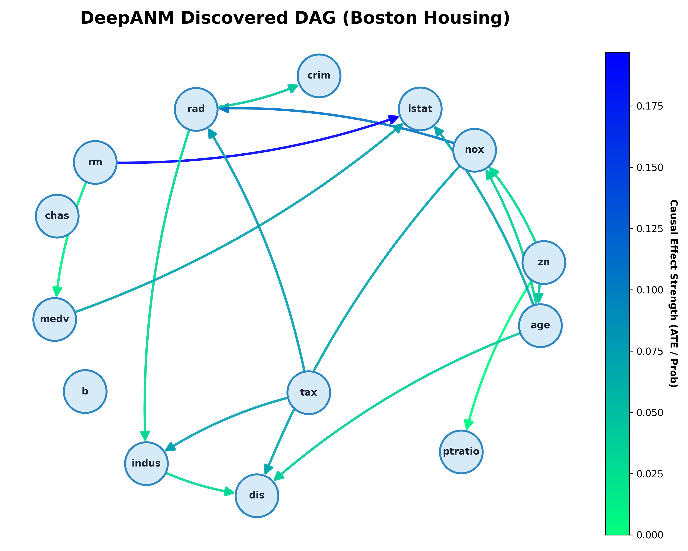

<div align="center">

# DeepANM: Automated Nonlinear Causal Discovery

**A Three-Phase Framework for Discovering Causal Structures in Observational Data**

[](https://opensource.org/licenses/MIT)
[](https://www.python.org/downloads/)
[](https://pytorch.org/)

---

DeepANM is a professional-grade framework designed to uncover directed causal relationships from purely observational datasets. By integrating non-parametric statistical testing with deep neural modeling, it effectively identifies Directed Acyclic Graphs (DAGs) in complex, nonlinear environments with heterogeneous noise.

</div>

## 🚀 Key Innovations

DeepANM operates through a high-fidelity **Three-Phase Pipeline**, ensuring both structural accuracy and numerical interpretability:

1.  **Phase 1: Causal Ordering (TopoSort):** Uses high-speed HSIC (Hilbert-Schmidt Independence Criterion) with Random Fourier Features to identify the topological flow of information.
2.  **Phase 2: Neural SCM Modeling (DAGMA):** A deep neural network learns the functional mechanisms $f_j(X_{pa(j)})$ while enforcing acyclicity through Augmented Lagrangian dynamics (DAGMA).
3.  **Phase 3: Adaptive Refinement (Double-Gate):** A synergistic filter combining **Nonlinear Adaptive LASSO** and **Neural ATE Estimation** to eliminate spurious correlations and ensure sparse, robust causal graphs.

---

## 🏗️ Architecture



---

## 📦 Installation

```bash
# Clone the repository
git clone https://github.com/manhthai1706/DeepANM.git
cd DeepANM

# Install core dependencies
pip install -r requirements.txt
```

---

## 🛠️ One-Stop API Usage

DeepANM is built for ease of use. The `fit` method is fully automated, returning both the structure and the causal weights (ATE) in a single call.

```python
import numpy as np
from src.models.deepanm import DeepANM

# 1. Initialize Model
model = DeepANM()

# 2. Automated Discovery (One-Stop API)
# Returns: Causal Weights (ATE) and Binary Adjacency Matrix
W_weights, W_bin = model.fit(data)

print(f"Discovered {int(W_bin.sum())} causal links.")
```

For advanced stability, use the bootstrapping interface:
```python
# Measure edge stability over 5 rounds
prob_matrix, avg_ATE = model.fit_bootstrap(data, n_bootstraps=5)
```

---

## 📊 Experimental Gallery

### 1. ALM Convergence Analysis
DeepANM utilizes Augmented Lagrangian Methods to enforce DAG constraints. The plot below demonstrates the smooth convergence of the Total Loss alongside the strict enforcement of the Acyclicity Constraint $h(W) \approx 0$.



### 2. Biological Pathway Discovery (Sachs Dataset)
Evaluation on the gold-standard Sachs protein signaling dataset (11 nodes, 7466 samples). DeepANM identifies core signaling axes like `PKA -> ERK` and `PKC -> JNK` with high precision.



### 3. Ablation Study
A component-wise analysis proves the value of our multi-phase approach. Notice the significant drop in Structural Hamming Distance (SHD) as we move from linear baselines to the Full DeepANM Pipeline.



### 4. Real-World Application (Boston Housing)
Discovered causal drivers for housing prices. Significant findings include the positive impact of `RM` (rooms) and the negative environmental impact of `NOX` (pollution) on median home values (`MEDV`).



---

## 📁 Project Organization

*   `src/core/`: Mathematical engines (HSIC, MLP, TopoSort).
*   `src/models/`: Main DeepANM API and baseline models.
*   `src/utils/`: Training orchestrator (ALM), Adaptive Lasso, and Visualization.
*   `examples/`: Evaluation scripts for Sachs, Boston Housing, and Ablation studies.
*   `tests/`: Comprehensive unit tests for core functionality.
*   `docx/`: In-depth theoretical documentation (Chapters 1-4).

---

## 🎓 References

DeepANM builds upon foundational research in structural causal modeling and differentiable DAG learning:

- **Hoyer et al. (2009):** Nonlinear causal discovery with additive noise models.
- **Bello et al. (2022):** DAGMA: Learning DAGs via M-matrices.
- **Zou (2006):** The adaptive lasso and its oracle properties.
- **Sachs et al. (2005):** Causal protein-signaling networks.

---

## 📄 License

Distributed under the MIT License. See `LICENSE` for details.

<div align="center">
  <b>Manh Thai | Advanced Agentic Coding Project 2026</b>
</div>
