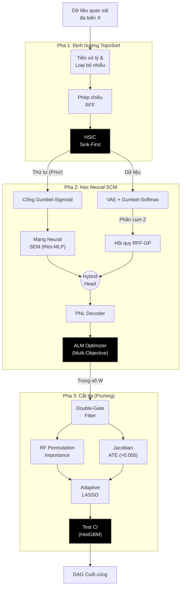

# CHƯƠNG 2: KIẾN TRÚC VÀ CƠ CHẾ VẬN HÀNH CỦA MÔ HÌNH DEEPANM

Chương này trình bày một cách hệ thống và chi tiết về cấu trúc kỹ thuật, nền tảng toán học và quy trình thực thi của mô hình **DeepANM (Deep Additive Noise Model)**. Đây là một hệ thống khám phá nhân quả (Causal Discovery) mạnh mẽ, được thiết kế để khắc phục những hạn chế của các phương pháp truyền thống trong việc xử lý dữ liệu phi tuyến, nhiễu không đồng nhất (Heterogeneous noise) và sự phức tạp của không gian trạng thái DAG.

## 2.1 Cấu trúc tổng thể của hệ thống đề xuất

Trong lý thuyết nhân quả, bài toán tìm kiếm đồ thị có hướng không chu trình (DAG) từ dữ liệu quan sát là một bài khó khăn đặc thù do tính chất **NP-Hard** của không gian tìm kiếm. Khi số lượng biến $d$ tăng lên, số lượng đồ thị khả thi tăng trưởng theo hàm siêu mũ. Để giải quyết vấn đề này, DeepANM triển khai một lộ trình **3 Pha Tương hỗ (3-Phase Synergetic Pipeline)** thay vì chỉ dựa vào các phương pháp heuristic thông thường.

### 2.1.1 Tiếp cận đa giai đoạn trong khám phá nhân quả

Cách tiếp cận chính của DeepANM là sự phân rã trách nhiệm giữa các tầng xử lý:
1.  **Hạn chế không gian (Pha 1):** Sử dụng các kiểm định thống kê phi tham số để xác định trật tự dòng chảy thông tin (Causal Ordering), giúp thu hẹp không gian tìm kiếm từ $2^{O(d^2)}$ xuống một tập hợp các đồ thị tuân thủ thứ tự topo.
2.  **Mô hình hóa sâu (Pha 2):** Sử dụng mạng neural sâu và các quy trình tối ưu liên tục (Continuous Optimization) để học đồng thời trọng số cạnh và các hàm chuyển đổi phi tuyến, tận dụng khả năng biểu diễn của các phân phối tiềm ẩn và Gaussian Processes.
3.  **Tinh chắt nhân quả (Pha 3):** Sử dụng các kỹ thuật học máy ensemble và lý thuyết can thiệp để triệt tiêu các cạnh giả định (Pseudo-edges) phát sinh do nhiễu hoặc tương quan gián tiếp.

<b>Hình 2.1: Kiến trúc luồng hệ thống 3 pha tương hỗ của DeepANM</b>

## 2.2 Pha 1: Định hướng Topological và Tiền xử lý Dữ liệu

Pha 1 đóng vai trò là bộ lọc sơ cấp, định hình không gian ưu tiên để đảm bảo các bước tối ưu hóa sau này không bị lạc hướng vào các bẫy chu trình (Cycles) – một lỗi cực kỳ phổ biến của cấu trúc đồ thị dựa trên Gradient.

### 2.2.1 Chuẩn hóa Đa tầng và Khử Outliers

Dữ liệu thực tế thường chịu ảnh hưởng nặng nề bởi sự khác biệt về thang đo (Scale variance). DeepANM triển khai hai kỹ thuật quan trọng kết hợp:
- **Isolation Forest:** Sử dụng cấu trúc cây ngẫu nhiên để xác định và kìm hãm tác động của các điểm dữ liệu dị biệt (Outliers), vốn gây sai lệch lớn cho các kiểm định phân phối.
- **Quantile Transformer:** Thực hiện biến đổi phi tuyến ánh xạ phân phối biên của từng biến về dạng Gaussian chuẩn. Điều này giúp các phép đo phụ thuộc thống kê sau đó (như HSIC) đạt trần hiệu suất.

### 2.2.2 Kiểm định HSIC dựa trên Random Fourier Features (RFF)

Cơ chế cốt lõi của Pha 1 là khả năng đo lường độ độc lập phi tuyến dựa trên định lý Hilbert-Schmidt Independence Criterion (HSIC). Tuy nhiên, tính toán HSIC theo phương pháp ma trận Gram truyền thống yêu cầu độ phức tạp $O(N^2)$. DeepANM vượt qua rào cản tính toán này bằng **Định lý Bochner** thông qua cấu trúc đặc trưng ngẫu nhiên (RFF).

Công thức không gian đệm xấp xỉ Kernel Gaussian bằng RFF:

$$
\phi(x) = \sqrt{\frac{2}{D}} \cos(W_{RFF}x + b)
$$

Trong đó $W_{RFF}$ và $b$ được tinh chỉnh ngẫu nhiên. Kỹ thuật này chuyển đổi bài toán kernel vô biên thành phép chiếu vector tuyến tính nhiều chiều, giúp tốc độ thực thi HSIC tăng gấp hàng nghìn lần nhưng vẫn duy trì năng lực phát hiện hàm ẩn.

### 2.2.3 Thuật toán Sắp xếp Chìm (Greedy Sink-First)

DeepANM áp dụng chiến lược phá hủy mạng nhân quả dần dần. Một biến $X_k$ được coi là "nút thoát" (Sink node) nếu nó không phải là nguyên nhân của bất kỳ biến nào khác. Trong không gian hồi quy, sự độc lập của sai số sinh ra từ hồi quy $X_k$ đối với toàn bộ tập biến còn lại chính là dấu hiệu của Sink node. Sự độc lập này được đo đạc chính xác bằng chỉ số RFF-HSIC, lặp lại liên tục để xây dựng thứ tự TopoSort cho toàn đồ thị.

## 2.3 Pha 2: Mô hình hóa lõi Deep Neural SCM (GPPOM-HSIC)

Đây là "nền tảng trí tuệ" của mô hình, nơi thực hiện việc "học" các phương trình cấu trúc (SCM) bằng mạng neural nhiều lớp kết hợp với tối ưu hóa Lagrangian. Điểm nổi bật là toàn bộ phép thử đồ thị rời rạc được vi phân hóa thành biến liên tục.

### 2.3.1 Lấy mẫu cạnh liên tục bằng Gumbel-Sigmoid (Straight-Through Estimator)

Để tìm kiếm mạng nhân quả bằng gradient-descent, một rào cản về mặt giải tích học là "sự tồn tại của cạnh" chỉ mang giá trị nhị phân $\{0, 1\}$, tức là không thể đạo hàm. Mô hình áp dụng kỹ thuật **Cổng Gumbel-Sigmoid** với kỹ xảo **Straight-Through Estimator (ST)**:
*   Trong quá trình "truyền tiến" (forward pass), mạng lưới sẽ bốc mẫu xác suất một đồ thị nhị phân rạch ròi bằng hàm bước Heavyside (cắt tại 0.5) kết hợp với phân phối Gumbel mô phỏng độ nhiễu.
*   Tuy nhiên, trong quá trình "truyền ngược" (backward pass) để cập nhật tham số, gradient vẫn được dẫn qua bề mặt trơn nhẵn của hàm liên tục Sigmoid. Công nghệ này cho phép mạng neural tự cắt đứt hoặc nối thêm cạnh ngay trong lúc đang huấn luyện các trọng số hồi quy.

### 2.3.2 Kiến trúc Mạng MLP Thặng dư và Phân cụm Cơ chế

Không giống các phương pháp cơ bản, DeepANM giả định một biến mục tiêu có thể bị điều phối bởi các hàm số nhân quả khác nhau tùy từng điều kiện (Mechanism Switching):

1.  **Encoder VAE:** Một mạng MLP với hàm kích hoạt GELU dự báo xác suất (z_logits) của một biến thuộc cơ chế nào trong một không gian mờ.
2.  **Gumbel-Softmax:** Gán nhãn phân cụm để đào cấu trúc liên kết nội tại của dữ liệu.
3.  **ANM_SEM Residual Blocks:** Sử dụng kiến trúc MLP Thặng dư (Res-MLP) với các *Skip Connections* để học hàm số truyền nhân quả $f(X)$. Các khối này ngăn cản hiện tượng triệt tiêu Gradient đối với các hàm số đặc thù.
4.  **Heterogeneous Noise Model:** Quên đi giả định nhiễu phân phối Gaussian đồng nhất phi thực tế, đầu ra nhiễu của mô hình là một mô hình trộn (Gaussian Mixture Model - GMM), cho phép mô tả chính xác những loại nhiễu bất định cao (đuôi dài, lệch, đa đỉnh).

### 2.3.3 Đầu dự báo lai (Hybrid GP-MLP Head)

Để cực đại hóa độ nhạy diễn đạt, giá trị dự báo kết quả $\hat{Y}$ không chỉ phụ thuộc vào nhánh hồi quy sâu SEM, mà còn được "trợ lực" bởi một mô hình không tham số Gaussian Process (GP):

$$
\hat{Y}_{pred} = \text{MLP}_{SEM}(X_{masked}) + \text{LinearHead}(\phi_{RFF}(X_{masked}) \odot \phi_{RFF}(Z_{soft}))
$$

Sự kết hợp này đem lại lợi ích kép: MLP phụ trách xu hướng mượt mà, định lượng tác động ở cự ly xa, trong khi GP-RFF chịu trách nhiệm phân tích chi tiết dữ liệu cục bộ bám theo cụm cơ chế $Z$.

### 2.3.4 Tối ưu hóa Đa mục tiêu và Ràng buộc ALM

Quy trình mất mát của mạng GPPOM-HSIC không chỉ dừng lại ở sai số bậc hai, mà là sự thỏa hiệp tổng hòa của **7 mục tiêu tối ưu (Multi-Objective Optimization Function)**:
1.  **Reconstruction MSE:** Thu hẹp khoảng cách giữa dự báo và thực tế.
2.  **NLL (Negative Log-Likelihood):** Tối ưu hóa xác suất xảy ra của phân phối nhiễu GMM.
3.  **HSIC_CLU:** Ép cụm cơ chế bí mật (Z) độc lập cực đại với nguyên nhân (X), đảm bảo tính đại diện khách quan.
4.  **HSIC_PNL:** Ràng buộc cốt lõi của lý thuyết ANM – Ép phần dư phân tách phải hoàn toàn độc lập với nguyên nhân đầu vào.
5.  **KL Divergence:** Tối ưu hóa không gian mạng Encoder.
6.  **L1 / L2 Penalty:** Khuyến khích tính thưa thớt (Sparsity) của ma trận cạnh.
7.  **DAGMA Penalty $h(W)$:** Phân cực giá trị các cạnh để biến đồ thị không bao giờ sinh ra chu trình.

Hình thức tối ưu của hàm phạt đồ thị cực kỳ nhạy bén thông qua định thức **Log-Determinant**:
$$
h(W) = -\text{slogdet}(I - W \circ W)
$$

Để duy trì kỷ luật cấu trúc này trên hệ thống Neural khổng lồ, **Thuật toán Augmented Lagrangian Method (ALM)** được triển khai bao bọc tối ưu hóa ngoài. Nếu mạng neural ngoan cố bám trụ chu trình, ALM sẽ tăng gấp đôi hình phạt theo từng vòng 10 epochs (nhân $\rho \to 2\rho$), kết hợp với Gradient Clipping (chặn gradient $\le 5.0$) đảm bảo mô hình sẽ vỡ đồ thị chu trình mà không bị sụp đổ số học.

## 2.4 Pha 3: Cắt tỉa và Chọn cạnh bằng Thích nghi Phi tuyến (Adaptive Pruning)

Pha 3 giải quyết vấn đề "cạnh giả" cực nhỏ nhưng dai dẳng do hệ quả của tối ưu hóa liên tục. DeepANM loại bỏ cách tinh lọc cắt ngưỡng tĩnh, thay vào đó là hệ thống thẩm định ba vòng màng lọc thích nghi.

### 2.4.1 Chọn cạnh qua Nonlinear Adaptive LASSO

Bước 1 sử dụng **Random Forest Permutation Importance** để đo thực tế lực cản:
- Mô hình Rừng ngẫu nhiên đo lường bằng cách xáo trộn (Permute) các cột biến nguyên nhân và quan sát sự sụp đổ của biến kết quả. 
- Ngưỡng lọc yêu cầu R-squared sụt giảm $> 3\%$ VÀ cường độ suy giảm đặc trưng vượt quá $2$ lần độ lệch chuẩn nhiễu. Bất kỳ giá trị hàm phi tuyến nào không vượt qua bài kiểm tra sức chịu đựng này đều bị coi là ngẫu nhiên và loại bỏ.

### 2.4.2 Màng lọc Giao thoa Causal Jacobian (ATE Gate)

Cạnh nhân quả phải gây tác động vật lý. DeepANM vi phân hóa thẳng qua đầu ra mô hình Neural (Causal Jacobian) để thu được đạo hàm trung bình ATE:

$$
\text{ATE}_{ij} = \mathbb{E} \left[ \left| \frac{\partial \hat{Y}_j}{\partial X_i} \right| \right]
$$

Hệ thống đặt ra **"Cửa từ trường"** tối giản với ngưỡng lọc `|ATE| > 0.005`. Thiết kế này vừa loại bỏ "rác cạnh" có trọng lượng không đủ ý nghĩa, vừa đủ nhạy để giữ lại các tương quan vi mô trong các dữ liệu tế bào biểu hiện rụt rè như bộ Gene/Protein. Cạnh cuối cùng là giao tiếp giữa Cổng 1 (Ý nghĩa thống kê) và Cổng 2 (Lực can thiệp).

### 2.4.3 Hậu kiểm Độc lập Điều kiện (Conditional Independence - CI)

Tương quan nhưng không phải là nguyên nhân trực tiếp là vấn đề cuối cùng (cạnh bắt cầu: $A \to B \to C$ thường sinh ra ảo giác cạnh $A \to C$). 
DeepANM vượt qua trở ngại phân loại này bằng thuật toán rừng tăng cường **Histogram-based Gradient Boosting (HistGBM)**. Nó huấn luyện mô hình dự báo $A$ và $C$ dựa trên $B$, sau đó trích xuất phần dư (Residuals). Sử dụng kiểm định độc lập giữa các phần dư, nếu không còn mối tương quan (p-value $> 0.01$ và $|corr| < 0.1$), cạnh ảo $A \to C$ sẽ bị vô hiệu hóa dứt điểm.

## 2.5 Đặc tính Kỹ thuật và Tính Diễn dịch

Mô hình thiết kế bằng sự pha trộn giữa học máy nguyên lý và không tham số để củng cố 3 đặc tính then chốt:
- **Scale Invariance:** Tính độc lập không chia tỷ lệ, giúp chống chịu với thông số nhiễu đo đạc.
- **Robustness:** Ổn định nhờ tối ưu hóa song song, chặn gradient ALM kết hợp Res-MLP.
- **Identifiability:** Chứng minh triệt để sự phân tách khả nghịch của nhiễu.

## 2.6 Tiểu kết chương

Chương này đã làm rõ kiến trúc tinh vi dưới nắp capo của hệ thống DeepANM. 3 pha xử lý không tồn tại độc lập mà bổ trợ hoàn hảo cho nhau: Pha 1 cho lộ trình an toàn, Pha 2 đào bới quan hệ phi tuyến tiềm ẩn qua hệ thống Multi-Objective loss mạnh mẽ, và Pha 3 đảm bảo cạnh thu được là chân lý. DeepANM thể hiện mình là một công cụ phân tích nhân quả thế hệ mới không khoan nhượng với nhiễu loạn nhưng vẫn duy trì tính diễn đồ hoàn thiện.
