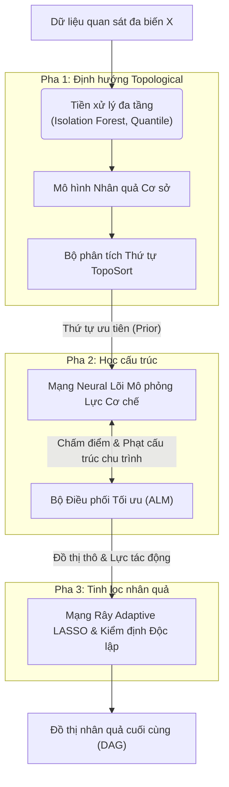
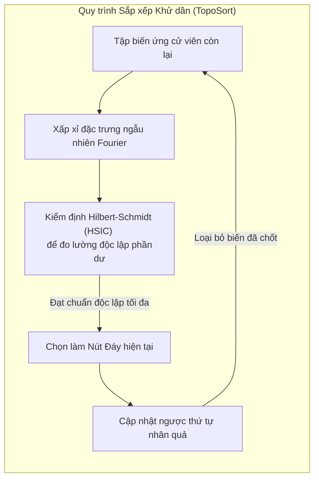
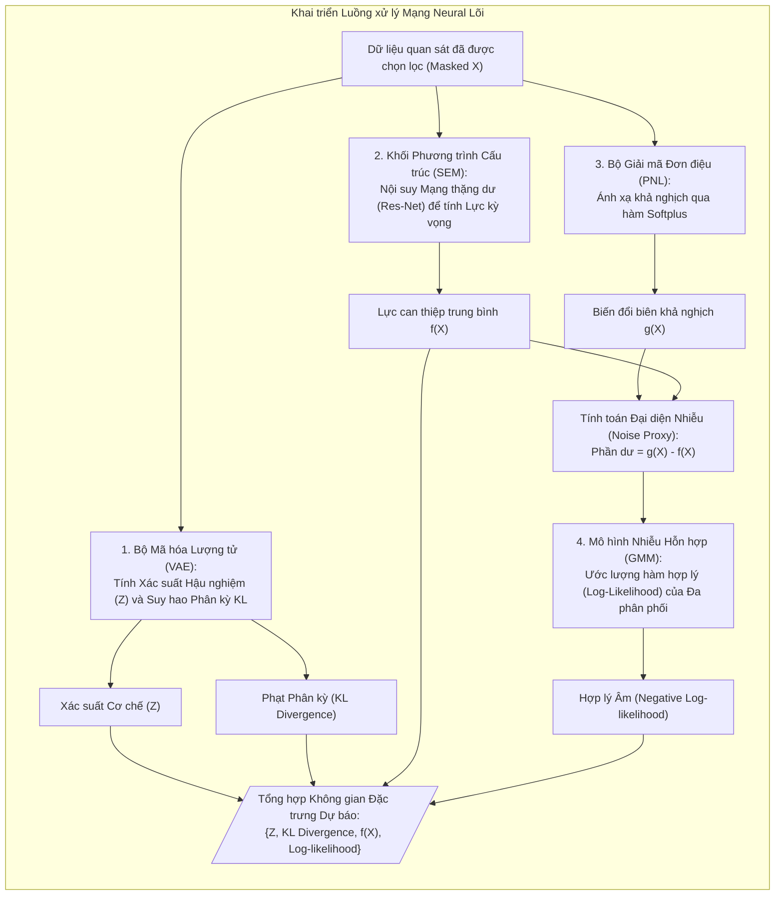
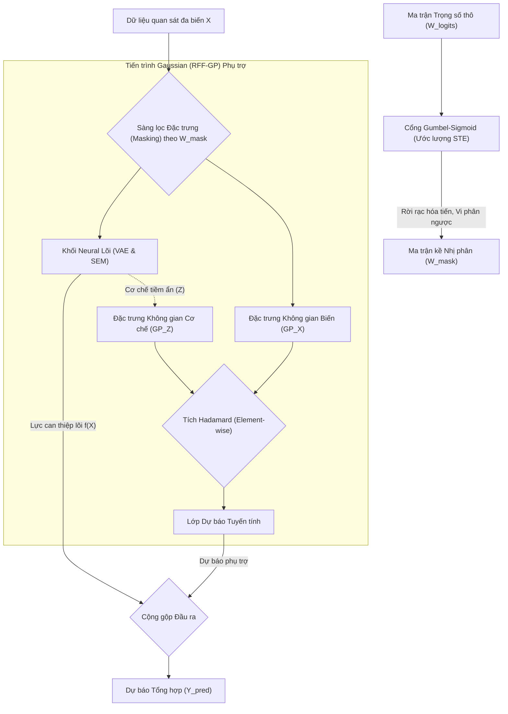
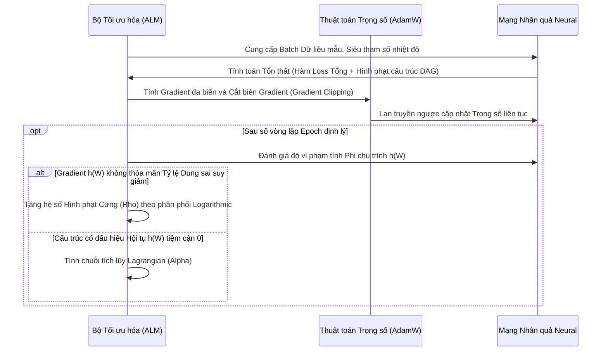
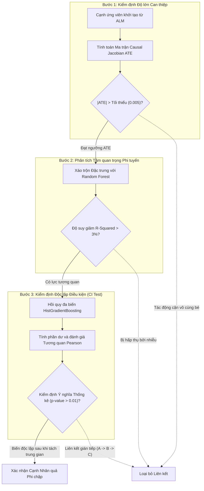

# CHƯƠNG 2: KIẾN TRÚC VÀ CƠ CHẾ VẬN HÀNH CỦA MÔ HÌNH DEEPANM

Chương này trình bày một cách hệ thống và chi tiết về cấu trúc kỹ thuật, nền tảng toán học và quy trình thực thi của mô hình **DeepANM (Deep Additive Noise Model)**. Đây là một hệ thống khám phá nhân quả (Causal Discovery) mạnh mẽ, được thiết kế để khắc phục những hạn chế của các phương pháp truyền thống trong việc xử lý dữ liệu phi tuyến, nhiễu không đồng nhất (Heterogeneous noise) và sự phức tạp của không gian trạng thái đồ thị có hướng không chu trình (DAG).

## 2.1 Cấu trúc tổng thể của hệ thống đề xuất

Trong lý thuyết nhân quả, bài toán tìm kiếm đồ thị từ dữ liệu quan sát là một bài khó khăn đặc thù do tính chất **NP-Hard** của không gian tìm kiếm. Khi số lượng biến tăng lên, số lượng đồ thị khả thi tăng trưởng theo hàm siêu mũ. Để giải quyết triệt để sự bùng nổ không gian này, mô hình DeepANM triển khai một lộ trình **3 Pha Tương hỗ (3-Phase Synergetic Pipeline)** tích hợp sâu nhiều thuật toán phân tích thống kê phi tham số, mạng học sâu và tối ưu hóa liên tục.

<b>Hình 2.1: Lộ trình 3 pha tổng thể xây dựng đồ thị nhân quả trong hệ thống DeepANM</b>

1.  **Hạn chế không gian (Pha 1):** Sử dụng các mô hình cơ sở tốc độ cao và thuật toán sắp xếp cấu trúc lưới để xác định dòng chảy ưu tiên qua các phép kiểm định thống kê.
2.  **Mô hình hóa sâu (Pha 2):** Sử dụng mạng neural đa tầng kết hợp với bộ tối ưu hóa liên tục để rèn dũa trọng số nhân quả mà không vướng điểm mù tính toán rời rạc.
3.  **Tinh chắt nhân quả (Pha 3):** Xây dựng rào chắn tinh lọc đa cấp độ để vô hiệu hóa những liên kết nhiễu mượn danh quan hệ trực tiếp.

---

## 2.2 Pha 1: Định hướng Cơ sở và Tiền xử lý Dữ liệu

Bước đầu tiên là thanh lọc dữ liệu và phác thảo hướng đi an toàn của luồng thông tin, đảm bảo mạng neural phía sau không lãng phí tài nguyên vào các quỹ đạo mâu thuẫn hay vòng lặp vô tận.

### 2.2.1 Chuẩn hóa Đa tầng và Khử điểm dị biệt

Mô hình sử dụng thuật toán cô lập **Isolation Forest** để loại bỏ các điểm dị biệt (outliers) nghiêm trọng sinh ra bởi sai số thiết bị đo đạc vật lý hoặc lỗi nhập liệu. Tiếp theo đó, kỹ thuật **Quantile Transformer** được áp dụng để chủ động biến đổi phân phối biên của từng biến độc lập về dạng Gaussian chuẩn. Sự nắn chỉnh này hỗ trợ tối đa cho các kiểm định độ nhạy dựa trên Kernel, giúp triệt tiêu hoàn toàn sự sai lệch do đơn vị đo đạc khác nhau.

### 2.2.2 Khởi tạo Cấu trúc Nhanh nguyên sinh

Thay vì bắt mạng neural phải bắt đầu quá trình đào tạo hoàn toàn mơ hồ, hệ thống thực hiện khởi chạy một mô hình rừng ngẫu nhiên (Random Forest) rút gọn để lập tức phác thảo khung đồ thị mồi. Hệ thống này sử dụng phép kiểm định tương quan khoảng cách (Distance Correlation) đánh giá trên phần dư để đề xuất một ma trận trọng số thô khởi đầu, làm tiền đề tăng tốc cho bộ sắp xếp. 

### 2.2.3 Định hướng Cấu trúc (Topological Sort)

DeepANM áp dụng chiến lược sắp xếp chìm (Greedy Sink-First). Nút "Sink" (Nút đáy) được định nghĩa là biến nằm ở tận cùng của nhân quả, không gây ra sự thay đổi cho bất kỳ biến nào khác trong quần thể.

<b>Hình 2.2: Sơ đồ thuật toán Sắp xếp Topological bằng Đặc trưng Ngẫu nhiên</b>

Để phát hiện sự độc lập phi tuyến, hạt nhân Hilbert-Schmidt (HSIC) được sử dụng. Tuy nhiên, tính toán HSIC nguyên thủy làm hao phí thời gian với độ phức tạp song phương $O(N^2)$. Bằng định lý Bochner, bài toán được hệ thống hóa thành xấp xỉ đặc trưng Fourier ngẫu nhiên (RFF) đưa độ cực hạn học máy về thời gian tuyến tính $O(N)$, cho phép đồ thị phản hồi ngay lập tức dẫu lượng mẫu tiến vào hàng nghìn.

---

## 2.3 Pha 2: Mô hình hóa Mô đun Sâu (Deep Neural SCM)

Trong pha này, một tổ hợp mạng neural phức hợp được cấu hình để vi phân hóa một bài toán đồ thị rời rạc về vùng không gian tối ưu toán học trơn tru.

### 2.3.1 Kiến trúc Mạng Neural Nhân quả Lõi (Core Neural SCM)

Phân hệ mạng lõi của mô hình không thiết kế để dự báo một điểm đơn nhất. Nó là một cỗ máy gồm 4 luồng xử lý thực hiện riêng biệt các tác vụ sinh học, cơ chế quy luật, tính toán lượng tử và quản lý bất định: 

1.  **Bộ mã hóa cơ chế (Encoder VAE):** Dùng mạng truyền thẳng kết nối với độ chuẩn hóa lớp dữ liệu nhằm dự đoán xác suất tiềm ẩn. Nó đi qua một hệ thống lấy mẫu hàm nhạt dần năng lượng (Gumbel-Softmax Annealing) nhằm xác định điểm dữ liệu thực sự đang chịu tác động từ luồng quy luật ẩn nào.
2.  **Khối Phương trình Cấu trúc:** Sử dụng các mạng nơ-ron có liên kết thặng dư tắt (Skip Connection) để học hàm sinh nhân quả biểu diễn nội hàm $f(X)$. Hệ thống liên kết thặng dư tránh được sự phai nhạt Gradient của mạng truyền dẫn sâu.
3.  **Bộ Giải mã Hậu Phi tuyến (Post-Nonlinear Decoder):** Biến đổi đầu ra khối hàm bằng hàm kích hoạt đơn điệu Softplus, đảm bảo tính khả nghịch ngặt nghèo. Dãy kiến trúc này cho phép chiết xuất dòng nhiễu nguyên thủy thuần túy theo chuẩn đo lường: `Đại diện nhiễu = Hàm hậu phi tuyến - Hàm sinh nhân quả`.
4.  **Hệ Nhiễu Hỗn hợp Đa phân phối:** Thống kê lượng phần dư chưa lý giải được thông qua một phân phối Gaussian đa đỉnh. Mô hình này giúp DeepANM dễ dàng thích ứng với dữ liệu chứa độ bất định cao, loại hình nhiễu méo lệch hoặc nhiễu có tính chất phân cực (heavy-tailed) của kinh tế, lâm sàng.

Nhờ vào kiến trúc hướng đối tượng bóc tách nghiêm ngặt, dòng chảy truyền tiến không bao giờ chồng chéo nhiệm vụ lặp lại nào:

<b>Hình 2.3: Mô phỏng logic dòng truyền tiến và sự phân giải toán học hàm nhân quả f(X) và hệ nhiễu.</b>

### 2.3.2 Kiến trúc Điều phối Song song Tổng quát

Mục đích thiết kế trên cùng là nhằm thiết lập song song đầu dự báo để cực đại hóa năng lực chống nhiễu loạn của Gradient.

<b>Hình 2.4: Kiến trúc bộ dự báo song song kết hợp Mạng học sâu và Tiến trình Gaussian.</b>

Công nghệ làm thay đổi cục diện thực sự của toàn mạng lưới nằm ở **Cổng Gumbel-Sigmoid sử dụng phương pháp Đạo hàm Xuyên thấu (Straight-Through Estimator)**. Xét bản chất một đồ thị phải tuân thủ dạng nhị phân rạch ròi. Ở hướng truyền tiến quy luật, Cổng Gumbel dùng hàm cắt tầng đột ngột để áp đặt cạnh là số thực 0 hoặc 1. Thế nhưng, tại pha cập nhật sai số đạo hàm ngược, quá trình Gradient sẽ lẩn tránh hàm đột biến và luồn qua cung hàm Sigmoid êm ái, bẻ cong không gian tối ưu để mô hình hoàn thành quá trình đào tạo ma trận không rời rạc hóa.

### 2.3.3 Tối ưu hóa đa mục tiêu với Cơ chế Phạt Lagrangian 

Vì tính phức tạp và cấu hình phân rã rất kỹ của sơ đồ, mô hình nhận về tận 7 mục tiêu đồng tối ưu nghịch lý khốc liệt:
1.  **MSE Gợi lại:** Tái lập khả năng mô phỏng mẫu gốc sát sao nhất.
2.  **Khả năng Hợp lý Âm:** Cực đại hóa xác suất khả dĩ của quần thể nhiễu hỗn hợp phi đồng đều.
3.  **Ràng buộc Tính Độc lập Cụm Sinh cơ chế:** Ép quần thể không gian ẩn phản ánh đúng sự độc lập ngẫu nhiên nguyên thủy khỏi tác nhân can thiệp đầu vào.
4.  **Ràng buộc Phân tích Phần dư:** Đây là trục xoay chuẩn ANM học máy – Ép biến nhiễu sau khai phá độc lập hoàn toàn tuyệt đối với mẫu gốc.
5.  **Dung hòa Cân bằng Phân phối Gumbel:** Khắc phục tính bão hòa năng lượng của vòm mã hóa.
6.  **Sự Thưa thớt Quy chuẩn L1/L2:** Phạt tỷ lệ đồ thị dày đặc vô lý và buộc chúng sinh ra lưới cấu trúc tinh nhuệ thưa thớt.
7.  **Định mức Cấm Vòng Lặp:** Hình thức định thức Logarit đặc biệt chống lại việc cạnh chắp vá quay ngược tạo nên hiệu ứng trứng sinh gà.

Ma trận nghịch lý này đòi hỏi một máy điều nhịp điều hành, gọi là **Bộ điều phối Tối ưu Augmented Lagrangian Method (ALM)**.

<b>Hình 2.5: Lưu đồ tuần tự của cơ chế kiểm soát động lực học (Augmented Lagrangian Method) đảm bảo tính Không chu trình.</b>

Công tác rào chắn thuật toán của ALM hoạt động như một hệ kiểm soát độc lập với mạng neural, chỉ theo dõi sự vi phạm chỉ số hướng vòng lặp. Sự tồn tại của việc tách rời kỹ thuật này giúp giảm bớt rủi ro thiên vị do mô hình có khuynh hướng tự thỏa hiệp độ đo dự đoán bằng cách nối chằng chịt hệ thống.

---

## 2.4 Pha 3: Tinh lọc nhân quả Vững chắc

Với một đồ thị được rèn giũa từ một tổ hợp hàm mạng neural, rỏ rỉ cạnh giả và sự nhận lầm cạnh trung gian luôn là tác dụng phụ. Xuyên suốt Pha 3, hệ thống sử dụng một mạng rây thanh trừng (Adaptive LASSO) cực kỳ khốc liệt dựa trên ba tấm màng độc lập.

<b>Hình 2.6: Quy trình tinh lọc Adaptive LASSO loại bỏ hệ số gây nhiễu và tương quan giả thông qua 3 cấp độ kiểm định.</b>

1.  **Cường độ Causal Jacobian (Màng 1):** Cạnh tìm được không chỉ để có mà phải gây rúng động đến biến đích. Bằng phép tính vi phân xuyên suốt chức năng của bộ tiền xử lý phi tuyến, hệ thống trả về chỉ số Tác động Cố ý (Average Treatment Effect - ATE). Chỉ cạnh sở hữu điểm lực tác động vật lý dương thực tế mới được truyền sang vòm sau.
2.  **Sức chống sốc Tác động (Màng 2):** Khối kiểm định sử dụng mô hình học máy thứ ba bám sát đánh sập thử trật tự cấu trúc biến nguyên nhân đang xét. Biến nào bị xáo trộn mà đồ thị không xi nhê sụp đổ giá trị đo R-Squared, biến đó không mang trong mình giá trị nguyên nhân tiên quyết.
3.  **Cắt đứt Cầu nối Mượn đường (Màng 3):** Trong khoa học tương quan học, hệ quả truyền nhiễm qua một trạm trung gian thường gây đánh lừa trực giác sinh cạnh lấn cấn. Áp dụng cỗ máy hồi quy tăng cường đồ thị rất tiên tiến, hệ thống huấn luyện tách rời trung gian, thu thập chiết xuất dồn và nếu hệ quả kiểm nghiệm độc lập cho ra giá trị an toàn, mầm mống bắt cầu ngụy biện đã được gỡ bỏ tận chân răng.

## 2.5 Tiểu kết chương

Nội dung hệ thống học thuyết này đã vén tấm màn đen giải mật quy trình DeepANM thiết kế, xây dựng và củng cố một công trình tìm kiếm nhân quả đáng tin cậy. Ba tầng giải quyết – từ dẫn lối cấu trúc sơ khai, chuyển đối môi trường tối ưu toán học trơn mịn đa mục tiêu, đến tinh lọc tàn nhẫn và xác quyết hệ quả thực tế liên đới. DeepANM không xây dựng một khối mô hình vô danh phỏng đoán, mà chia tách rõ ràng đặc điểm nhiễu, cơ chế quy luật, cho ra một nền tảng khám phá sự vận hành cốt lõi phi tuyến của vạn vật.
