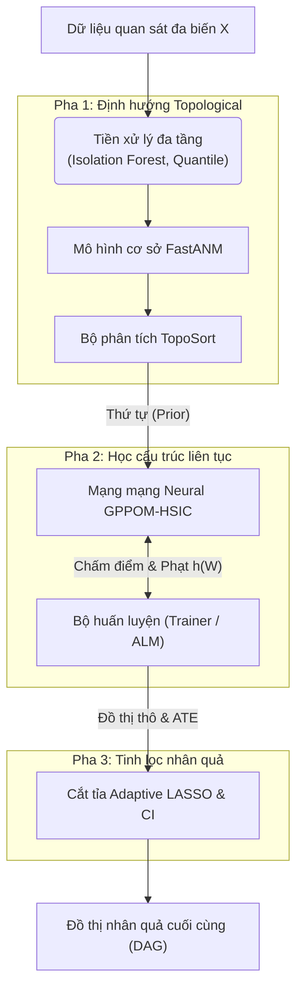
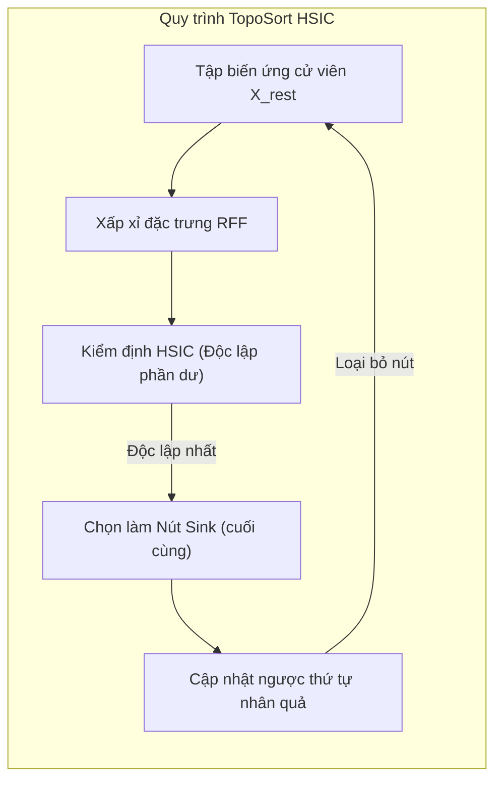
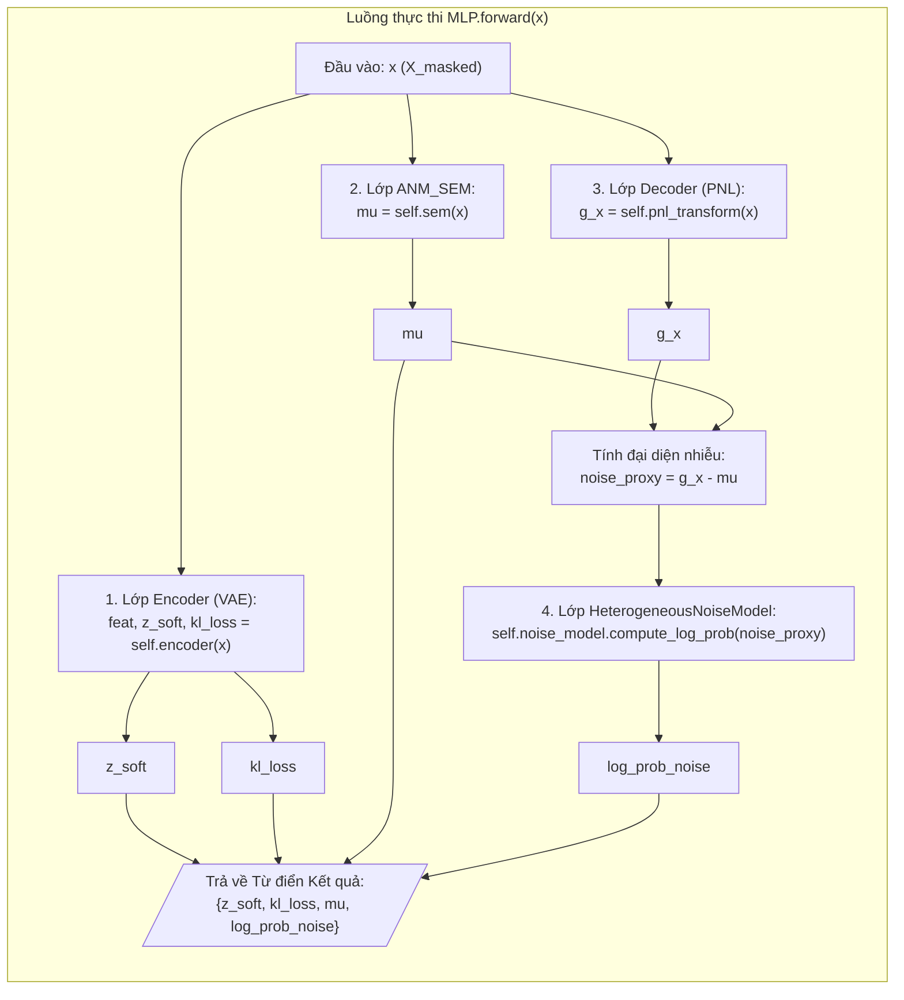
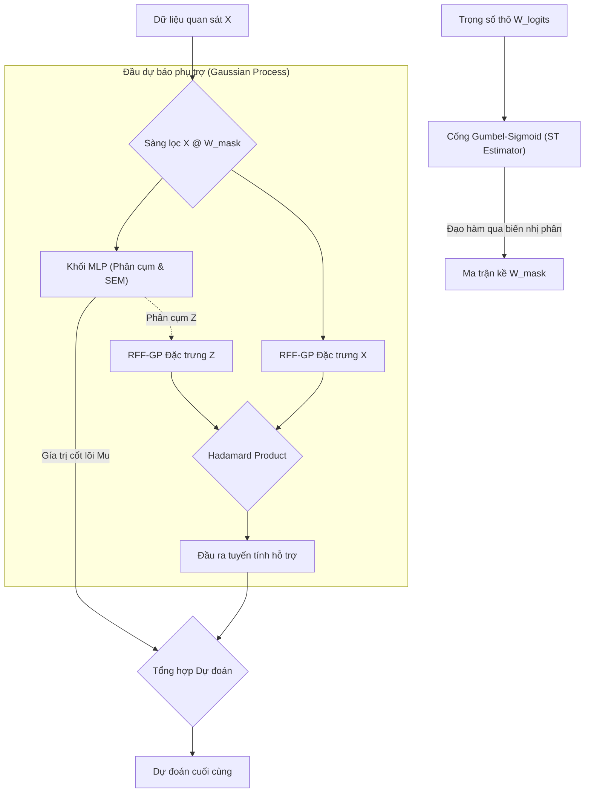
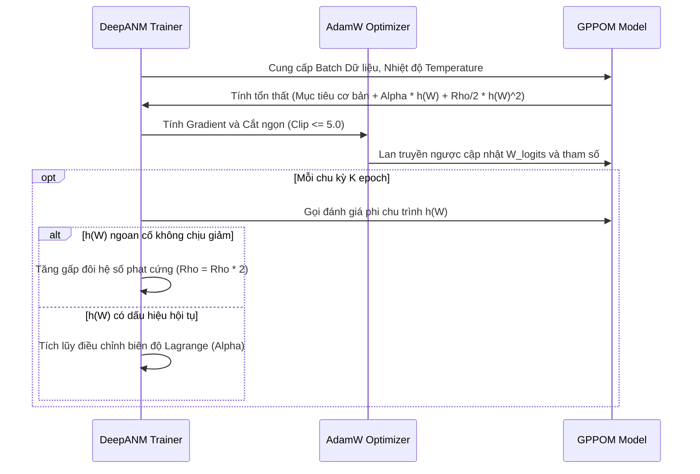
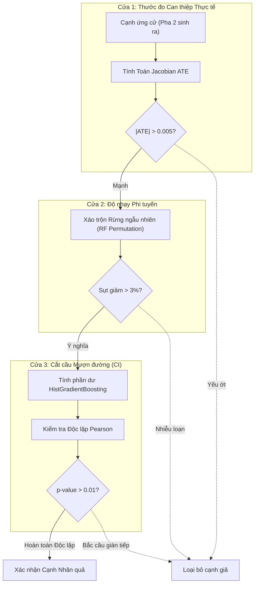

# CHƯƠNG 2: KIẾN TRÚC VÀ CƠ CHẾ VẬN HÀNH CỦA MÔ HÌNH DEEPANM

Chương này trình bày một cách hệ thống và chi tiết về cấu trúc kỹ thuật, nền tảng toán học và quy trình thực thi của mô hình **DeepANM (Deep Additive Noise Model)**. Đây là một hệ thống khám phá nhân quả (Causal Discovery) mạnh mẽ, được thiết kế để khắc phục những hạn chế của các phương pháp truyền thống trong việc xử lý dữ liệu phi tuyến, nhiễu không đồng nhất (Heterogeneous noise) và sự phức tạp của không gian trạng thái DAG.

## 2.1 Cấu trúc tổng thể của hệ thống đề xuất

Trong lý thuyết nhân quả, bài toán tìm kiếm đồ thị có hướng không chu trình (DAG) từ dữ liệu quan sát là một bài khó khăn đặc thù do tính chất **NP-Hard** của không gian tìm kiếm. Khi số lượng biến $d$ tăng lên, số lượng đồ thị khả thi tăng trưởng theo hàm siêu mũ. Để giải quyết vấn đề này, DeepANM triển khai một lộ trình **3 Pha Tương hỗ (3-Phase Synergetic Pipeline)** tích hợp sâu nhiều thuật toán học máy.

<b>Hình 2.1: Lộ trình 3 pha tổng thể trong hệ thống DeepANM</b>

1.  **Hạn chế không gian (Pha 1):** Sử dụng các mô hình cơ sở nhanh (`FastANM`) và thuật toán sắp xếp (`TopoSort`) để xác định dòng chảy qua các phép kiểm định thống kê.
2.  **Mô hình hóa sâu (Pha 2):** Sử dụng mạng neural lõi (`GPPOM-HSIC` và `MLP`) kết hợp với bộ tối ưu hóa liên tục (`Trainer` ALM) để rèn dũa trọng số nhân quả.
3.  **Tinh chắt nhân quả (Pha 3):** Sử dụng công cụ cắt tỉa (`Adaptive LASSO`) để vô hiệu hóa những liên kết nhiễu.

---

## 2.2 Pha 1: Định hướng Cơ sở và Tiền xử lý Dữ liệu

Bước đầu tiên là thanh lọc dữ liệu và phác thảo hướng đi an toàn của luồng thông tin, đảm bảo mạng neural phía sau không lạc vào vòng lặp vô tận.

### 2.2.1 Chuẩn hóa Đa tầng và Khử Outliers

Sử dụng **Isolation Forest** để loại bỏ các điểm dị biệt và **Quantile Transformer** để tạo dáng phân phối Gaussian chuẩn, hỗ trợ tối đa cho các kiểm định độ nhạy cao.

### 2.2.2 FastANM: Khởi tạo Cấu trúc Nhanh

Thay vì để mạng mạng neural dò dẫm từ Không (Zero-knowledge), hệ thống có khả năng khởi chạy qua `FastANM` để lấy một bộ khung ban đầu. FastANM dùng Random Forest để dự báo nhanh các cạnh, sử dụng phép kiểm định tương quan khoảng cách (Distance Correlation) trên phần dư để tạo lập ma trận đồ thị mồi. 

### 2.2.3 Định hướng Topological (TopoSort)

DeepANM áp dụng chiến lược sắp xếp chìm (Greedy Sink-First). Nút "Sink" là biến không gây ra bất kỳ biến nào khác.

<b>Hình 2.2: Sơ đồ thuật toán Sắp xếp TopoSort bằng RFF-HSIC</b>

Kiểm định HSIC nguyên bản rất chậm ($O(N^2)$). Thông qua đặc trưng Fourier ngẫu nhiên (RFF) dựa trên định lý Bochner, bài toán được xấp xỉ xuống $O(N)$, cho phép mạng hoạt động siêu tốc trên hàng ngàn mẫu dữ liệu.

---

## 2.3 Pha 2: Mô hình hóa lõi Deep Neural SCM (GPPOM-HSIC)

Khối `GPPOM_HSIC` (Gaussian Process Partially Observable Model) và lõi `MLP` đảm nhận việc vi phân hóa một đồ thị nhân quả rời rạc thành một không gian tối ưu toán học trơn tru.

### 2.3.1 Kiến trúc Mạng Neural Nhân quả (Module MLP)

Module lõi được thiết kế theo hướng đối tượng, đóng gói bên trong lớp (Class) trung tâm là `MLP`. Khối này đóng vai trò phân phối luồng dữ liệu (Data Flow) truyền qua 4 mạng Neural chuyên biệt, giải quyết 4 bài toán sinh học/thống kê riêng biệt: 

1.  **Lớp `Encoder` (Bộ mã hóa cơ chế VAE):** Dùng mạng MLP + LayerNorm để dự đoán xác suất ẩn, lấy mẫu qua Gumbel-Softmax có ủ nhiệt (Annealing). Đầu ra trực tiếp là xác suất cụm `z_soft` và điểm phạt `kl_loss` của mô hình VAE.
2.  **Lớp `ANM_SEM` (Phương trình Cấu trúc chắp vá):** Sử dụng các khối Res-MLP với các liên kết tắt (Skip Connection) để học hàm sinh nhân quả chính xác $f(X)$. Đầu ra là sức mạnh can thiệp cốt lõi biểu diễn qua tensor `mu`.
3.  **Lớp `Decoder` (Giải mã Hậu phi tuyến PNL):** Biến đổi đầu vào bằng hàm đơn điệu $g(X)$ (Softplus) bảo toàn tính khả nghịch. Cấu trúc Post-Nonlinear này dùng để tách đại diện nhiễu một cách chính xác theo chuẩn ANM: `noise_proxy = g(X) - mu`.
4.  **Lớp `HeterogeneousNoiseModel` (Hệ Nhiễu Hỗn hợp):** Tính toán mô hình Gaussian đa đỉnh (5 thành phần Gauss) trên tensor đại diện nhiễu sinh ra từ khối Decoder. Đầu ra là `log_prob_noise`, giúp DeepANM tối ưu mượt mà các dữ liệu có đuôi nặng (heavy-tailed) phi chuẩn.

Dưới đây là sơ đồ luồng dữ liệu truyền tiến (Forward Pass) ánh xạ trực tiếp từ mã nguồn của thuật toán:

<b>Hình 2.3: Ánh xạ cấu trúc mã nguồn (Object-Oriented) và luồng dữ liệu truyền tiến của mạng nhân quả bên trong file mlp.py</b>

### 2.3.2 Kiến trúc Điều phối Tổng thể (GPPOM-HSIC)

Bên trên khối MLP, GPPOM làm nhiệm vụ tổ chức dòng dữ liệu và bổ sung mạng dự báo hỗ trợ bằng tiến trình Gaussian. Không sử dụng thuật ngữ "lai tạp" (hybrid), chúng tôi định nghĩa đây là **Đầu dự báo song song**.

<b>Hình 2.4: Kiến trúc GPPOM-HSIC. Tích hợp trích xuất đặc trưng cơ chế ẩn và sức mạnh của Cổng Gumbel.</b>

Khâu quan trọng tuyệt đối ở đây là **Cổng Gumbel-Sigmoid với Straight-Through (ST) Estimator**. Thay vì phải chọn ngưỡng tĩnh cho đồ thị, cổng Gumbel ép giá trị đồ thị là biến nhị phân $\{0, 1\}$ ở lần truyền tiến (để mạng học các đường đi rõ ràng), nhưng khi truyền đạo hàm ngược, ST bẽ cong không gian giúp đạo hàm đi qua hàm Sigmoid liên tục để cập nhật $W\_{logits}$.

### 2.3.3 Tối ưu hóa đa mục tiêu với Augmented Lagrangian (Trainer)

Mạng neural có 7 mục tiêu xung đột phải thỏa mãn:
1.  **MSE:** Tái cấu trúc giá trị y.
2.  **NLL:** Hàm hợp lý cực đại cho nhiễu GMM.
3.  **HSIC_CLU:** Ép độc lập giữa nguyên nhân ($X$) và biến phân cụm ($Z$).
4.  **HSIC_PNL:** Ràng buộc cốt yếu: Phần dư phải độc lập với Nguyên nhân.
5.  **KL Divergence:** Cân bằng phân phối Gumbel cho kiến trúc VAE.
6.  **L1 / L2 Penalty:** Ép cấu trúc đồ thị trở nên sắc bén (thưa).
7.  **$h(W)$ DAGMA:** Hàm phạt log-determinant chống vi phạm chu trình đồ thị.

Quá trình giữ thăng bằng cho cả 7 hàm số được kiểm soát bởi cơ chế **Augmented Lagrangian Method (ALM)** nằm bên trong File `trainer.py`:

<b>Hình 2.5: Luồng xử lý điều phối Gradient và chống bùng nổ của khối Trainer</b>

Sự chặt chẽ của Trainer đảm bảo mô hình không bao giờ sinh ra đồ thị lặp, giải quyết xuất sắc điểm yếu truyền thống của máy học cấu trúc.

---

## 2.4 Pha 3: Tinh lọc nhân quả (Adaptive LASSO)

Ngay cả một thuật toán mạnh nhất cũng sẽ dính cạnh nhiễu hoặc cạnh gián tiếp. Module `Adaptive LASSO` là bức tường lửa 3 lớp bảo vệ chân lý cuối cùng.

<b>Hình 2.6: Mạng rây tĩnh điện Adaptive LASSO loại bỏ toàn bộ các tương quan không phải là nguyên nhân</b>

1.  **Cơ chế Jacobian ATE (Cổng 1):** Cạnh tìm được phải mang lực tác động mạnh ($> 0.005$). Nó được tính vi phân xuyên thẳng cấu trúc PNL Decoder để tìm ra mức độ can thiệp thực sự (Treatment Effect).
2.  **Xáo trộn RF (Cổng 2):** Đo sự sụt giảm trên phân phối ngẫu nhiên để miễn nhiễm với các tương quan tuyến tính giả.
3.  **HistGBM CI (Cổng 3):** Những đường link kiểu $A \to B \to C$ thường sinh ảo giác $A \to C$. Thuật toán học máy `Histogram-based Gradient Boosting` sẽ tìm phần dư và loại trừ hiện tượng bắc cầu này.

## 2.5 Tiểu kết chương

Chương này đã làm rõ kiến trúc tinh vi dưới nắp capo của hệ thống DeepANM qua 3 pha xử lý bổ trợ hoàn hảo cho nhau. Việc không sử dụng khái niệm lai tạp mơ hồ mà phân chia rõ tính năng cho phép hệ thống triển khai mạng Neural SCM kết hợp Gumbel Gate giải quyết bài toán Không chu trình khét tiếng. DeepANM thể hiện mình là một mẫu hình Causal Discovery thế hệ mới: Vững chắc về lý thuyết, sâu sắc về biểu diễn và minh bạch trong đào thải giả định.
