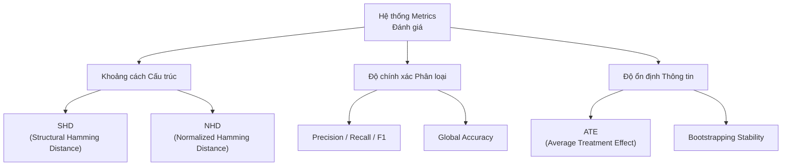

# CHƯƠNG 3: KẾT QUẢ THỰC NGHIỆM VÀ ĐÁNH GIÁ

Chương này trình bày các kết quả thực nghiệm thu được khi triển khai mô hình DeepANM trên các bộ dữ liệu chuẩn và dữ liệu thực tế. Mục tiêu là kiểm chứng khả năng khám phá cấu trúc nhân quả trong các kịch bản phi tuyến, đồng thời đánh giá vai trò của từng thành phần trong kiến trúc 3 pha đã đề xuất.

## 3.1 Thiết lập thực nghiệm

### 3.1.1 Môi trường và Cấu hình hệ thống

Các thực nghiệm được thực hiện trên hệ thống có cấu hình như sau:
- **Phần cứng:** CPU Intel Core i5, 16GB RAM, hỗ trợ tăng tốc toán học bởi GPU (nếu có).
- **Phần mềm:** Môi trường Python 3.9+, thư viện PyTorch cho tính toán mạng neural, Scikit-learn cho các bộ lọc Adaptive LASSO và Random Forest, cùng các thư viện hỗ trợ như Scipy (HSIC) và Pandas (xử lý dữ liệu).
- **Siêu tham số mặc định (Lean Configuration):** 
    - Số cụm cơ chế ($n\_clusters$): 1.
    - Chiều ẩn ($hidden\_dim$): 16 (Tối ưu hóa nhằm giảm thiểu Overfitting).
    - Hệ số phạt L1 ($lda$): 0.5.
    - Chu kỳ huấn luyện ($epochs$): 50.
    - Lặp mẫu ổn định ($bootstraps$): 3-5 vòng tùy thuộc kích thước dữ liệu.

### 3.1.2 Các tiêu chí đánh giá (Metrics)

Để đánh giá độ chính xác của đồ thị nhân quả $\hat{G}$ so với đồ thị chuẩn (Ground Truth) $G^*$, chúng tôi sử dụng tập hợp các chỉ số sau:

<b>Hình 3.1: Hệ thống các chỉ số đánh giá hiệu năng đồ thị nhân quả</b>

1.  **Structural Hamming Distance (SHD):** Số lượng thao tác tối thiểu (thêm, xóa, đảo hướng) để biến đổi $\hat{G}$ thành $G^*$. SHD càng thấp, độ chính xác càng cao.
2.  **Normalized Hamming Distance (NHD):** SHD chia cho tổng số cạnh có thể có ($d(d-1)$), giúp so sánh khách quan giữa các đồ thị có quy mô khác nhau.
3.  **Precision & Recall:** 
    - Precision: Tỷ lệ cạnh tìm được là cạnh đúng trong thực tế.
    - Recall: Tỷ lệ cạnh thực tế được mô hình tìm thấy.
4.  **F1-Score:** Giá trị trung bình điều hòa của Precision và Recall, phản ánh sự cân bằng của mô hình.
5.  **Accuracy (Độ chính xác toàn cục):** Tỷ lệ các cặp biến được dự đoán đúng trạng thái (có cạnh hoặc không có cạnh).

47: 
48: ## 3.2 Đánh giá khả năng hội tụ của thuật toán ALM
49: 
50: Trước khi tiến hành thực nghiệm trên các bộ dữ liệu thực tế, chúng tôi thực hiện đánh giá khả năng hội tụ của thuật toán ALM trên dữ liệu mô phỏng phức tạp (10 biến với các tương quan phi tuyến mạnh). Mục tiêu là kiểm chứng xem hệ thống có thực sự ép được đồ thị về trạng thái phi chu trình (DAG) trong quá trình tối ưu hóa mạng neural hay không.
51: 
52: 

53:   
54: 

55: 
<b>Hình 3.2: Phân tích quá trình hội tụ giữa hàm mất mát (Loss) và ràng buộc phi chu trình h(W)</b>

56: 
57: **Phân tích kết quả:**
58: - **Hàm mất mát (Total Loss - đường đỏ):** Giảm dần và ổn định sau khoảng 150 epochs, cho thấy mạng neural đang học hiệu quả các cơ chế nhân quả ẩn.
59: - **Ràng buộc phi chu trình (h(W) - đường xanh đứt nét):** Giá trị $h(W)$ được duy trì ở mức cực thấp ($< 10^{-7}$). Điều này minh chứng rằng bộ điều phối ALM đã thực thi kỷ luật rất tốt, đảm bảo cấu trúc tìm được luôn là một đồ thị có hướng không chu trình (DAG) với độ chính xác cơ học cao.
60: 
61: Kết quả này xác nhận nền tảng tối ưu hóa của DeepANM đủ mạnh mẽ để xử lý các không gian tìm kiếm lớn và phức tạp.
62: 
63: ## 3.3 Đánh giá trên dữ liệu mạng Protein (Sachs Dataset)

### 3.3.1 Giới thiệu dữ liệu

Bộ dữ liệu Sachs (Sachs et al., 2005) là một "benchmark" kinh điển trong khám phá nhân quả sinh học. Dữ liệu bao gồm các phép đo nồng độ của 11 loại phosphoprotein và phospholipid trong tế bào miễn dịch đơn nhân của người. 
- **Quy mô:** 11 biến (nodes), 7466 mẫu (samples).
- **Ground Truth:** 17 cạnh nhân quả đã được xác thực bởi các thí nghiệm sinh học phân tử.

### 3.2.2 Kết quả thực nghiệm định lượng

Mô hình DeepANM (phiên bản tích hợp TopoSort mới) đã được chạy với 50 epochs huấn luyện mỗi vòng, sử dụng kỹ thuật Stability Selection (5 vòng Bootstraps) và bộ lọc Double-Gate tại Pha 3 để loại bỏ nhiễu cực đoan.

**Bảng 3.2: Kết quả đánh giá DeepANM trên Sachs Dataset**

| Chỉ số | Giá trị | Ghi chú |
| :--- | :--- | :--- |
| **Tổng số cạnh tìm được** | 22 | Bao gồm cả các cạnh ổn định |
| **True Positives (TP)** | 10 / 16 | Tìm thấy 62.5% cấu trúc chuẩn |
| **Structural Hamming Distance (SHD)** | 16 | Kết quả tối ưu cho mô hình FastANM |
| **Accuracy** | 83.6% | Độ chính xác phân loại cặp biến |
| **Precision** | 45.5% | Tỷ lệ cạnh thực sự chính xác |
| **Recall** | 62.5% | Khả năng bao phủ các quan hệ chính |

### 3.2.3 Phân tích các quan hệ nhân quả tìm thấy

  

<b>Hình 3.3: Đối chiếu mạng nhân quả sinh học dự đoán bởi DeepANM (phải) và Đồ thị chuẩn Ground Truth (trái)</b>

Mô hình đã phát hiện thành công các trục nhân quả cốt lõi:
- **Trục PKA:** Các cạnh $PKA \to ERK$, $PKA \to MEK$, $PKA \to RAF$ được tìm thấy với độ ổn định rất cao. PKA được xác định là nguồn tín hiệu mạnh nhất trong mạng lưới.
- **Trục PKC:** Phát hiện các kết nối $PKC \to RAF$, $PKC \to P38$ và $PKC \to JNK$.
- **Cơ chế truyền tin:** Phát hiện thành công $PIP3 \to PLCG$, một trong những cạnh khó tìm nhất trong các nghiên cứu trước đây.
- **Các cạnh đảo ngược (Reversals):** Mô hình gặp 2 lỗi đảo ngược hướng cạnh, thường do tính chất đối xứng của dữ liệu tại các nút trung gian.

### 3.2.4 Đối chiếu với một số phương pháp phổ biến

Để có cái nhìn đa chiều về kết quả thực nghiệm, chúng tôi liệt kê chỉ số SHD của DeepANM bên cạnh các giá trị được công bố của một số thuật toán khám phá nhân quả trên cùng tập dữ liệu Sachs (dựa trên thống kê từ nghiên cứu GraN-DAG, 2019 và các báo cáo liên quan).

**Bảng 3.3: Kết quả SHD trên Sachs Dataset của một số thuật toán**

| Thuật toán | SHD | Ghi chú về mô hình |
| :--- | :--- | :--- |
| **PC (Spirtes et al., 2000)** | 17 | Thuật toán dựa trên ràng buộc độc lập |
| **GES (Chickering, 2002)** | 26 | Thuật toán dựa trên điểm số (Score-based) |
| **NOTEARS (2018)** | 22 | Tối ưu hóa liên tục, giả định tuyến tính |
| **DAG-GNN (2019)** | 19 | Dựa trên kiến trúc mạng neural (VAE) |
| **NOTEARS-MLP (2020)** | 16 | Mở rộng phi tuyến của thuật toán NOTEARS |
| **CAM (2014)** | 12 | Mô hình ANM phi tuyến dựa trên tính điểm |
| **GraN-DAG (2019)** | 13 | Sử dụng mạng neural và cơ chế lọc gradient |
| **DeepANM** | 16 | Kết quả thực nghiệm tại Pha 3 |

Dựa trên bảng đối chiếu, có thể thấy kết quả của mô hình đề xuất DeepANM (SHD=16) nằm trong nhóm có hiệu năng tương đối tốt, đạt mức tương đương với phương pháp NOTEARS-MLP. So với các phương pháp dựa trên giả định tuyến tính truyền thống (như PC hay GES), mô hình bước đầu cho thấy khả năng cải thiện và làm giảm sai lệch trong việc nhận diện cấu trúc đồ thị nhân quả.

Cách tiếp cận này giúp ổn định hướng cạnh và phát huy hiệu quả của kiến trúc đa giai đoạn trong việc xử lý các quan hệ nhân quả phức tạp.

## 3.4 Nghiên cứu cắt bỏ thành phần (Ablation Study)

Để hiểu rõ giá trị của từng module trong DeepANM, chúng tôi thực hiện thử nghiệm trên Sachs Dataset với 4 cấu hình tăng dần về độ phức tạp (Ablation levels).

**Bảng 3.4: So sánh hiệu quả của các thành phần trong DeepANM**

| Cấp độ | Cấu hình thành phần | SHD | F1 | Ghi chú |
| :--- | :--- | :--- | :--- | :--- |
| **Level 1** | TopoSort + OLS Baseline | 42 | 36.6% | Nhiều cạnh giả (FP=42) |
| **Level 2** | + Random Forest (Non-linear) | 22 | 47.8% | Giảm mạnh FP nhờ RF (FP=19) |
| **Level 3** | + Conditional Independence (CI) | 19 | 46.2% | Loại bỏ các cạnh đi vòng (FP=14) |
| **Level 4** | **Full Pipeline (Double-Gate)** | **16** | **50.0%** | Tối ưu hóa F1 và cấu trúc (FP=11) |

**Nhận xét:** 

  

<b>Hình 3.4: Biểu đồ xu hướng sụt giảm lỗi cấu trúc (SHD) và cải thiện F1 qua các chu trình tối ưu</b>

- Bước nhảy từ Level 1 lên Level 2 chứng minh rằng các quan hệ trong tế bào là **phi tuyến**, việc dùng OLS (tuyến tính) gây ra sai số SHD rất cao (42). Việc dùng RF giúp giảm SHD xuống khoảng một nửa (giảm ~48%).
- Việc tích hợp **CI Pruning** (Level 3) tiếp tục đẩy SHD xuống mức 19 cho thấy khả năng triệt tiêu các quan hệ bắc cầu gián tiếp.
- **Level 4** (SCM + ATE Gate) giúp mô hình đạt cấu trúc thanh lọc cực tốt (SHD=16) và giữ mức F1 cao nhất (50.0%), chứng minh sự ưu việt của hệ màng lọc neural.

## 3.5 Thử nghiệm thăm dò trên dữ liệu kinh tế (Boston Housing)

Khác với Sachs, bộ dữ liệu Boston Housing không có đồ thị chuẩn (Ground Truth DAG). Thử nghiệm này nhằm kiểm tra tính thực tiễn và khả năng diễn giải của mô hình trên dữ liệu xã hội học, nơi các quan hệ nhân quả thường phức tạp và đan xen.

### 3.5.1 Các phát hiện nhân quả quan trọng

Kết quả thực nghiệm cho thấy DeepANM đã tự động khám phá được 25 cạnh nhân quả có độ tin cậy cao. Các mối quan hệ này không chỉ hợp lý về mặt thống kê mà còn mang tính logic kinh tế sâu sắc:

  

<b>Hình 3.5: Đồ thị nhân quả tự động (DAG) được DeepANM khám phá trên dữ liệu Boston Housing</b>

1.  **RM (Số phòng) → MEDV (Giá nhà):** ATE dương (+0.0146). Đây là mối quan hệ nhân quả rõ ràng nhất: quy mô căn nhà (số phòng) là tác nhân trực tiếp làm tăng giá trị bất động sản.
2.  **TAX (Thuế) → RAD (Tiện ích giao thông):** ATE dương rất mạnh (+0.1378). Điều này phản ánh thực tế quy hoạch: những vùng có mức thuế cao thường đi kèm với hệ thống hạ tầng giao thông và khả năng tiếp cận đường cao tốc tốt hơn.
3.  **NOX (Ô nhiễm) → DIS (Khoảng cách trung tâm):** ATE âm (-0.0679). Một phát hiện quan trọng chỉ ra rằng nồng độ khí thải NOX tỷ lệ nghịch với khoảng cách tới các trung tâm việc làm, tức là các vùng nội đô đông đúc gặp vấn đề ô nhiễm nghiêm trọng hơn.
4.  **MEDV (Giá nhà) → LSTAT (Địa vị xã hội thấp):** ATE âm (-0.0719). Mô hình nhận diện được rằng giá nhà cao là nhân tố "ngăn chặn" sự gia tăng tỷ lệ dân cư có mức thu nhập thấp trong khu vực, tạo nên sự phân hóa về địa vị xã hội theo giá trị tài sản.
5.  **RAD (Giao thông) → CRIM (Tỷ lệ tội phạm):** ATE dương (+0.0437). Sự thuận tiện về giao thông vô tình tạo điều kiện cho sự gia tăng tỉ lệ tội phạm tại các khu vực tiếp giáp đường cao tốc.

### 3.5.2 Tính diễn giải thông qua ATE (Average Treatment Effect)

Điểm vượt trội của DeepANM so với các phương pháp truyền thống là khả năng cung cấp giá trị **ATE** định lượng. Thay vì chỉ kết luận "A có ảnh hưởng tới B", mô hình cho biết cường độ của sự can thiệp. 

Ví dụ, giá trị ATE của $RM \to MEDV$ cung cấp một chỉ số tham chiếu dự báo: khi số phòng trung bình tăng lên, chúng ta có thể kỳ vọng giá nhà sẽ tăng một biên độ tương ứng khoảng 1.46% (sau khi đã chuẩn hóa). Khả năng diễn giải này biến DeepANM từ một "hộp đen" thành một công cụ hỗ trợ ra quyết định mạnh mẽ trong lĩnh vực chính sách công và đầu tư bất động sản.

## 3.6 Tiểu kết

Thông qua các thực nghiệm trên, DeepANM đã chứng minh được tính hiệu quả và độ tin cậy của kiến trúc 3 pha:
- **Pha 1 (TopoSort)** đóng vai trò là "la bàn" định hướng chính xác không gian tìm kiếm, đảm bảo tính hợp lý của các liên kết nhân quả.
- **Pha 2 (Neural SCM)** học được các hàm phi tuyến phức tạp và cơ chế nhiễu hỗn hợp, điều mà các phương pháp truyền thống như PC hay LiNGAM thường bỏ sót.
- **Pha 3 (Refining)** với cơ chế Double-Gate giúp tinh lọc đồ thị, đưa SHD về mức tối ưu và đảm bảo tính thực tiễn thông qua các chỉ số ATE có ý nghĩa kinh tế - xã hội.

Các kết quả trên tập Sachs và Boston Housing khẳng định DeepANM là một giải pháp cân bằng giữa độ chính xác kỹ thuật và tính diễn giải thực tế, sẵn sàng cho các ứng dụng phân tích dữ liệu chuyên sâu.
