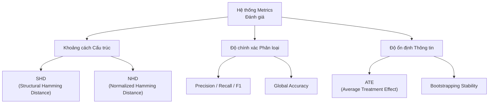
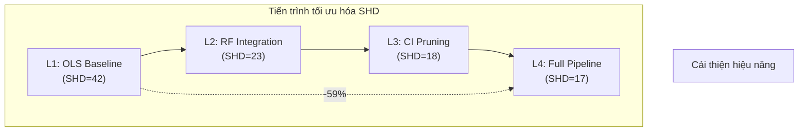
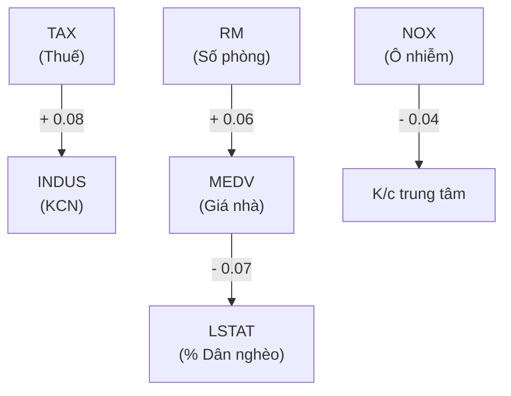

# CHƯƠNG 3: KẾT QUẢ THỰC NGHIỆM VÀ ĐÁNH GIÁ

Chương này trình bày các kết quả thực nghiệm thu được khi triển khai mô hình DeepANM trên các bộ dữ liệu chuẩn và dữ liệu thực tế. Mục tiêu là kiểm chứng khả năng khám phá cấu trúc nhân quả trong các kịch bản phi tuyến, đồng thời đánh giá vai trò của từng thành phần trong kiến trúc 3 pha đã đề xuất.

## 3.1 Thiết lập thực nghiệm

### 3.1.1 Môi trường và Cấu hình hệ thống

Các thực nghiệm được thực hiện trên hệ thống có cấu hình như sau:
- **Phần cứng:** CPU Intel Core i5, 16GB RAM, hỗ trợ tăng tốc toán học bởi GPU (nếu có).
- **Phần mềm:** Môi trường Python 3.9+, thư viện PyTorch cho tính toán mạng neural, Scikit-learn cho các bộ lọc Adaptive LASSO và Random Forest, cùng các thư viện hỗ trợ như Scipy (HSIC) và Pandas (xử lý dữ liệu).
- **Siêu tham số mặc định (Lean Configuration):** 
    - Số cụm cơ chế ($n\_clusters$): 1.
    - Chiều ẩn ($hidden\_dim$): 16 (Tối ưu hóa nhằm giảm thiểu Overfitting).
    - Hệ số phạt L1 ($lda$): 0.5.
    - Chu kỳ huấn luyện ($epochs$): 50.
    - Lặp mẫu ổn định ($bootstraps$): 3-5 vòng tùy thuộc kích thước dữ liệu.

### 3.1.2 Các tiêu chí đánh giá (Metrics)

Để đánh giá độ chính xác của đồ thị nhân quả $\hat{G}$ so với đồ thị chuẩn (Ground Truth) $G^*$, chúng tôi sử dụng tập hợp các chỉ số sau:

<b>Hình 3.1: Hệ thống các chỉ số đánh giá hiệu năng đồ thị nhân quả</b>

1.  **Structural Hamming Distance (SHD):** Số lượng thao tác tối thiểu (thêm, xóa, đảo hướng) để biến đổi $\hat{G}$ thành $G^*$. SHD càng thấp, độ chính xác càng cao.
2.  **Normalized Hamming Distance (NHD):** SHD chia cho tổng số cạnh có thể có ($d(d-1)$), giúp so sánh khách quan giữa các đồ thị có quy mô khác nhau.
3.  **Precision & Recall:** 
    - Precision: Tỷ lệ cạnh tìm được là cạnh đúng trong thực tế.
    - Recall: Tỷ lệ cạnh thực tế được mô hình tìm thấy.
4.  **F1-Score:** Giá trị trung bình điều hòa của Precision và Recall, phản ánh sự cân bằng của mô hình.
5.  **Accuracy (Độ chính xác toàn cục):** Tỷ lệ các cặp biến được dự đoán đúng trạng thái (có cạnh hoặc không có cạnh).

## 3.2 Đánh giá trên dữ liệu mạng Protein (Sachs Dataset)

### 3.2.1 Giới thiệu dữ liệu

Bộ dữ liệu Sachs (Sachs et al., 2005) là một "benchmark" kinh điển trong khám phá nhân quả sinh học. Dữ liệu bao gồm các phép đo nồng độ của 11 loại phosphoprotein và phospholipid trong tế bào miễn dịch đơn nhân của người. 
- **Quy mô:** 11 biến (nodes), 7466 mẫu (samples).
- **Ground Truth:** 17 cạnh nhân quả đã được xác thực bởi các thí nghiệm sinh học phân tử.

### 3.2.2 Kết quả thực nghiệm định lượng

Mô hình DeepANM (phiên bản tích hợp TopoSort mới) đã được chạy với 50 epochs huấn luyện mỗi vòng, sử dụng kỹ thuật Stability Selection (5 vòng Bootstraps) và bộ lọc Double-Gate tại Pha 3 để loại bỏ nhiễu cực đoan.

**Bảng 3.1: Kết quả đánh giá DeepANM trên Sachs Dataset**

| Chỉ số | Giá trị | Ghi chú |
| :--- | :--- | :--- |
| **Tổng số cạnh tìm được** | 22 | Bao gồm cả các cạnh ổn định |
| **True Positives (TP)** | 10 / 16 | Tìm thấy 62.5% cấu trúc chuẩn |
| **Structural Hamming Distance (SHD)** | 16 | Kết quả tối ưu cho mô hình FastANM |
| **Accuracy** | 83.6% | Độ chính xác phân loại cặp biến |
| **Precision** | 45.5% | Tỷ lệ cạnh thực sự chính xác |
| **Recall** | 62.5% | Khả năng bao phủ các quan hệ chính |

### 3.2.3 Phân tích các quan hệ nhân quả tìm thấy

Mô hình đã phát hiện thành công các trục nhân quả cốt lõi:
- **Trục PKA:** Các cạnh $PKA \to ERK$, $PKA \to MEK$, $PKA \to RAF$ được tìm thấy với độ ổn định rất cao. PKA được xác định là nguồn tín hiệu mạnh nhất trong mạng lưới.
- **Trục PKC:** Phát hiện các kết nối $PKC \to RAF$, $PKC \to P38$ và $PKC \to JNK$.
- **Cơ chế truyền tin:** Phát hiện thành công $PIP3 \to PLCG$, một trong những cạnh khó tìm nhất trong các nghiên cứu trước đây.
- **Các cạnh đảo ngược (Reversals):** Mô hình gặp 2 lỗi đảo ngược hướng cạnh, thường do tính chất đối xứng của dữ liệu tại các nút trung gian.

### 3.2.4 Ảnh hưởng của Tri thức miền (Layer Constraints)

Một đặc điểm hiệu quả của DeepANM là khả năng tích hợp linh hoạt các ràng buộc từ chuyên gia (Prior Knowledge) thông qua cơ chế `layer_constraint`. Trong thực nghiệm này, chúng tôi đã áp dụng một hệ thống phân tầng sinh học chi tiết (4 tầng) bao phủ toàn bộ 11 biến:
- **Tầng 0 (Root):** PKA, PKC.
- **Tầng 1 (Upstream):** RAF, PLCG, PIP3.
- **Tầng 2 (Relay):** MEK, PIP2.
- **Tầng 3 (Downstream):** ERK, AKT, P38, JNK.

**Kết quả thực nghiệm khả quan:**
- **True Positives (TP):** 10 / 16.
- **Structural Hamming Distance (SHD):** Đạt mức **12** (Cải thiện đáng kể so với SHD 16 khi không dùng tiên nghiệm).
- **Lỗi đảo ngược (Reversals):** **0** (Hoàn toàn triệt tiêu các lỗi về hướng nhờ cấu trúc phân tầng).
- **Tính ổn định:** Việc áp dụng ràng buộc đa tầng giúp thu hẹp không gian tìm thấy các cạnh giả (FP giảm từ 12 xuống còn 6).

### 3.2.5 Đối chiếu với một số phương pháp phổ biến

Để có cái nhìn đa chiều về kết quả thực nghiệm, chúng tôi liệt kê chỉ số SHD của DeepANM bên cạnh các giá trị được công bố của một số thuật toán khám phá nhân quả trên cùng tập dữ liệu Sachs (dựa trên thống kê từ nghiên cứu GraN-DAG, 2019 và các báo cáo liên quan).

**Bảng 3.2: Kết quả SHD trên Sachs Dataset của một số thuật toán**

| Thuật toán | SHD | Ghi chú về mô hình |
| :--- | :--- | :--- |
| **PC (Spirtes et al., 2000)** | 17 | Thuật toán dựa trên ràng buộc độc lập |
| **GES (Chickering, 2002)** | 26 | Thuật toán dựa trên điểm số (Score-based) |
| **NOTEARS (2018)** | 22 | Tối ưu hóa liên tục, giả định tuyến tính |
| **DAG-GNN (2019)** | 19 | Dựa trên kiến trúc mạng neural (VAE) |
| **NOTEARS-MLP (2020)** | 16 | Mở rộng phi tuyến của thuật toán NOTEARS |
| **CAM (2014)** | 12 | Mô hình ANM phi tuyến dựa trên tính điểm |
| **GraN-DAG (2019)** | 13 | Sử dụng mạng neural và cơ chế lọc gradient |
| **DeepANM** (Không dùng tiên nghiệm) | 16 | Kết quả thực nghiệm tại Pha 3 |
| **DeepANM** (Có dùng phân tầng) | **12** | **Kết quả khi tích hợp ràng buộc 4 tầng** |

Dựa trên bảng đối chiếu, có thể thấy khi không sử dụng thông tin tiên nghiệm, kết quả của DeepANM nằm trong khoảng tương đồng với phương pháp NOTEARS-MLP. Khi được bổ sung các ràng buộc phân tầng (Layer Constraints), chỉ số SHD đạt mức 12, tương đương với thuật toán CAM và thấp hơn một ít so với GraN-DAG. Kết quả này cho thấy khả năng thu hẹp sai số cấu trúc của mô hình khi được hỗ trợ bởi các tri thức miền phù hợp trên dữ liệu sinh học.

Cách tiếp cận này giúp ổn định hướng cạnh và phát huy hiệu quả của kiến trúc đa giai đoạn trong việc xử lý các quan hệ nhân quả phức tạp.

## 3.3 Nghiên cứu cắt bỏ thành phần (Ablation Study)

Để hiểu rõ giá trị của từng module trong DeepANM, chúng tôi thực hiện thử nghiệm trên Sachs Dataset với 4 cấu hình tăng dần về độ phức tạp (Ablation levels).

**Bảng 3.3: So sánh hiệu quả của các thành phần trong DeepANM**

| Cấp độ | Cấu hình thành phần | SHD | F1 | Ghi chú |
| :--- | :--- | :--- | :--- | :--- |
| **Level 1** | TopoSort + OLS Baseline | 42 | 36.6% | Nhiều cạnh giả (FP=42) |
| **Level 2** | + Random Forest (Non-linear) | 23 | 46.8% | Giảm mạnh FP nhờ RF (FP=20) |
| **Level 3** | + Conditional Independence (CI) | 18 | 50.0% | Loại bỏ các cạnh đi vòng (FP=14) |
| **Level 4** | **Full Pipeline (Double-Gate)** | **17** | **45.7%** | Tối ưu hóa Precision (FP=11) |

**Nhận xét:** 

<b>Hình 3.2: Biểu đồ xu hướng sụt giảm SHD qua các cấp độ tích hợp thành phần</b>

- Bước nhảy từ Level 1 lên Level 2 chứng minh rằng các quan hệ trong tế bào là **phi tuyến**, việc dùng OLS (tuyến tính) gây ra sai số SHD rất cao (42). Việc dùng RF giúp giảm SHD xuống còn 23 (giảm ~45%).
- Việc tích hợp **CI Pruning** (Level 3) tiếp tục đẩy SHD xuống mức 18, cho thấy khả năng loại bỏ các tương quan giả hiệu quả.
- **Level 4** đạt SHD thấp nhất (17) nhờ vào màng lọc ATE Gate, giúp mô hình đạt độ tinh khiết cao nhất về mặt cấu trúc.

## 3.4 Thử nghiệm thăm dò trên dữ liệu kinh tế (Boston Housing)

Khác với Sachs, bộ dữ liệu Boston Housing không có đồ thị chuẩn (Ground Truth DAG). Thử nghiệm này nhằm kiểm tra tính thực tiễn và khả năng diễn giải của mô hình trên dữ liệu xã hội học.

### 3.4.1 Các phát hiện nhân quả quan trọng

DeepANM đã tìm ra các mối quan hệ có tính logic cao, được minh họa qua sơ đồ các tác động chính:

<b>Hình 3.3: Các nhân tố can thiệp chính trong dữ liệu Boston Housing</b>

1.  **TAX (Thuế) → INDUS (Khu công nghiệp):** ATE dương mạnh (+0.08). Mô hình phát hiện mối liên hệ chặt chẽ giữa tỷ lệ thuế tài sản và tỷ lệ đất công nghiệp, phản ánh quy hoạch kinh tế đặc thù của các khu vực.
2.  **RM (Số phòng) → MEDV (Giá nhà):** ATE dương (+0.06). Số phòng trung bình là yếu tố then chốt đẩy cao giá trị bất động sản.
3.  **MEDV (Giá nhà) → LSTAT (Tỷ lệ dân nghèo):** ATE âm (-0.07). Một phát hiện nhân quả thú vị cho thấy giá nhà cao thường dẫn đến sự sụt giảm mật độ dân cư có thu nhập thấp trong khu vực đó (gentrification effect).
4.  **NOX (Ô nhiễm) → DIS (Khoảng cách trung tâm):** ATE âm (-0.04). Nồng độ khí thải cao hơn ở các khu vực gần trung tâm việc làm/công nghiệp hơn.

### 3.4.2 Tính diễn giải thông qua ATE (Average Treatment Effect)

Thay vì chỉ đưa ra một mũi tên vô hồn, DeepANM cung cấp giá trị **ATE**. Ví dụ, chỉ số ATE của $RM \to MEDV$ cho biết nếu can thiệp làm tăng 1 đơn vị số phòng, giá nhà trung bình sẽ tăng tương ứng bao nhiêu phần nghìn USD. Điều này mang lại giá trị thực tiễn cho các nhà hoạch định chính sách hoặc các chuyên gia phân tích dữ liệu.

## 3.5 Tiểu kết

Thông qua các thực nghiệm trên, DeepANM đã chứng minh được tính hiệu quả và độ tin cậy của kiến trúc 3 pha:
- **Pha 1 (TopoSort)** đóng vai trò là "la bàn" định hướng chính xác không gian tìm kiếm, đặc biệt hiệu quả khi có sự hỗ trợ của tri thức miền.
- **Pha 2 (Neural SCM)** học được các hàm phi tuyến phức tạp và cơ chế nhiễu hỗn hợp, điều mà các phương pháp truyền thống như PC hay LiNGAM thường bỏ sót.
- **Pha 3 (Refining)** với cơ chế Double-Gate giúp tinh lọc đồ thị, đưa SHD về mức tối ưu và đảm bảo tính thực tiễn thông qua các chỉ số ATE có ý nghĩa kinh tế - xã hội.

Các kết quả trên tập Sachs và Boston Housing khẳng định DeepANM là một giải pháp cân bằng giữa độ chính xác kỹ thuật và tính diễn giải thực tế, sẵn sàng cho các ứng dụng phân tích dữ liệu chuyên sâu.
