# CHƯƠNG 3: MÔ HÌNH NHÂN QUẢ HỌC SÂU THÍCH NGHI (DeepANM)

## 3.1 Triết lý Thiết kế và Tầm nhìn Hệ thống

Chương này trình bày chi tiết về kiến trúc, tư tưởng thiết kế và quy trình vận hành của hệ thống DeepANM (Deep Additive Noise Model) - một mô hình lai (hybrid model) do học viên đề xuất nhằm giải quyết bài toán khám phá cấu trúc nhân quả (Causal Discovery) trong môi trường dữ liệu phức tạp. DeepANM không chỉ đơn thuần là một thuật toán học máy, mà là một hệ thống tích hợp các cột trụ kiến thức từ Toán học tối ưu liên tục, Lý thuyết Nhân quả của Judea Pearl và các tiến bộ mới nhất trong lĩnh vực học sâu (Deep Learning).

### 3.1.1 Thách thức của các mô hình truyền thống

Trong kỷ nguyên dữ liệu lớn, việc xác định mối quan hệ "cha-con" giữa các biến số không còn đơn giản là tính toán hệ số tương quan (Correlation). Các phương pháp truyền thống như PC Algorithm hay Greedy Equivalence Search (GES) thường gặp khó khăn khi đối mặt với:
1.  **Tính phi tuyến (Non-linearity):** Các mối quan hệ sinh học hoặc kinh tế thường không tuân theo các đường thẳng tuyến tính đơn giản.
2.  **Nhiễu không đồng nhất (Heteroscedasticity):** Sai số của mô hình thay đổi tùy theo giá trị của biến đầu vào, làm mất tính chính xác của các kiểm định thống kê cổ điển.
3.  **Bùng nổ tổ hợp (Combinatorial Explosion):** Số lượng đồ thị DAG tăng theo hàm mũ so với số lượng biến, khiến việc tìm kiếm rời rạc trở nên bất khả thi với các hệ thống lớn (ví dụ: mạng gen hàng ngàn node).

### 3.1.2 Mục tiêu chiến lược của DeepANM

DeepANM được xây dựng để phá vỡ bức tường hạn chế này thông qua một lộ trình tự động hóa khép kín (end-to-end pipeline). Hệ thống được thiết kế để:
-   **Định danh cấu trúc phi tuyến:** Tận dụng sức mạnh của Mạng Neural để xấp xỉ bất kỳ hàm nhân quả phức tạp nào.
-   **Tối ưu hóa liên tục:** Chuyển đổi bài toán tìm kiếm đồ thị rời rạc (NP-Hard) sang bài toán tối ưu hóa trong không gian số thực, cho phép sử dụng các kỹ thuật Gradient Descent hiện đại.
-   **Bảo vệ tính phi chu trình (Acyclicity):** Đảm bảo đồ thị kết quả luôn là một DAG hợp lệ thông qua các rào chắn toán học thông minh.

## 3.2 Cơ sở Lý thuyết và Các Định lý Phụ trợ

Trước khi đi sâu vào cấu trúc tầng của DeepANM, việc nắm vững các tiền đề toán học là vô cùng cần thiết để hiểu tại sao mô hình này có thể "nhìn thấy" được nhân quả từ dữ liệu quan sát.

### 3.2.1 Mô hình Nhiễu Cộng phi tuyến (Nonlinear Additive Noise Model)

DeepANM dựa trên giả thuyết ANM, phát biểu rằng một biến kết quả $Y$ được tạo thành từ một hàm phi tuyến của các nguyên nhân $X$ cộng với một nhiễu độc lập $E$:
$$Y = f(X) + E$$

### 3.2.2 Định lý về Tính định danh Nhân quả (Causal Identifiability)

Định lý quan trọng nhất ở đây là **Tính định danh (Identifiability)**. Trong các mô hình tuyến tính Gaussian truyền thống, ta không thể phân biệt được hướng nhân quả nếu chỉ dựa vào dữ liệu quan sát (vấn đề Lớp tương đương Markov). Tuy nhiên, DeepANM tận dụng một kẽ hở toán học: nếu hàm $f$ là phi tuyến VÀ/HOẶC nhiễu $E$ không phải là Gaussian, thì hướng nhân quả sẽ được cố định một cách duy nhất.

Nói cách khác, sơ đồ nhân quả để lại "dấu vân tay" trong mớ hỗn độn của dữ liệu phi tuyến. DeepANM được thiết kế để truy vết các dấu vân tay này bằng cách ép sai số $E$ phải độc lập với $X$. Nếu ta giả định sai hướng (ví dụ $Y \to X$), sự độc lập này sẽ bị vi phạm một cách toán học, và mô hình sẽ lập tức nhận diện được sự sai lệch đó.

### 3.2.3 Quy tắc Tối ưu liên tục cho Đồ thị rời rạc

Một đóng góp vĩ đại của các nghiên cứu gần đây (như NOTEARS) mà DeepANM kế thừa là việc chuyển đổi cấu trúc đồ thị $G$ thành một ma trận trọng số thực $W$. Thay vì phải duyệt qua $2^{d^2}$ đồ thị (một con số lớn hơn cả số nguyên tử trong vũ trụ), ta chỉ cần tìm các giá trị $W$ sao cho hàm mất mát là nhỏ nhất. DeepANM nâng cấp tư tưởng này bằng cách sử dụng **DAGMA**, một kỹ thuật dựa trên Log-Determinant giúp việc ép đồ thị về dạng DAG nhanh hơn và chính xác hơn trên các hệ thống lớn.

## 3.3 Tiền xử lý Dữ liệu: Xây dựng Nền móng Tin cậy

Một mô hình học sâu dù mạnh đến đâu cũng sẽ thất bại nếu "rác vào, rác ra" (Garbage In, Garbage Out). DeepANM tích hợp một quy trình tiền xử lý cực kỳ khắt khe để bảo vệ mạng nơ-ron khỏi các tín hiệu gây nhiễu.

### 3.3.1 Cách ly Ngoại lệ bằng Isolation Forest

Trong thực tế, dữ liệu thường bị hỏng do lỗi cảm biến hoặc các biến cố cực đoan. Nếu đưa các giá trị này vào huấn luyện, mạng nơ-ron sẽ bị "vỡ" Gradient. 
**Isolation Forest** hoạt động bằng cách xây dựng các cây quyết định ngẫu nhiên. Những điểm dữ liệu "lạ" sẽ bị cô lập rất nhanh (nằm ở các tầng nông của cây), trong khi dữ liệu bình thường cần nhiều bước chia tách hơn. DeepANM tự động loại bỏ các điểm này, giúp mô hình tập trung vào các quy luật phổ quát thay vì bị đánh lừa bởi các sai số cá biệt.

### 3.3.2 Chuẩn hóa Phân phối qua Quantile Transformation

Mạng nơ-ron nhân quả rất nhạy cảm với thang đo của dữ liệu. Nếu biến $A$ có đơn vị là "triệu" và biến $B$ có đơn vị là "0.1", mô hình sẽ mặc định coi $A$ quan trọng hơn $B$. 
DeepANM sử dụng **Quantile Transformer** để ép mọi biến số về cùng một phân phối Chuẩn (Gaussian). Kỹ thuật này không chỉ làm cân bằng thang đo mà còn giúp các thuật toán tối ưu như Adam hoạt động ổn định hơn, tránh hiện tượng bùng nổ hoặc biến mất gradient thường gặp trong các bài toán nhân quả phức tạp.

## 3.4 Kiến trúc Luồng Hệ thống 3 Pha (3-Phase Pipeline)

Để quản lý độ phức tạp và đảm bảo tính chính xác, tôi thiết kế DeepANM theo cấu trúc phân tầng gồm 3 pha chuyên biệt. Mỗi pha đóng một vai trò chiến lược trong việc thu hẹp không gian tìm kiếm và tinh chỉnh kết quả cuối cùng.

```mermaid
graph TD
    classDef highlight fill:#0b1117,color:#fff,stroke:#58a6ff,stroke-width:2px;
    classDef sub core fill:#161b22,stroke:#30363d,stroke-width:1px;
    
    Data["<b>Dữ liệu thô (X)</b><br/>Observational Data"] --> Pre["<b>Tiền xử lý</b><br/>Outliers & Norm"]
    
    subgraph phase1 ["PHÀ 1: ĐỊNH HƯỚNG TOPOSORT"]
        Pre --> RFF["RFF Projection<br/>(Kernel Space)"]
        RFF --> Sink["Greedy Sink-First<br/>(HSIC Order)"]
    end
    
    subgraph phase2 ["PHA 2: TỐI ƯU CỐT LÕI (SCM)"]
        Sink -->|"Thứ tự ưu tiên"| GPPOM["Deep Neural SCM<br/>(VAE + DAGMA)"]
        GPPOM --> ALM["ALM Optimization<br/>(Dual Loop)"]
    end
    
    subgraph phase3 ["PHA 3: LỌC TINH (POST-PRUNING)"]
        ALM -->|"Ma trận W_raw"| DG["Double-Gate Filter<br/>(ATE + RF)"]
        DG --> CI["CI Testing<br/>(Spurious Refutation)"]
    end
    
    CI --> Final["<b>KẾT QUẢ: ĐỒ THỊ DAG</b>"]
    
    class Data,Final highlight;
    class GPPOM,Sink,DG sub;
```

<b>Hình 3.1: Sơ đồ luồng vận hành 3 pha chiến lược của mô hình DeepANM</b>

Sự phối hợp giữa 3 pha tạo ra một cơ chế tự kiểm chứng: Pha 1 gợi ý hướng đi, Pha 2 thực hiện xây dựng mô hình và Pha 3 đảm nhiệm vai trò kiểm soát chất lượng cuối cùng.

## 3.5 Pha 1: Khám phá Thứ tự Topological (TopoSort Phase)

Thách thức lớn nhất trong học cấu trúc nhân quả là sự mơ hồ về chiều tác động. Nếu chỉ dựa vào tương quan, ta không thể biết $A \to B$ hay $B \to A$. Tuy nhiên, theo lý thuyết Additive Noise Model (ANM), nếu ta đi đúng chiều nhân quả, phần dư (Residual) sẽ độc lập với biến nguyên nhân.

### 3.5.1 Phép chiếu Không gian Đặc trưng ngẫu nhiên (Random Fourier Features)

Để tính toán sự độc lập phi tuyến, ta cần làm việc trong không gian Hilbert (RKHS) với các hàm Kernel. Tuy nhiên, việc tính toán ma trận Kernel trực tiếp có độ phức tạp $O(N^2)$, cực kỳ chậm với tập dữ liệu lớn. DeepANM sử dụng kỹ thuật **Random Fourier Features (RFF)** dựa trên định lý Bochner để xấp xỉ Kernel.

**Cơ sở lý thuyết:** RFF chuyển đổi dữ liệu đầu vào sang một không gian đặc trưng mới nơi mà tích vô hướng của các vector xấp xỉ đúng giá trị của một Gaussian Kernel. Điều này biến bài toán phi tuyến phức tạp thành các phép nhân ma trận tuyến tính nhanh chóng, giảm độ phức tạp xuống $O(N \cdot D)$.

### 3.5.2 Chỉ số Độc lập HSIC (Hilbert-Schmidt Independence Criterion)

DeepANM sử dụng HSIC làm thước đo "la bàn" để định hướng. Khác với hệ số tương quan Pearson (chỉ đo quan hệ đường thẳng), HSIC có khả năng phát hiện mọi dạng phụ thuộc phi tuyến.
- Nếu HSIC xấp xỉ 0: Hai biến hoàn toàn độc lập.
- Nếu HSIC lớn: Tồn tại một mối liên kết ẩn nào đó.
- Tính ứng dụng: Trong DeepANM, HSIC không chỉ dùng để chọn biến mà còn dùng làm một hàm mất mát (loss signal) để ép mô hình học đúng trật tự tự nhiên.

Trong Pha 1, HSIC được tính toán thần tốc nhờ vào lớp RFF đã nêu ở trên, cho phép thực hiện hàng ngàn phép thử nghiệm độc lập trong thời gian ngắn mà không gây quá tải cho hệ thống.

### 3.5.3 Chiến lược "Bóc vỏ" Sink-First (Greedy Sink-First Ordering)

Điểm độc đáo của DeepANM so với các phương pháp cũ là chiến lược **"Tìm nút đích trước" (Sink-First)**. Trong một hệ thống nhân quả, biến nằm ở cuối luồng (Sink Node) là biến "yêu đuối" nhất - nó không gây ảnh hưởng lên ai nhưng lại nhận ảnh hưởng từ tất cả.

**Quy trình logic mở rộng:**
1.  **Giả thuyết đồng nhất:** Ta coi tất cả các biến đều có khả năng là nút đích.
2.  **Mô phỏng dự đoán:** Với mỗi biến $X_i$, ta thử dùng tất cả các biến còn lại để dự đoán nó thông qua một mô hình hồi quy nhanh.
3.  **Đánh giá phần dư:** Nếu $X_i$ thực sự là nút đích, thì sai số dự đoán của nó phải không còn chứa đựng bất kỳ thông tin nào từ các biến cha. Ta đo chỉ số HSIC giữa phần sai số này và các biến còn lại.
4.  **Bóc vỏ:** Biến nào có HSIC thấp nhất chính là "Kết quả cuối cùng" của hệ thống tại thời điểm đó. Ta "bóc" nó ra, đưa vào danh sách thứ tự và lặp lại quá trình với các biến còn lại cho đến khi toàn bộ các node được sắp xếp.

Kết quả của Pha 1 là một **Thứ tự Topological (Permutation)**. Đây là một mỏ neo cực kỳ quan trọng, giúp mạng nơ-ron ở Pha 2 không bao giờ phải lo lắng về việc vẽ nhầm các đường quay ngược thời gian, từ đó tập trung hoàn toàn vào việc học hàm phi tuyến và phân rã cơ chế.

---

## 3.6 Pha 2: Cỗ máy Lõi Nhân quả (Deep Neural SCM Fitter - GPPOMC)

Nếu Pha 1 đóng vai trò "người dẫn đường", thì Pha 2 chính là "trái tim" của hệ thống DeepANM. Tại đây, ta thực sự xây dựng các phương trình cấu trúc phi tuyến (Structural Equation Models - SCM) để mô tả cách các biến số tương tác với nhau trong thế giới thực.

### 3.6.1 Cơ chế Kết hợp VAE và Cổng Gumbel-Softmax

DeepANM kế thừa và phát triển tư tưởng từ kiến trúc Biến phân (Variational Auto-Encoder - VAE). Tuy nhiên, thay vì chỉ nén dữ liệu, DeepANM sử dụng VAE để khám phá các **Cơ chế Nhân quả ẩn (Latent Causal Mechanisms)**.

Trong thực tế, một mối quan hệ $A \to B$ có thể thay đổi tùy theo điều kiện môi trường. DeepANM thiết kế một khối **Encoder** để phân loại mỗi mẫu dữ liệu vào một "cụm cơ chế" (Cluster). Để bộ não máy tính có thể học được các lựa chọn rời rạc này (chọn Cụm 1 hay Cụm 2) mà vẫn có thể tính đạo hàm (Backpropagation), tôi sử dụng thủ thuật **Gumbel-Softmax**. Kỹ thuật này cho phép mô hình thử nghiệm các cấu trúc khác nhau một cách ngẫu nhiên nhưng vẫn hội tụ về một lựa chọn tối ưu nhất.

### 3.6.2 Mô hình hóa Phương trình Cấu trúc bằng Res-MLP

Để học các hàm phi tuyến $f(X)$, DeepANM sử dụng một mạng nơ-ron đa tầng với kết nối thặng dư (Residual MLP).
- **Residual Blocks:** Giúp dòng Gradient chảy mượt mà xuyên suốt các lớp mạng, ngăn chặn hiện tượng mất mát thông tin khi mạng quá sâu.
- **Activation GELU:** Sử dụng hàm kích hoạt GELU (thay vì ReLU truyền thống) giúp các đường cong nhân quả mượt mà hơn, phản ánh chính xác các quy luật vật lý và sinh học trong tự nhiên.

### 3.6.3 Xây dựng Mô hình Nhiễu không đồng nhất (Heterogeneous Noise Model)

Đây là một trong những điểm đột phá nhất của dự án. Hầu hết các mô hình nhân quả hiện nay (như NOTEARS hay GraN-DAG) đều giả định nhiễu là hằng số hoặc tuân theo phân phối Gaussian đơn giản. Điều này là xa rời thực tế.
Trong dữ liệu y sinh, một gen có thể có nhiễu rất nhỏ ở nồng độ thấp nhưng lại nhiễu cực đại ở nồng độ cao. DeepANM giải quyết vấn đề này bằng mô hình **GMM (Gaussian Mixture Model)**:
- Mạng nơ-ron không chỉ dự đoán giá trị trung bình $\mu$, mà còn dự đoán cả phân phối sai số.
- Cho phép mô hình "chấp nhận" các vùng dữ liệu bất định mà không làm chệch hướng đồ thị nhân quả chính.

### 3.6.4 Tối ưu hóa DAGMA và Thuật toán ALM

Để đảm bảo mạng nơ-ron không vẽ ra các đường vòng (Cycle), DeepANM áp dụng rào chắn toán học **DAGMA**. Thay vì kiểm soát từng cạnh một cách rời rạc, DAGMA nhìn vào toàn bộ ma trận trọng số $W$ và tính toán một giá trị "hình phạt chu trình" dựa trên định thức ma trận.

- **Vòng lặp trong (Adam Optimizer):** Cố gắng giảm sai số dự đoán (MSE) và tăng độ khớp của nhiễu.
- **Vòng lặp ngoài (ALM Controller):** Theo dõi xem đồ thị có vi phạm tính phi chu trình không. Nếu có chu trình xuất hiện, ALM sẽ tăng "hình phạt" lên gấp 10 lần, ép mạng nơ-ron phải cắt bỏ những mắt xích yếu nhất để triệt tiêu vòng lặp.

### 3.6.5 Suy diễn Biến phân và Thành phần KL-Divergence

Trong quá trình học các cụm cơ chế, mô hình VAE của DeepANM sử dụng hàm mất mát **KL-Divergence**. Vai trò của nó là tạo ra một "lực đàn hồi" ngăn cản mô hình quá tin vào một cụm cơ chế duy nhất (Overfitting). KL-Divergence ép các xác suất phân loại cụm phải tản ra đều đặn, chỉ khi dữ liệu thực sự cho thấy sự khác biệt rõ rệt, mô hình mới được phép tách cụm. Điều này giúp đồ thị nhân quả bền vững hơn trước các lỗi nhiễu ngẫu nhiên trong tập huấn luyện.

---

## 3.7 Pha 3: Hệ thống Lọc Cạnh Double-Gate (Post-Pruning Phase)

Dù Pha 2 đã tạo ra một đồ thị DAG rất tốt, nhưng do mạng nơ-ron làm việc trong không gian số thực liên tục, ma trận trọng số $W$ thường còn sót lại các giá trị nhỏ (nhiễu nền). Pha 3 đóng vai trò là "bộ lọc tinh" cuối cùng để loại bỏ các mối quan hệ giả (False Positives).

### 3.7.1 Cổng 1: Neural Jacobian ATE (Average Treatment Effect)

Dựa trên lý thuyết can thiệp (Intervention) của Pearl, DeepANM tính toán ma trận độ nhạy Jacobian. Ta thực hiện các can thiệp giả lập: "Nếu ta rung lắc nhẹ giá trị của biến Cha, biến Con sẽ phản ứng bao nhiêu?". Những cạnh có phản ứng quá yếu (độ nhạy thấp) sẽ bị đánh dấu là không có tác động nhân quả thực sự. Điều này giúp loại bỏ những cạnh "toán học" mà không có ý nghĩa vật lý.

### 3.7.2 Cổng 2: Random Forest Permutation Importance

Để tăng tính bền vững, tôi tích hợp thêm một lớp kiểm chứng từ mô hình không phải neural: **Random Forest (Rừng ngẫu nhiên)**.
Ta thử xáo trộn dữ liệu của từng biến cha. Nếu việc xáo trộn không làm giảm độ chính xác của dự đoán biến con, chứng tỏ mối quan hệ đó chỉ là ngẫu nhiên sinh ra do trùng hợp thống kê. Chỉ những cạnh vượt qua được cả hai "cổng" (Neural ATE và RF Importance) mới được giữ lại. Đây là một cơ chế phòng thủ đa tầng (Defense in depth) để đảm bảo độ tin cậy của đồ thị.

### 3.7.3 Cổng 3: Kiểm định Độc lập Điều kiện (Partial Correlation)

Cuối cùng, hệ thống thực hiện kiểm định độc lập (CI Test) trên các phần dư. Mục tiêu là loại bỏ các đường dẫn gián tiếp. Ví dụ nếu $A \to B \to C$, mô hình có thể lầm tưởng tồn tại cạnh trực tiếp $A \to C$. Cổng CI sẽ kiểm tra: Nếu ta đã biết thông tin về $B$, liệu $A$ có còn giúp dự đoán $C$ tốt hơn không? Nếu không, cạnh $A \to C$ chính thức bị loại bỏ để trả lời đúng về cấu trúc xương sống nhân quả.

---

## 3.8 Triển khai Kỹ thuật và Tối ưu hóa Hiệu năng

### 3.8.1 Tính toán Tensor song song

Tận dụng kiến trúc GPU để tính toán hàng triệu phép biến đổi Fourier cùng lúc. Điều này giúp tối ưu hóa luồng dữ liệu và tăng tốc độ huấn luyện.

### 3.8.2 Lập lịch Nhiệt độ (Temperature Scheduling)

Tham số nhiệt độ $\tau$ của cổng Gumbel được hạ dần, giúp mô hình chuyển dịch mượt mà từ thăm dò sang chốt chặn cấu trúc.

### 3.8.3 Tự động điều chỉnh siêu tham số

Hệ thống có khả năng tự thay đổi hệ số lấn át (penalty coefficient) tùy theo độ phức tạp của đồ thị.

### 3.8.4 Phân tích Độ phức tạp (Complexity Analysis)

Về mặt toán học, độ phức tạp của DeepANM được tối ưu hóa để có khả năng mở rộng (Scalability):
- **Thời gian (Time Complexity):** Nhờ vào kỹ thuật RFF và tối ưu hóa liên tục, độ phức tạp chỉ xấp xỉ $O(N \cdot d^2)$ với $N$ là số mẫu và $d$ là số biến. So với các phương pháp duyệt đồ thị rời rạc có độ phức tạp $O(2^d)$, DeepANM cho phép xử lý các mạng lưới gen với hàng trăm biến số trên một máy trạm thông dụng.
- **Không gian (Space Complexity):** Mô hình chủ yếu lưu trữ các ma trận trọng số và RFF features, độ phức tạp $O(d^2 + d \cdot n\_features)$. Điều này đảm bảo DeepANM có thể nằm gọn trong bộ nhớ VRAM của các dòng GPU phổ thông như RTX 3060 hoặc 4060.

## 3.9 Tiểu kết chương

Chương 3 đã phác họa một bức tranh toàn cảnh về "hệ điều hành nhân quả" DeepANM. Điểm cốt lõi không chỉ nằm ở môt thuật toán duy nhất, mà là một quy trình 3 pha bổ trợ lẫn nhau: Pha 1 rào trước đón sau, Pha 2 tấn công trung tâm, và Pha 3 dọn dẹp hậu trường. Sự kết hợp này mang lại cho DeepANM khả năng khám phá nhân quả với độ chính xác và tính bền vững vượt xa các phương pháp truyền thống, hứa hẹn sẽ mang lại những kết quả bất ngờ trong các thử nghiệm thực tế ở chương tiếp theo.
