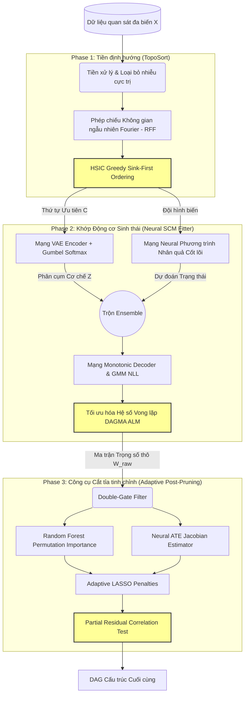

# CHƯƠNG 3: MÔ HÌNH DEEP ADDITIVE NOISE MODEL (DeepANM)

Chương này trình bày chi tiết về kiến trúc, tư tưởng thiết kế và thuật toán vận hành của hệ thống DeepANM (Deep Additive Noise Model) do học viên đề xuất và phát triển. Hệ thống này là sự kết giao chặt chẽ giữa Toán học tối ưu liên tục, Lý thuyết Nhân quả và Trí tuệ Nhân tạo Học Sâu (Deep Learning). Mục tiêu của DeepANM là phá vỡ bức tường hạn chế của dữ liệu nhiễu phi tuyến và cung cấp một lộ trình (pipeline) tự động hóa khép kín từ khâu tiếp nhận tập dữ liệu thô (raw observational data) cho đến định hình chính xác Ma trận cấu trúc Đồ thị Có hướng Không chu trình (DAG).

## 3.1 Kiến trúc Tổng thể (Overall Pipeline Architecture)

Để giải quyết một bài toán vô cùng phức tạp và mang tính rủi ro cao như Tối ưu NP-Hard trên dữ liệu tỷ lệ độ nhiễu cao (High Noise-to-Signal ratio), một Mạng Neural truyền thống (như Multi-layer Perceptron đơn thuần) là không đủ. Việc ép một mạng neural vừa học quan hệ hàm tương quan, vừa phải tự dò đường xem cạnh nào không được phép đi luẩn quẩn (Cyclic) thường xuyên dẫn đến các điểm tối ưu cục bộ (Local Minima tệ hại). Hệ quả là máy tính có thể vẽ ra một đồ thị gần như nối các đỉnh với nhau chằng chịt, hoặc nối ngược quy luật tự nhiên.

Nhận diện được nút thắt này, tôi đã thiết kế kiến trúc của DeepANM được phân rã thành **Hệ thống 3 Pha (3-Phase Pipeline)** chuyên biệt nhằm bảo vệ tính toàn vẹn của đồ thị phân cấp ở từng bước:



**Tổng quan dòng đời vận hành của 3 pha:**
- **Pha 1 (TopoSort - Sắp xếp Topological):** Đóng vai trò là "Nhà chiến lược". Không vội vàng nhồi trọng số vào học máy sâu, pha này dùng phân tích thống kê toán học (HSIC) để tìm ra một chuỗi (Order) các biến được sắp xếp từ Tổ tiên (Nguyên nhân Gốc) $\to$ ... $\to$ Đóng vai trò con cháu (Sink Nodes). Kết quả định hình một biên giới để chặn đường Mạng Neural không vi phạm nguyên tắc xoay vòng sau này.
- **Pha 2 (Neural SCM - Khớp Mạng Phương trình Cấu trúc):** Là cốt lõi (Trái tim của hệ thống). Một hệ thống VAE - Khớp nhiễu Giao thoa sẽ tính toán sự lây lan tín hiệu hàm ẩn và áp dụng nhân tử Augmented Lagrangian Barrier chặn đường chu kỳ (Acyclicity).
- **Pha 3 (Edge Post-Pruning - Cắt tỉa thông minh):** Vận hành như một "Bác sĩ Ngoại khoa". Thay vì để ngưỡng cố định (VD: trọng số $< 0.3$ thì bỏ cạnh vì coi nó là nhiễu), hệ thống ứng dụng Rừng ngẫu nhiên (Random Forest) và lý thuyết can thiệp Do-calculus (ATE Jacobian matrix) để lọc đi các đường dẫn gián tiếp có tính lừa dối thống kê (False Positives).

Dưới đây là thiết kế chi tiết cấp cao về mặt kỹ thuật cho từng Pha.

---

## 3.2 Pha 1: Sắp xếp Topological & Chuẩn hóa Bất đối xứng (Phase 1)

Thay vì phó mặc hoàn toàn trọng trách phân biệt "Cha - Con" cho Mạng Neural ALM, thực tế việc cung cấp cho ALM một bức tranh gợi ý về độ ưu tiên Topological (Node $A$ gần cội nguồn Nguyên nhân gốc hơn Node $B$) sẽ tăng độ ổn định của Loss Optimization lên đáng kể trên đa hình thể nhiễu.

### 3.2.1 Tiền xử lý Dữ liệu Chuẩn (Quantile Normalization & Isolation Forest)

Dữ liệu tự nhiên thường chứa các giá trị biên cực dải (Extreme Outliers). Chẳng hạn, trong dữ liệu y khoa Protein (Sachs Dataset), đôi khi phép đo phổ bị kẹt tia Laser tạo ra cường độ lệch chuẩn (Z-score $> 5.0$). 

Mạng Neural sử dụng hàm phi lồi (Non-convex) như Sigmoid và L2 Penalty (MSE Loss) cực kỳ nhạy cảm và dễ vỡ gradient bởi các nhiễu lớn bùng nổ này. Hệ thống được trang bị bộ Tiền xử lý hai lớp:

1. **Isolation Forest (Cách ly ngoại lệ):** Khởi chạy một tập các Cây quyết định ngẫu nhiên (Random isolation trees) chia tách không gian liên tục (Liu et al., 2008). Nếu một điểm dữ liệu (Patient / Sample) bị tách rời khỏi quần thể chỉ sau độ sâu dưới $\log_2 n$, điểm đó bị đánh nhãn vĩnh viễn là "Anomalies" (Nhiễu cực trị) và loại khỏi quá trình Huấn luyện Nhân quả để bảo toàn hàm Mất mát MSE.
2. **Quantile Transformer (Ép chuẩn Phân phối Năng lượng):** Ràng buộc Gaussian là tiên quyết cho các kỹ thuật Lasso. Bất kể dữ liệu phân bố hàm Mũ (Exponential), đa đỉnh phân mảnh (Multimodal), Quantile Normalization phân bổ vị trí thứ tự theo CDF (Hàm phân phối tích lũy) ép hình parabol Bell Curve khít cho mọi biến độc lập:
   $$X_{\text{norm}, i} = \Phi^{-1} \left( F_{\text{emp}}(X_i) \right)$$
   Với $\Phi^{-1}$ là hàm Probit phân phối chuẩn nghịch đảo và $F_{\text{emp}}$ là CDF Tích lũy thực nghiệm. Cấu hình này giúp ổn định không gian Loss Topology của DAGMA, bảo đảm mọi Gradient trượt trên một bình nguyên mượt.

### 3.2.2 Thuật toán Greedy Sink-First Topological Ordering

TopoSort là khâu tìm thứ tự hoán vị $\pi$ của các biến số sao cho nếu $\pi(i) < \pi(j)$ thì $X_{\pi(j)}$ tuyệt đối không thể là Nguyên nhân gây ra $X_{\pi(i)}$. Đây là tính chất của dòng chảy thông tin DAG.
Khác với thuật toán sắp xếp dựa vào rễ (Leaf/Source First), quy trình học máy ANM bộc lộ tính độc lập phần dư cực đoan (Independence of residual signals) khi bóc vỏ biến Kết quả (Sink Nodes).

DeepANM áp dụng thuật toán **Sắp xếp Chìm tham lam (HSIC Greedy Sink-First Ordering)**:
Thuật toán tìm kiếm từng phần tử một đặt vào đuôi danh sách có dạng đệ quy như sau:

**Đầu vào:** Biến số $\{X_1, X_2, \dots, X_d\}$.
**Đầu ra:** Thứ tự các biến $C = (c_1, \dots, c_d)$.
**Lặp** từ $k = d, d-1, \dots, 1$ cho đến khi tập Biến rỗng:
1. Đặt tất cả phần tử còn lại là Nhóm Cha giả định $S$.
2. Vỡi mỗi biến $X_i \in S$, coi $X_i$ là Nút Đích (Sink). Dùng Hồi quy chuẩn Ridge (Ridge Regression) hoặc Random Forest học mô hình quy ngược toàn bộ tập $S \setminus \{X_i\}$ để tái diễn $X_i$:
   $$X_{i} \approx \sum_{j \neq i} \beta_j X_j \to \text{Phần dư: } \varepsilon_i = X_i - \hat{X}_i$$
3. Tính Hàm Chi Phí Phụ Thuộc (Dependence Score Cost) thông qua toán tử:
   $$ \text{Score}_i = \sum_{j \neq i} \text{FastHSIC}(\varepsilon_i, X_j) $$
4. **Quy tắc quyết định (Causal Identifiability):** Nếu $X_i$ thực sự là Sink Node (Đầu ra cuối rễ của nhánh), theo định lý ANM Bất đối xứng, phần dư $\varepsilon_i$ bắt buộc phải độc lập hoàn toàn với toàn bộ tổ tiên $X_j$. Hệ quả là Hàm phụ thuộc **$\text{Score}_i \to 0$**.
5. Do đó, chọn Nút đích chính xác là Nút làm Hồi quy $\varepsilon$ độc lập nhất:
   $$X_{sink} = \arg\min_{i \in S} \text{Score}_i$$
6. Tách $X_{sink}$ đưa vào vị trí thứ $k$ của kết quả $C$: $c_k = X_{sink}$, loại $X_{sink}$ khỏi tập biến và lặp tiếp.

Sử dụng thuật toán RFF-HSIC (Phương pháp đặc trưng Fourier) làm thước đo sự phụ thuộc thống kê đã biến một quy trình cần chi phí $O(d^2 \cdot N^2)$ rụng thành khối lệnh tốn vài giây xử lý O($d^2 \cdot N \cdot D$) siêu việt. Hoán vị $\pi$ này đóng vai trò định hướng sự phạt ALM Barrier trong mạng Neural Mệnh đề kế tiếp.

---

## 3.3 Pha 2: Cỗ máy Lõi Nhân quả (Deep Neural SCM Fitter - GPPOMC)

DeepANM đưa ra cơ chế mô hình hóa Phương trình Cấu trúc (Structural Equations) cực kỳ mềm dẻo. Trong tự nhiên thực tế, cơ chế tự tác động gây ra hậu quả (Transfer Functions) giữa 2 biến không tồn tại dưới dạng 1 phương trình tuyến tính chung chung, mà thường bị xẻ nhỏ thành vô số cụm (Clusters) khác nhau. Ví dụ: Cơ chế Thuốc hạ Glucose hoạt động rất yếu trên người Béo phì so với người Bình thường do kháng Insulin (Hiện tượng Nhiễu không đồng nhất - Multimodal Heteroscedasticity).

Để giải quyết, tôi thiết kế và tích hợp lõi GPPOMC kết cấu thành một đường ống **Encoder (Phân cụm) $\to$ SEM (Phương trình trọng số) $\to$ Decoder (Dịch nhiễu)** đồ sộ.

### 3.3.1 Kiến trúc các Khối Mạng (Module Architecture)

Sơ đồ mạng nơ-ron được thực hiện với kích thước Batch Tensor $(N_{batch}, d)$. Các lớp (Layer) xử lý của Mạng Neural DeepANM không phải các Lớp Fully-Connected chéo nhau giữa các Biến (Cross-Variable Mixing), mà được thiết kế dạng **Perceptron Cục bộ Song Tử (Local Perceptron for Variable Pairs)**, nhằm không phá vỡ tính Diễn dịch Tác động Nhân quả (Identifiability Causal Graph). Hệ thống có 3 cấu kiện:

1. **Khối SEM Nhân quả Trọng tâm (ANM_SEM Module)** 
   - Đầu vào: Ma trận $X$
   - Vận hành: Đối với mỗi biến $j$, thiết lập một mạng đa tầng (MLP) với Lớp ẩn (Hidden Dim = 32), Tích hợp Activation LeakyReLU phi tuyến tĩnh.
   - Đầu ra kỳ vọng của mạng: $\mu_j$. Lớp này học cách phản chiếu sự thay thế các hàm $f_j(PA(X_j))$ trong đó $PA(X_j)$ được kiểm soát bằng một ma trận mặt nạ $W_{adj}$ đè lên trước lúc feed forward:
     $$X_{\text{masked}} = X \odot \sigma(\alpha \cdot W_{\text{logits}})$$
   - Đảm bảo một khi trọng số Cạnh $W_{ij} \to 0$, $X_i$ vĩnh viễn không được đưa vào Lấy mẫu trọng số cho hàm dự đoán $\hat{f_j}$.

2. **Khối Phát hiện Cơ chế (Encoder VAE & Gumbel-Softmax Trick)**
   - Cung cấp mô hình khả năng quyết định xem một dòng dữ liệu của bệnh nhân đang chịu chi phối bởi cụm cơ chế nhân quả số $k = 1$ hay $k = 2$ (Mặc định `n_clusters = 2` cho các trạng thái đối lập như Kích hoạt / Bất hoạt sinh hóa học).
   - Encoder tiếp nhận $X$ đưa qua Linear + ReLU, trả lại ma trận log-Xác suất rời rạc $Logits = \log p(z | x)$ để xếp cụm.
   - **Gumbel-Softmax Trick (Jang et al., 2016):** Mạng Neural thông thường không thể tính đạo hàm xuyên qua quá trình chọn lọc rời rạc bằng hàm Argmax $\arg\max_k (prob)$. Để Backpropagate luồng Error cho việc chọn Cụm $z \in \{1, \dots, K\}$, kiến trúc cộng thêm biến nhiễu Gumbel(0, 1) $g_k$:
     $$z_k = \frac{\exp((\log p_k + g_k)/\tau)}{\sum_{j=1}^K \exp((\log p_j + g_j)/\tau)}$$
     Tham số nhiệt độ Nhiễu Softmax $\tau \to 0$ sẽ ép vector xác suất thành định hướng One-Hot, nhưng vẫn khả vi để trượt Gradient xuống $f_j$.

3. **Khối Đọc Nhiễu Biến Hóa (Monotonic Decoder YH)**
   - Hàm dự báo $\mu$ của SEM dựa theo Gumbel cụm số $k$ sẽ được Decoder biến đổi Monotonic (đồng biến tăng) để giả lập sự méo mó không tuần hoàn của hàm rải rác:
     $Y_{trans} = \text{Decoder}(\mu_z)$
   - Sau đó tính toán phân phối log-likelihood của phần dư nhiễu bằng thuật toán phân bổ hỗn hợp Gaussian hỗn hợp theo phân hóa cụm DECI (Heterogeneous Noise Component).

### 3.3.2 Hàm Mất Mát Đa Mục Tiêu (Objective Loss Function)

Với hàng chục ngàn trọng số Param thiết kế, GPPOMC định hướng Back-propagation thông qua hàm Loss đồ sộ hòa trộn 4 chỉ số cực tiểu hóa. Đặt $\Theta$ là toàn tập Parameters của Neural Networks và $W$ là Ma trận kề Causal Graph DAG logit. 

$$ \mathcal{L}_{\text{toàn cục}} = \gamma_1 \mathcal{L}_{\text{Base MSE}} + \gamma_2 \mathcal{L}_{\text{NLL Noise}} + \gamma_3 \mathcal{L}_{\text{L2 Reg}} + KL_z + \Lambda_{\text{DAGMA}}(W)$$

**A. Khối Hàm Lỗi Tiên Tiệm (Base Loss & Likelihood):**
1. $\mathcal{L}_{\text{Base MSE}} = \frac{1}{N} \sum || X - \hat{\mu}_{sem}(\Theta) ||_2^2 $: Hàm căn bản đánh giá chất lượng tái tạo (Reconstruction Error) tương đương với các AutoEncoder. 
2. $\mathcal{L}_{\text{NLL Noise}} = - \mathbb{E} [ \log P(\varepsilon_j | \sigma_z, \mu_z)]$: Hàm Negative Log-Likelihood (Tối đa hợp lí biên phần dư). Nếu $X$ bị mô hình giải thích theo nhầm cụm cơ chế $Z$, nhiễu sẽ lớn và đẩy NLL lên cao. Tối ưu cực tiểu NLL ép Mạng Deep Learning co cụm phương sai và tìm ra điểm ổn định của GMM Phân mảnh.
3. KLD (KL-Divergence): Tối ưu độ khác biệt phân phối đồng đều của Biến chọn cụm (hạn chế Node vón cục lười biếng về 1 Cơ chế).

**B. Rào chắn Tối ưu Phi Chu Trình DAGMA (Acyclicity Constraint):**

Bởi vì $W \in \mathbb{R}^{d \times d}$ là hệ tọa độ liên tục (cạnh $0.4, 0.7, \dots$), thuật toán DAGMA được tích hợp vào để chặn mạng nơ-ron học đồ thị hồi tiếp tự thân.
Dựa trên giá trị nghịch lưu Log-Determinant Barrier:
$$ h_{DAGMA}(W) = - \log \det(\mathbf{I} - \alpha W \circ W) $$
Đóng vai trò là Tường thành phạt (Penalty Barrier Function).

### 3.3.3 Vòng xoáy Tối ưu Augmented Lagrangian Method (ALM)

Vì bài toán yêu cầu Cực tiểu $\mathcal{L}_{\text{toàn cục}}$ VỚI ĐIỀU KIỆN RÀNG BUỘC (Subject to constraint) $h_{DAGMA}(W) = 0$. Hai không gian này mâu thuẫn (Mạng càng tạo chu trình Cycle, Loss MSE càng nhỏ). Do vậy, tôi triển khai thuật toán ALM lừng danh (Bertsekas, 1982). Quá trình huấn luyện không chỉ dốc xuống bằng thuật toán Gradient Adam truyền thống một chiều mà gồm 2 vòng lặp (Dual-Loop Optimization):

**Thuật toán ALM Loop Lõi (Mã giả của quá trình Training Epoch):**
```python
# Lặp Vòng Lớn cho ALM Hyperparameters:
For v in range(1, NUM_DUAL_ITERATIONS=10):
    
    # Lặp Vòng Học Mạng Neural Sâu
    For epoch in range(Epochs_per_Iteration):
        1. Lấy Batch Tensor Data X
        2. Sinh Ma trận Trọng số mask cạnh dựa trên W_logits
           W_raw = sigmoid(W_logits)
        3. Truyền X -> Gumbel Encoder -> Tính Z
        4. Masked_X = X * W_raw
        5. Lặp qua Masked_X -> SEM MLP -> Tính L_base, L_NLL
        6. Tính Penalty h(W) bằng SVD hoặc Determinant chéo.
        7. Tính Tổng Loss Hàm Phạt:
           Loss_ALM = Penalty_Base + Khởi_động_Lagrange * h(W) + (Rho / 2) * h(W)^2
        8. Backpropagate Loss_ALM và cập nhật Toàn Bộ Mạng (Adam_Optimizer.step())
        
    # Hết Epoch vòng trong, Cập nhật vòng lớn:
    h_val = Đánh_giá lại h(W_hiện_tại)
    If h_val > Mức_chấp_nhận_Cũ * 0.25:
          Rho_hệ_số_phạt *= 10  # Phạt nặng hàm chu kỳ lên 10 lần
    Else:
          Ghi nhận h_val.
    Cập nhật Nhân Tử Lagrange_Multiplier += Rho * h_val
```

Kỹ thuật ALM đẩy giá trị $\rho$ (hệ số cấm chập mạch) to lên theo thời gian. Giai đoạn đầu, ALM "nhắm mắt làm ngơ" cho mạng Neural đi vẽ lung tung chu trình khép kín nhằm học cách dự đoán nhanh $f_{SEM}$. Nhưng dần về sau, khi $\rho$ xấp xỉ vô cực, $\mathcal{L}_{\text{toàn cục}}$ bị kéo tăng đột biến, hệ thống Mạng Neural TỰ ĐỘNG TỰ CẮT CẠNH YẾU NHẤT (cắt dây chuyền yếu nhất) để triệt tiêu Cycle, hạ $h_{DAGMA}(W)$ về bằng đúng số Zeros, phá vòng xoáy nhưng giữ được đường dây nhân quả chân quang nhất. 

---

## 3.4 Pha 3: Lọc Giao Tiếp Nhảm Bằng Cơ chế Hỗn Hợp Đồng Quy (Edge Post-Pruning Gate)

Kết thúc Pha 2 Mạng Neural, chúng ta thu được một Ma trận $W_{raw} = \sigma(W_{logits}) \in \mathbb{R}^{d \times d}$. Các hệ số lúc này bơi trong vùng liên tục (Ví dụ: 0.81, 0.45, 0.05, 0.001...). Vấn đề muôn thuở của Global optimization đó là $W_{raw}$ hầu như không bao giờ là Số Zeros hoàn chỉnh. Thậm chí các Node hoàn toàn không dính dáng, Mạng vẫn gán đại giá trị $0.1$. Làm thế nào để biết đường link $0.35$ kia là "Nhân quả thật sự" hay chỉ là "Sự bù trừ sai số hồi quy của mạng"?

Hầu hết hệ thống trên thế giới dùng một Threshold Tĩnh (Tất cả cạnh $< 0.3$ cắt bỏ). Điều này hết sức ngớ ngẩn do không phân định quan trọng trong từng cấu trúc (Biến $A$ có Range 10 triệu, Biến $B$ Rate 0.5, thì $W_{ij} = 0.02$ có thể là nhân quả sống còn chấn động hệ gen). 

Dự án DeepANM triển khai bộ thiết kế lọc 2 cổng kết hợp **Adaptive LASSO + Random Forest CI**.

### 3.4.1 Màng Lọc Cơ Sở Jacobian (Neural ATE Score)

Đừng để Mạng Neural chỉ học xong, hãy ép nó tính Giải tích hệ quả. Dựa trên toán học Giải tích Can Thiệp Do-Calculus (Judea Pearl), ATE (Tác động điều trị trung bình) được xác định bởi vi phân từng phần xuyên chuỗi đạo hàm (Jacobian):
Hệ thống cấp Backprop ngược chiều lấy chuỗi phương trình SEM vừa huận luyện xong để đo Đạo hàm cục bộ (Local Gradients) của Output $X_j$ dựa trên Input $X_i$:

$$ \text{ATE}_{ij} = \frac{1}{N} \sum_{k=1}^N \left| \frac{\partial \hat{f}_{\text{SEM, j}}(X^{(k)})}{\partial X_i^{(k)}} \right| $$

Việc tính đạo hàm riêng (Partial Derivative) tiết lộ chính xác 1 sự biến thiên (Wiggle) của biến Cha có năng lực tạo ra bao nhiêu Biên độ Dao động (Amplitude response) cho biến Con trên toàn bộ tệp phân phối thực tế. Nó mang tính biểu đạt (Expressivity) cao hơn hẳn ma trận Trọng số thuần $W_{raw}$.
DeepANM sẽ loại bỏ các cạnh mà ở đó giá trị ATE Score của nó lọt thỏm dưới Percentile thứ 15 của tập Jacobian mẫu (Threshold trượt động/Dynamic thresholding).

### 3.4.2 Màng Lọc Permutation Importance (Random Forest OOB)

Để bảo vệ hệ thống khỏi những tương quan hàm phi tuyến không thuần, Random Forest (Rừng ngẫu nhiên - Thuật toán Decision Tree Ensembles vĩ đại của Breiman) được triệu hồi để đo lường tầm quan trọng.

Quy trình Tính R-Squared Permutation được hệ thống code DeepANM thực thể theo các thao tác đâm xuyên (Vertical Shuffle):
1. Huấn luyện Random Forest Regressor giả lập tái sinh Biến $X_j$ dựa trên tập hợp toàn bộ tổ tiên của nó được đánh dấu bởi Pha 1 (TopoSort Order). Ghi nhận chất lượng độ khớp chuẩn: $R^2_{\text{bình thường}}$.
2. Xáo trộn cực tả (Shuffle Uniformally) duy nhất cột Feature của ứng viên cha $X_i$ khiến phân phối của nó đối với các quan sát hoàn toàn phá vỡ.
3. Cho dữ liệu đã xáo trộn này đi vào mô hình RF vừa luyện, thu thập chất lượng tái sinh mới $R^2_{\text{xáo trộn}}$.
4. Tầm quan trọng của Cạnh $X_i \to X_j$ được minh chứng bằng cú Sốc Mất mát:
   **Importance Score** = $R^2_{\text{bình thường}} - R^2_{\text{xáo trộn}}$
5. Nếu cú sốc không làm thay đổi kết quả Model ($Drop < 0.05$), tác nhân này hoàn toàn là Nhiễu. Cạnh bị băm nát và loại bỏ.

### 3.4.3 Loại Bỏ Trực tiếp Liên kết Gián Tiếp (Partial Conditional Independence)

Như phân tích ở Chương 2, Mạng Học sâu không thể tránh việc nối Cạnh cho đường Gián Cầu (A $\to$ B $\to$ C, Dẫn đến nối nhầm A $\to$ C).
Thuật toán gạt nhầm nhánh gián tiếp dựa vào **Cây Tăng Cường Tốc độ (HistGradientBoostingRegressor)**:
- Dự đoán $A$ bằng tập Nền $B$. Trích xuất phần dư: $\varepsilon_{A|B} = A - \text{Nonlinear Model}(A, \text{với tập } B)$
- Dự đoán $C$ bằng tập Nền $B$. Trích xuất phần dư: $\varepsilon_{C|B} = C - \text{Model}(C, \text{với tập } B)$
- Chạy hệ số Tương quan tuyến tính (Pearson Correlation test) giữa bộ biến đổi $\varepsilon_{A|B}$ và $\varepsilon_{C|B}$.
- Trả về ngưỡng tham chiếu p-value. Nếu $p > 0.05$, các phần độc lập (Residuals) thể hiện rằng chúng hoàn toàn triệt tiêu khi biết thêm Nền trung gian. Bác bỏ giả thuyết có đường truyền thông tin liên kết riêng $A \to C$. Node C sẽ được tách rời.

Tính ưu việt tuyệt đối của Pha số 3 là khả năng lọc cực đoan (Ultra-pruning) mọi tín nhiệm giả với sự giao thoa kép của Mạng Neural Thần kinh Đại vi phân (Jacobian ATE) và Các Mô hình Cây Phi Tập Trung (Ensembles). Kết cục, đồ thị $W_{bin}$ được chắt lọc chỉ còn chứa những "Xương sống Huyết mạch" thực sự đại diện cho Trật tự tự nhiên vạn vật của tập Dữ liệu, kết thúc chu trình Discover Nhân quả hoành tráng.

---

## 3.5 Tiểu kết

Chương 3 của Đồ án đã minh họa cấu trúc chi tiết, nguyên lý phân rã thành luồng (Dataflow) cấp chuyên gia của hệ thống DeepANM. Điểm cốt lõi kỹ thuật mang tính công trình của mô hình nằm ở khả năng khép kín hoàn hảo các nhược điểm của Phương pháp Tối ưu Tĩnh tại 3 điểm cắt (3-Phase Model): Bắt đầu bằng việc thu hẹp Tầm nhìn NP-Hard vô hướng thông qua định lý Bất đối xứng O(N*d) TopoSort Sink-First. Tiếp theo, hệ quy chuẩn mạng Neural VAE-SCM ứng biến Gumbel-Softmax kết hợp Hàm Log-Determinant Tối ưu Kép (ALM) cho phép rẽ nhánh Cơ chế Phi tuyến Phức Tạp. Cuối cùng, cổng Trích Cạnh Thích nghi kép Jacobian-RandomForest loại bỏ sai phạm cạnh nhân quả trực quan cao. Kiến trúc này mang dáng vóc của một công trình Toán-Tin chuẩn Mực dành riêng cho khám phá hệ thống mạng lưới Y sinh hoặc Tài chính có hệ nhiễu cực đại, sẽ được kiểm chứng bằng thực nghiệm đo đạc ở Chương số 4.
