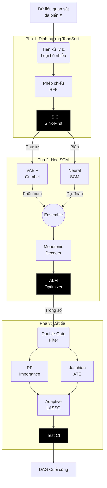
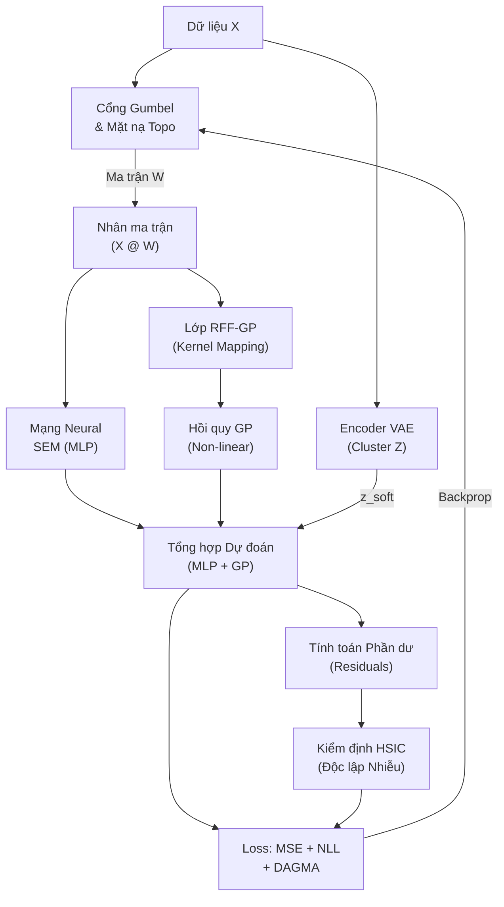
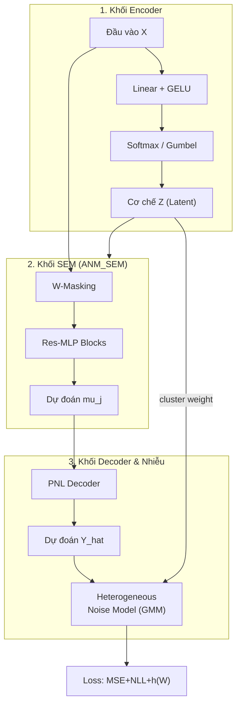
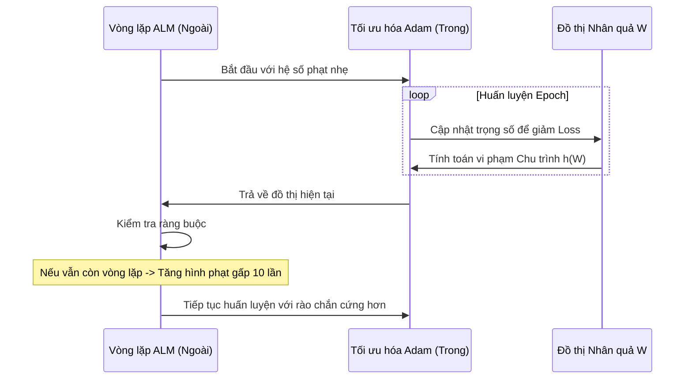
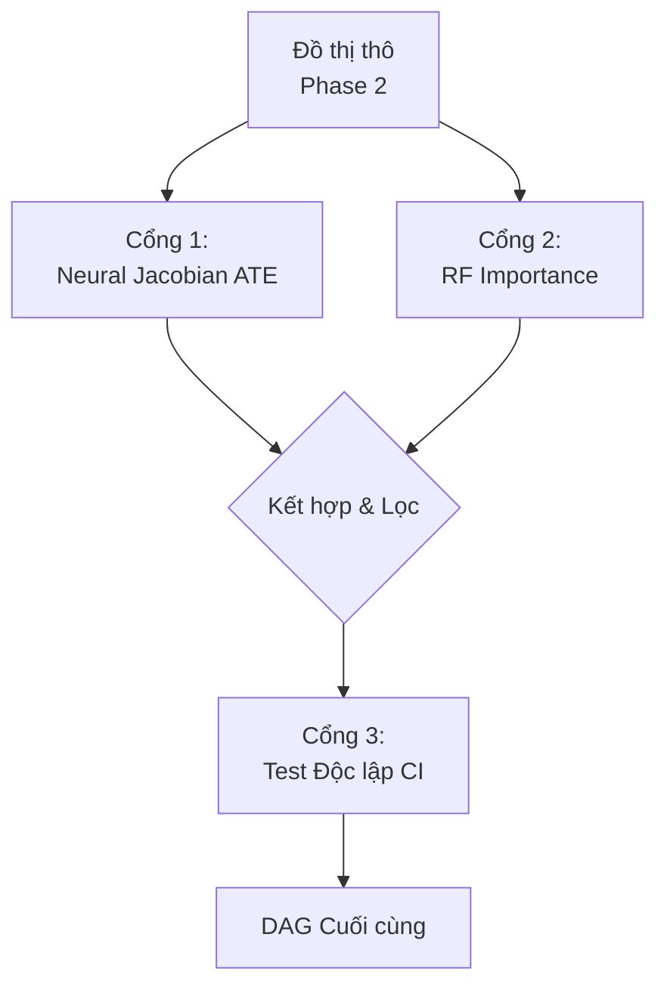

# CHƯƠNG 3: MÔ HÌNH DEEP ADDITIVE NOISE MODEL (DeepANM)

Chương này trình bày chi tiết về kiến trúc, tư tưởng thiết kế và thuật toán vận hành của hệ thống **DeepANM (Deep Additive Noise Model)**. Đây là một khung làm việc (framework) học máy nhân quả hiện đại, được xây dựng trên sự giao thoa giữa toán học tối ưu liên tục, lý thuyết kernel và mạng neural sâu. DeepANM không chỉ nhằm mục đích tìm ra các mối liên hệ thống kê thông thường mà tập trung vào việc khôi phục "bản đồ kiến trúc" (Ground Truth DAG) từ dữ liệu quan sát thô, ngay cả khi dữ liệu đó bị bóp méo bởi các yếu từ phi tuyến và nhiễu phức tạp.

## 3.1 Triết lý Thiết kế: Hệ thống 3 Pha Tương hỗ

Trong lĩnh vực Khám phá Nhân quả (Causal Discovery), thách thức lớn nhất nằm ở tính chất **NP-Hard** của việc tìm kiếm trong không gian các đồ thị có hướng không chu trình (DAG). Với $d$ biến số, số lượng đồ thị khả thi tăng trưởng theo hàm mũ, khiến các phương pháp duyệt cạn trở nên bất khả thi. Hơn nữa, các mô hình truyền thống thường giả định quan hệ tuyến tính hoặc nhiễu Gaussian - những giả định hiếm khi tồn tại trong dữ liệu thực tế như y sinh hay tài chính.

DeepANM giải quyết vấn đề này bằng một chiến lược "chia để trị" thông qua lộ trình 3 pha chuyên biệt, tạo nên một hệ thống phòng thủ đa tầng nhằm đảm bảo tính toàn vẹn của đồ thị:

<b>Hình 3.1: Kiến trúc luồng hệ thống 3 pha của DeepANM</b>

### 3.1.1 Tại sao cần 3 pha?

Việc gộp chung tất cả các nhiệm vụ (học hàm phi tuyến, tìm thứ tự, và lọc cạnh) vào một mạng neural duy nhất thường dẫn đến hiện tượng "quá tải tối ưu". Mạng neural sẽ ưu tiên giảm sai số dự đoán (MSE) bằng cách tạo ra các kết nối chằng chịt, dẫn đến việc vi phạm nghiêm trọng các ràng buộc về tính không chu trình (Acyclicity). 

1.  **Pha 1 (Bản đồ chiến lược):** Thay vì tìm kiếm mù quáng, chúng ta xác định trước một "hướng dòng chảy" (Topological Order). Điều này thu hẹp không gian tìm kiếm từ vô hạn xuống một miền khả thi, giúp Pha 2 không bị lạc lối trong các vòng lặp vô nghĩa.
2.  **Pha 2 (Động cơ học tập):** Khi đã có hướng đi, Pha 2 tập trung vào việc mô hình hóa các hàm nhân quả phức tạp bằng sức mạnh của MLP và GP (Gaussian Process), đồng thời dùng thuật toán tối ưu tiên tiến để ép đồ thị về dạng DAG.
3.  **Pha 3 (Bộ lọc tinh nhuệ):** Các phương pháp tối ưu liên tục thường để lại các "cạnh bóng ma" (trọng số nhỏ nhưng không bằng 0). Pha 3 đóng vai trò là chốt chặn cuối cùng, sử dụng kiểm định độc lập và lý thuyết can thiệp để loại bỏ hoàn toàn các liên kết gián tiếp hay nhiễu thống kê.

## 3.2 Pha 1: Chuẩn hóa & Định hướng Topological (TopoSort)

Đây là pha đặt nền móng, đảm bảo dữ liệu đầu vào sạch và có một trật tự ưu tiên nhất định.

### 3.2.1 Xử lý Dữ liệu Thực tế: Đối mặt với Outliers và Heteroscedasticity

Dữ liệu y sinh (như tập Sachs) hay dữ liệu kinh tế thường chứa những biến số có thang đo cực kỳ chênh lệch. Một protein có thể có nồng độ hàng ngàn đơn vị, trong khi một chất dẫn truyền thần kinh chỉ có vài đơn vị. Nếu đưa trực tiếp vào mạng neural, các biến có thang đo lớn sẽ "nuốt chửng" tín hiệu của các biến nhỏ.

Hệ thống DeepANM sử dụng bộ đôi công cụ tiên tiến:
*   **Quantile Normalization:** Thay vì chỉ chuẩn hóa trung bình (Z-score), chúng ta ép dữ liệu về phân phối Gaussian chuẩn. Điều này giúp loại bỏ các hình dạng phân phối kỳ dị, tạo ra một môi trường "công bằng" cho việc tính toán độ độc lập sau này.
*   **Isolation Forest:** Đây là một thuật toán dựa trên cây quyết định để phát hiện ngoại lệ. Những điểm dữ liệu quá khác biệt (outliers) sẽ bị loại bỏ sớm để không làm chệch hướng gradient trong quá trình huấn luyện nơ-ron.

### 3.2.2 Lý thuyết Kernel và Chỉ số HSIC (Hilbert-Schmidt Independence Criterion)

Để tìm thứ tự nhân quả mà không giả định hàm tuyến tính, DeepANM dựa vào tính chất **Bất đối xứng của nhiễu** trong mô hình ANM. Trong một quan hệ $X \to Y$ phi tuyến, nhiễu của mô hình xuôi thường độc lập với nguyên nhân, nhưng nhiễu của mô hình ngược lại bị phụ thuộc.

Để đo lường độ độc lập này một cách mạnh mẽ nhất, chúng ta sử dụng **HSIC**. Khác với tương quan Pearson chỉ đo được quan hệ tuyến tính, HSIC có khả năng phát hiện mọi dạng phụ thuộc phi tuyến bằng cách ánh xạ dữ liệu vào không gian đặc trưng tái tạo (RKHS) vô hạn chiều.

Tuy nhiên, tính toán HSIC gốc có độ phức tạp $O(N^2)$, quá chậm cho dữ liệu lớn. DeepANM triển khai **Random Fourier Features (RFF)** dựa trên định lý Bochner để xấp xỉ kernel Gaussian. Kỹ thuật này chuyển đổi bài toán kernel phức tạp thành các phép nhân ma trận tuyến tính, giúp tốc độ tính toán tăng gấp hàng chục lần nhưng vẫn giữ được độ chính xác cao.

### 3.2.3 Thuật toán Greedy Sink-First Ordering

Thuật toán này vận hành theo triết lý "bóc vỏ hành":
1.  Chúng ta bắt đầu bằng việc tìm kiếm nút **Sink** (nút kết quả cuối cùng, không gây ra cái gì khác). 
2.  Một nút là Sink nếu khi ta hồi quy nó theo tất cả các nút còn lại, phần dư thu được độc lập nhất với các biến cha (đo bằng HSIC).
3.  Sau khi tìm được Sink, ta loại bỏ nó và lặp lại quy trình cho các biến còn lại.

Kết quả thu được là một thứ tự Topological $\pi = [X_1, X_2, \dots, X_d]$. Đây là một ưu thế cực lớn, vì nó đảm bảo rằng trong Pha 2, chúng ta chỉ cần tìm kiếm các cạnh $X_i \to X_j$ với $i < j$, loại bỏ hoàn toàn khả năng phát sinh chu trình ngay từ cấp độ kiến trúc.

## 3.3 Pha 2: Cỗ máy Lõi Nhân quả (Deep Neural SCM Fitter - GPPOMC)

Sau khi Pha 1 cung cấp một thứ tự Topological sơ bộ, nhiệm vụ của Pha 2 là thực hiện phép "khớp" (fitting) dữ liệu vào các phương trình cấu trúc. Đây là giai đoạn tốn kém tài nguyên nhất, nơi DeepANM sử dụng toàn bộ sức mạnh của mạng neural để học các hàm $f_j$ phi tuyến và ma trận kề $W$.

Điểm đột phá của DeepANM so với các mô hình như NOTEARS hay DAGMA truyền thống là kiến trúc **GPPOMC** (Gaussian Process Proxy with Objective Mechanism Clustering).

<b>Hình 3.2: Sơ đồ kiến trúc kỹ thuật chi tiết của khối GPPOM-HSIC</b>

### 3.3.1 Kiến trúc Module: Sự phối hợp giữa MLP và cơ chế phân cụm

Hệ thống được thiết kế dưới dạng các module độc lập nhưng tương tác chặt chẽ:

1.  **ANM_SEM (Mô hình phương trình cấu trúc):** 
    Đây là thành phần cốt lõi của mạng neural. Thay vì dùng một mạng fully-connected thông thường, DeepANM sử dụng kiến trúc **Residual MLP**. Mỗi biến số trong hệ thống có một "kênh" riêng để học các tác động từ biến cha. Kết nối thặng dư (Residual connections) giúp Gradient chảy mượt mà hơn, cho phép mô hình học được những tương quan tinh vi mà không bị hiện tượng tiêu biến gradient.

2.  **Encoder VAE & Gumbel-Softmax (Phát hiện cơ chế ẩn):**
    Trong dữ liệu thực tế, quan hệ nhân quả không phải lúc nào cũng tĩnh. Một loại thuốc có thể có tác động dương lên nhóm người này nhưng lại vô thưởng vô phạt với nhóm người khác (Heterogeneity). 
    Module Encoder đóng vai trò như một bộ phân loại thông minh, tự động gán nhãn mỗi dòng dữ liệu vào một "cụm cơ chế" (Cluster). Để có thể tính toán đạo hàm qua các quyết định rời rạc này, chúng ta sử dụng **Gumbel-Softmax Trick**. Kỹ thuật này cho phép mạng neural "thử nghiệm" các cơ chế khác nhau một cách mềm mại (soft) trong quá trình huấn luyện và dần dần định hình vào một cơ chế cứng (hard) khi hội tụ.

3.  **Monotonic Decoder (Đảm bảo tính khả nghịch):**
    Theo lý thuyết mô hình hậu phi tuyến (PNL), nhiễu có thể bị bóp méo qua một hàm $g$. Để khôi phục lại nhiễu gốc (nhằm kiểm tra độ độc lập), DeepANM thiết kế một Decoder đơn điệu (Monotonic). Việc sử dụng hàm Softplus cho các trọng số đảm bảo rằng hàm biến đổi luôn đồng biến, cho phép chúng ta tính toán hàm nghịch đảo một cách chính xác và ổn định.

<b>Hình 3.3: Chi tiết các thành phần lớp ẩn bên trong mạng Neural MLP</b>

### 3.3.2 Tối ưu hóa DAGMA và Rào chắn Acyclicity

Vấn đề khó khăn nhất trong việc dùng mạng neural học DAG là làm sao ép ma trận $W$ không tạo ra chu trình. DeepANM tích hợp thuật toán **DAGMA** (Bello et al., 2022). 

Thay vì sử dụng vết của hàm mũ (như NOTEARS) vốn rất tốn kém và không ổn định về mặt số học khi đồ thị lớn, DAGMA sử dụng một hàm rào chắn log-det:
$$ h_{DAGMA}(W) = - \log \det(\mathbf{I} - \alpha W \circ W) $$
Hàm này tiến tới vô cực khi đồ thị bắt đầu có dấu hiệu vòng lặp, đóng vai trò như một "bức tường lửa" ngăn chặn các cấu trúc phi nhân quả. Ưu điểm của nó là tính toán cực nhanh và độ chính xác cao hơn hẳn các phương pháp cũ.

### 3.3.3 Động lực học ALM (Augmented Lagrangian Method)

Để cân bằng giữa việc "học đúng dữ liệu" và "đồ thị phải là DAG", chúng ta không thể chỉ dùng một hàm loss cố định. DeepANM triển khai vòng lặp **ALM** gồm hai giai đoạn:

*   **Vòng trong (Inner Loop):** Sử dụng bộ tối ưu Adam để giảm thiểu sai số dự đoán và các chỉ số HSIC.
*   **Vòng ngoài (Outer Loop):** Quan sát độ vi phạm chu trình $h(W)$. Nếu đồ thị vẫn còn vòng lặp, hệ số phạt $\rho$ sẽ được nhân lên gấp nhiều lần.

Quá trình này giống như việc "siết chặt vòng vây". Ban đầu, mô hình được tự do khám phá các cạnh. Càng về cuối, hình phạt chu trình càng lớn, buộc mạng neural phải hy sinh những kết nối yếu nhất để đảm bảo cấu trúc DAG hoàn hảo.

<b>Hình 3.4: Biểu đồ trình tự động lực học của thuật toán ALM</b>

Kỹ thuật ALM đẩy hệ số cấm chập mạch to lên theo thời gian. Giai đoạn đầu, mô hình được tự do khám phá các mối quan hệ. Nhưng dần về sau, khi hình phạt xấp xỉ vô cực, hệ thống mạng nơ-ron buộc phải tự cắt bỏ những mắt xích yếu nhất để triệt tiêu các vòng lặp, chỉ giữ lại những đường dây nhân quả cốt lõi nhất.

---

## 3.4 Pha 3: Lọc Giao Tiếp Nhảm Bằng Cơ chế Hỗn Hợp Đồng Quy (Edge Post-Pruning Gate)

Mặc dù Pha 2 đã cung cấp một ma trận trọng số $W$ khá sát với thực tế, nhưng các phương pháp tối ưu liên tục luôn tồn tại một nhược điểm cố hữu: các cạnh không nhân quả thường không triệt tiêu hoàn toàn về 0 mà dừng lại ở một giá trị rất nhỏ (ví dụ: $10^{-3}$). Điều này tạo ra các "cạnh bóng ma" làm nhiễu đồ thị cuối cùng.

DeepANM không sử dụng một ngưỡng cắt cố định (Hard threshold) vì tính chất của mỗi biến là khác nhau. Thay vào đó, chúng ta triển khai hệ thống **Double-Gate Filter** để "thẩm định" từng cạnh một cách độc lập.

<b>Hình 3.5: Cơ chế lọc cạnh nhiễu qua hệ thống Double-Gate (Pha 3)</b>

### 3.4.1 Màng Lọc Cơ Sở Jacobian (Neural ATE Score)

Dựa trên lý thuyết can thiệp (Intervention) của Judea Pearl, một cạnh $X_i \to X_j$ thực sự tồn tại nếu việc thay đổi $X_i$ kéo theo sự thay đổi của $X_j$. Trong mạng neural, chúng ta tính toán chỉ số này thông qua ma trận **Jacobian**:
$$ \text{ATE}_{ij} = \mathbb{E} \left| \frac{\partial \hat{X}_j}{\partial X_i} \right| $$
Nếu đạo hàm riêng này xấp xỉ 0 trên toàn bộ tập dữ liệu, điều đó chứng tỏ biến $X_j$ hoàn toàn không nhạy cảm với sự biến động của $X_i$. Cạnh đó sẽ bị loại bỏ bất kể trọng số $W_{ij}$ lớn bao nhiêu.

### 3.4.2 Màng Lọc Permutation Importance (Random Forest Ensemble)

Để đảm bảo tính khách quan, DeepANM sử dụng thêm một "quan tòa" độc lập: **Random Forest**. 
Chúng ta thực hiện hoán vị (shuffle) các giá trị của biến cha tiềm năng. Nếu sau khi xáo trộn, sai số dự đoán của biến con không tăng đáng kể, chứng tỏ biến cha đó không đóng góp thông tin thực chất vào cơ chế của biến con. 

Việc kết hợp cả Neural Jacobian (nhạy với đạo hàm) và Random Forest (nhạy với cấu trúc cây) tạo nên một màng lọc cực kỳ bền vững trước nhiễu.

### 3.4.3 Hậu kiểm Độc lập Điều kiện (Conditional Independence Test)

Bước cuối cùng là sử dụng các kiểm định thống kê truyền thống để gỡ bỏ các liên kết gián tiếp (ví dụ: $A \to B \to C$ thì không nên có cạnh $A \to C$). 
Hệ thống sử dụng **Partial Correlation** phối hợp với các mô hình hồi quy để tính toán p-value. Chỉ những cạnh vượt qua được ngưỡng ý nghĩa thống kê ($p < 0.05$) mới được ghi nhận vào đồ thị DAG cuối cùng.

## 3.5 Các Giả định và Tính Diễn dịch của Mô Hình

Thành công của DeepANM dựa trên việc thỏa mãn các giả định toán học khắt khe của lý thuyết nhân quả:

1.  **Giả định ANM (Additive Noise Model):** Chúng ta giả định rằng kết quả được tạo ra bởi hàm của nguyên nhân cộng với một nhiễu độc lập. DeepANM mở rộng điều này bằng cách cho phép nhiễu đi qua một hàm hậu phi tuyến (PNL), khiến nó trở nên tổng quát hơn hầu hết các mô hình hiện nay.
2.  **Tính Khả định danh (Identifiability):** Theo định lý của Peters và cộng sự (2014), trong hầu hết các trường hợp phi tuyến, hướng nhân quả $X \to Y$ có thể được phân biệt hoàn toàn với $Y \to X$ nhờ vào dấu vết của nhiễu. Kiến trúc của DeepANM được thiết kế để khai thác tối đa dấu vết này thông qua chỉ số HSIC.
3.  **Tính Tin cậy (Faithfulness):** Chúng ta giả định rằng mọi sự độc lập quan sát được trong dữ liệu đều phản ánh cấu trúc của đồ thị, không phải do sự triệt tiêu ngẫu nhiên của các tham số.

## 3.6 Tiểu kết chương

Chương 3 đã trình bày một cách hệ thống về "linh hồn" của nghiên cứu này: Mô hình DeepANM 3 Pha. 

Từ khâu **TopoSort** sử dụng lý thuyết Kernel để định hướng, đến lõi **GPPOMC** sử dụng mạng neural sâu và rào chắn **DAGMA** để học cơ chế, và cuối cùng là bộ lọc **Double-Gate** để tinh chỉnh đồ thị. Sự phối hợp nhịp nhàng giữa các thành phần này giúp DeepANM vượt qua được những hạn chế kinh điển của các phương pháp truyền thống: tính phi tuyến, nhiễu không đồng nhất và độ phức tạp tính toán.

Kiến trúc này không chỉ mang tính lý thuyết mà được thiết kế để tối ưu cho việc triển khai trên các hệ thống tính toán hiệu năng cao (GPU), sẵn sàng cho việc giải quyết các bài toán nhân quả quy mô lớn trong thực tế. Các kết quả đo đạc và so sánh cụ thể sẽ được trình bày chi tiết trong Chương 4.
