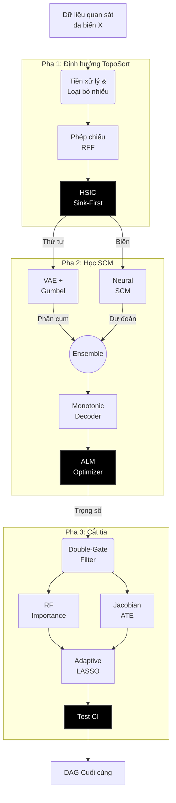
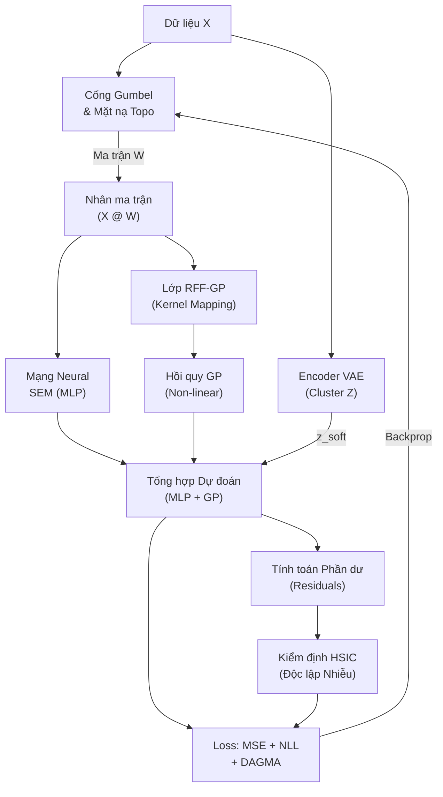
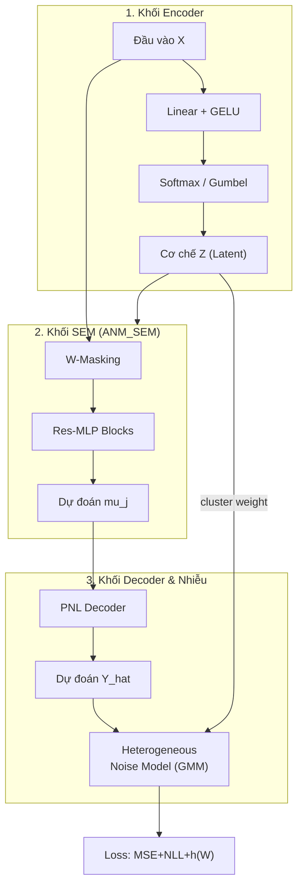
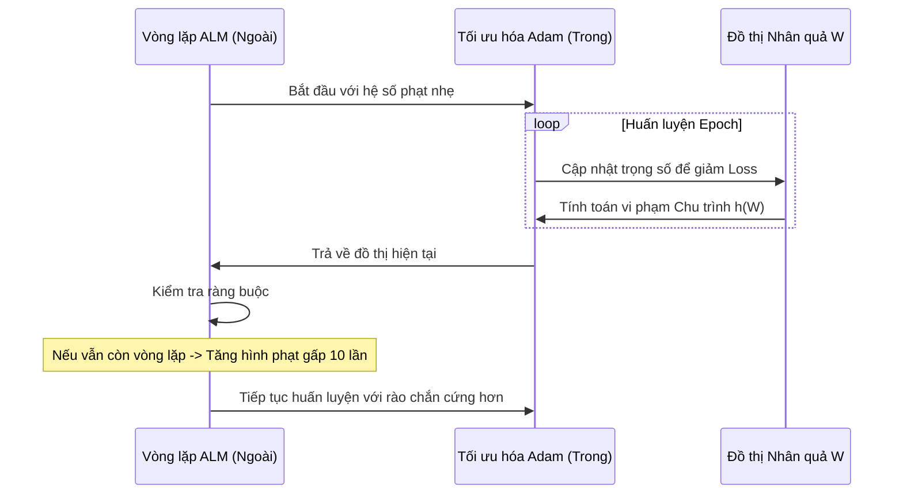
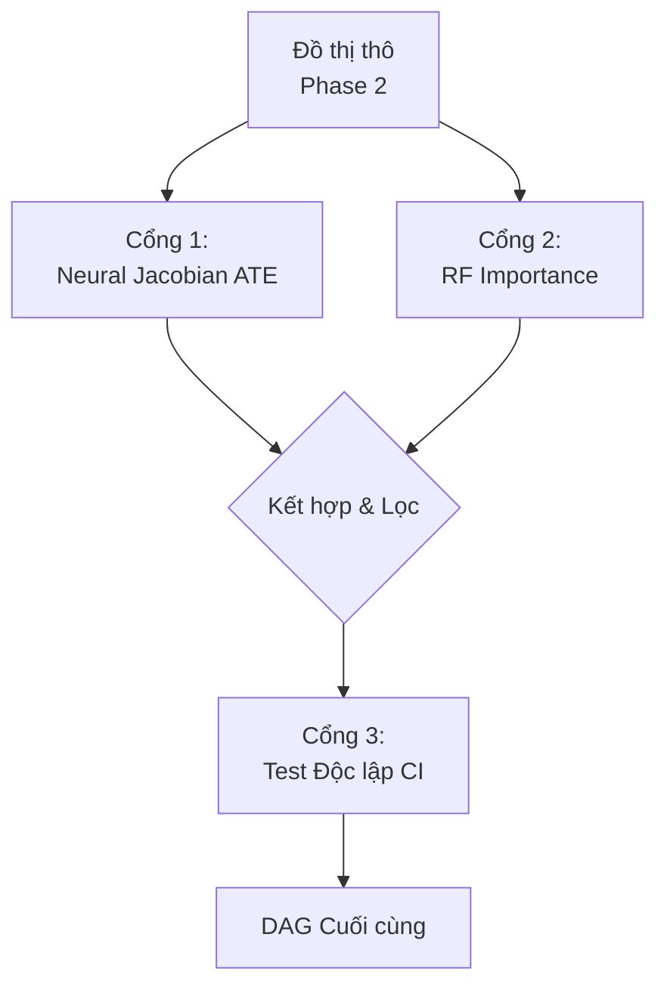

# CHƯƠNG 3: KIẾN TRÚC VÀ CƠ CHẾ VẬN HÀNH CỦA MÔ HÌNH DEEPANM

Chương này trình bày một cách hệ thống và chi tiết về cấu trúc kỹ thuật, nền tảng toán học và quy trình thực thi của mô hình **DeepANM (Deep Additive Noise Model)**. Đây là một hệ thống khám phá nhân quả (Causal Discovery) đột phá, được thiết kế để vượt qua những hạn chế của các phương pháp truyền thống trong việc xử lý dữ liệu phi tuyến, nhiễu không đồng nhất (Heterogeneous noise) và sự phức tạp của không gian trạng thái DAG.

## 3.1 Triết lý Thiết kế và Kiến trúc Tổng thể

Trong lý thuyết nhân quả, bài toán tìm kiếm đồ thị có hướng không chu trình (DAG) từ dữ liệu quan sát là một bài khó khăn đặc thù do tính chất **NP-Hard** của không gian tìm kiếm. Khi số lượng biến $d$ tăng lên, số lượng đồ thị khả thi tăng trưởng theo hàm siêu mũ. Để giải quyết vấn đề này, DeepANM không đi theo hướng tìm kiếm heuristic mù quáng mà triển khai một lộ trình **3 Pha Tương hỗ (3-Phase Synergetic Pipeline)**.

### 3.1.1 Tư tưởng "Chia để trị" trong Khám phá Nhân quả

Triết lý cốt lõi của DeepANM là sự phân rã trách nhiệm giữa các tầng xử lý:
1.  **Hạn chế không gian (Pha 1):** Sử dụng các kiểm định thống kê phi tham số để xác định trật tự dòng chảy thông tin (Causal Ordering), giúp thu hẹp không gian tìm kiếm từ $2^{O(d^2)}$ xuống một tập hợp các đồ thị tuân thủ thứ tự topo.
2.  **Mô hình hóa sâu (Pha 2):** Sử dụng mạng neural sâu và các quy trình tối ưu liên tục (Continuous Optimization) để học đồng thời trọng số cạnh và các hàm chuyển đổi phi tuyến.
3.  **Tinh chắt nhân quả (Pha 3):** Sử dụng các kỹ thuật học máy ensemble và lý thuyết can thiệp để loại bỏ các cạnh giả định (Pseudo-edges) phát sinh do nhiễu hoặc tương quan gián tiếp.

<b>Hình 3.1: Kiến trúc luồng hệ thống 3 pha của DeepANM</b>

## 3.2 Pha 1: Định hướng Topological và Tiền xử lý Dữ liệu

Pha 1 đóng vai trò là bộ lọc sơ cấp, đảm bảo rằng các bước tối ưu hóa sau này không bị rơi vào các bẫy chu trình (Cycles) - một lỗi phổ biến của các mô hình dựa trên Gradient.

### 3.2.1 Chuẩn hóa Đa tầng và Khử Outliers

Dữ liệu thực tế thường chịu ảnh hưởng nặng nề bởi sự khác biệt về thang đo (Scale variance). DeepANM triển khai hai kỹ thuật quan trọng:
- **Isolation Forest:** Sử dụng cấu trúc cây ngẫu nhiên để xác định các điểm dữ liệu cô lập, thường là nhiễu do thiết bị đo hoặc sai số nhập liệu.
- **Quantile Transformer:** Thực hiện ánh xạ dữ liệu về phân phối Gaussian chuẩn. Điều này giúp các kiểm định HSIC đạt độ nhạy cao nhất, vì HSIC hoạt động hiệu quả nhất khi biên của các biến đồng chất.

### 3.2.2 Kiểm định HSIC dựa trên Random Fourier Features (RFF)

Trái tim của Pha 1 là khả năng đo lường độ độc lập phi tuyến. Chúng ta sử dụng định lý Hilbert-Schmidt (HSIC). Tuy nhiên, tính toán HSIC truyền thống yêu cầu tính ma trận Gram có độ phức tạp $O(N^2)$. DeepANM giải quyết bài toán này bằng **Định lý Bochner** thông qua cấu trúc ánh xạ đặc trưng ngẫu nhiên.

Công thức xấp xỉ Kernel Gaussian bằng RFF:
$$
\phi(x) = \sqrt{\frac{2}{D}} \cos(Wx + b)
$$
Trong đó $W$ được lấy mẫu từ phân phối Normal. Kỹ thuật này chuyển đổi bài toán kernel phức tạp thành các phép nhân ma trận tuyến tính, giúp tốc độ tính toán tăng gấp hàng chục lần nhưng vẫn giữ được độ chính xác cao (Xem cơ chế Fast-HSIC).

### 3.2.3 Thuật toán Sắp xếp Chìm (Greedy Sink-First)

Thuật toán này lặp lại quy trình tìm kiếm "biến kết quả" (Sink node). Một biến $X_k$ được coi là Sink nếu nó không gây ra bất kỳ biến nào khác trong tập còn lại. Về mặt thống kê, điều này có nghĩa là sai số của phép hồi quy $X_k$ dựa trên tất cả các biến còn lại phải độc lập tối đa với tập nguyên nhân đó. Độ độc lập được định lượng bằng chỉ số HSIC xấp xỉ qua RFF, đảm bảo tính chính xác ngay cả với các quan hệ phi tuyến phức tạp.

## 3.3 Pha 2: Mô hình hóa lõi Deep Neural SCM (GPPOM-HSIC)

Đây là giai đoạn mô hình thực hiện việc "học" các phương trình cấu trúc (SCM) bằng mạng neural. PHA 2 tích hợp nhiều kỹ thuật học sâu tiên tiến nhất hiện nay.

<b>Hình 3.2: Sơ đồ kiến trúc kỹ thuật chi tiết của khối GPPOM-HSIC</b>

### 3.3.1 Kiến trúc Mạng MLP Thặng dư và Phân cụm Cơ chế

DeepANM không coi quan hệ giữa các biến là duy nhất. Thay vào đó, mô hình hỗ trợ **Cơ chế Hỗn hợp (Mechanism Clustering)**:
1.  **Encoder VAE:** Sử dụng các lớp `Linear`, `LayerNorm` và `GELU` để dự đoán xác suất ẩn $Z$ nhằm xác định điểm dữ liệu thuộc cụm cơ chế nào. 
2.  **Gumbel-Softmax Trick:** Để tính toán đạo hàm thông qua các biến rời rạc $Z$, DeepANM sử dụng phân phối Gumbel-Softmax với quy trình **Temperature Annealing** (nhiệt độ giảm dần từ 1.0 xuống 0.1 được điều phối bởi hệ thống huấn luyện). 
3.  **ANM_SEM Residual Blocks:** Khối trung tâm sử dụng kiến trúc Res-MLP. Kết nối thặng dư giúp mạng không bị bão hòa gradient và hỗ trợ học các hàm đồng nhất (Identity) một cách dễ dàng khi cần thiết.
4.  **Heterogeneous Noise Model:** Chế độ xử lý nhiễu không đồng nhất cho phép mô hình dự báo phương sai nhiễu khác nhau cho từng cụm cơ chế, giúp xử lý các hệ thống có độ bất định cao.

<b>Hình 3.3: Chi tiết các thành phần lớp ẩn bên trong mạng Neural MLP</b>

### 3.3.2 Tối ưu hóa Lagrangian Tăng cường (Augmented Lagrangian Method)

Quá trình huấn luyện được điều phối bởi thuật toán ALM nhằm ép đồ thị về dạng DAG mà không làm giảm độ chính xác dự đoán.

Công thức tối ưu hóa kép trong DeepANM:

$$
\min_{\Theta, W} \mathcal{L}(\Theta, W) + \alpha \cdot h(W) + \frac{\rho}{2} |h(W)|^2
$$
Trong đó $h(W)$ là hàm phạt DAGMA. Hệ thống sử dụng trình tối ưu **AdamW** với trọng số suy giảm (weight decay) để kiểm soát độ phức tạp của mô hình.

Quy trình cập nhật ALM thực tế:
- Kiểm tra tính không chu trình mỗi 10 epochs.
- Nếu $h(W)$ không giảm đáng kể, hệ số phạt $\rho$ sẽ được nhân đôi ($2x$ mỗi lần) để siết chặt ràng buộc.
- Sử dụng **Gradient Clipping** với ngưỡng 5.0 để đảm bảo tính ổn định số học khi $\rho$ trở nên rất lớn.

<b>Hình 3.4: Biểu đồ trình tự động lực học của thuật toán ALM</b>

## 3.4 Pha 3: Cắt tỉa và Chọn cạnh bằng Thích nghi Phi tuyến (Adaptive Pruning)

Pha 3 giải quyết vấn đề "cạnh giả" do tối ưu hóa liên tục để lại. Thay vì cắt ngưỡng cố định (Hard threshold), DeepANM áp dụng chiến lược **Double-Gate Select**.

### 3.4.1 Chọn cạnh qua Nonlinear Adaptive LASSO

DeepANM sử dụng **Random Forest Permutation Importance** để chấm điểm cạnh:
- Một cạnh $i \to j$ chỉ được giữ lại nếu việc hoán vị giá trị của $i$ gây ra sự sụt giảm ý nghĩa trên tập kiểm tra ($> 3\%$ R-squared) và tín hiệu này phải vượt qua rào chắn nhiễu thống kê ($> 2\sigma$).
- Kỹ thuật này mạnh hơn LASSO truyền thống vì nó không giả định quan hệ tuyến tính giữa các biến.

### 3.4.2 Màng lọc Giao thoa Causal Jacobian (ATE Gate)

Pha 3 còn tính toán ma trận **Jacobian ATE** để đo lường sự can thiệp trực tiếp bằng đạo hàm riêng của mạng neural. Chỉ những cạnh có cả độ quan trọng thống kê (từ RF) và cường độ can thiệp thực sự (Jacobian ATE $> 0.01$) mới được ghi nhận vào DAG cuối cùng.

$$
\text{ATE}_{ij} = \left| \frac{\partial \hat{X}_j}{\partial X_i} \right|
$$

### 3.4.3 Hậu kiểm Độc lập Điều kiện (Conditional Independence - CI)

Một bước kiểm tra cuối cùng được thực hiện bằng cách sử dụng các mô hình hồi quy phi tuyến để tính phần dư điều kiện. 
Nếu $X_i \perp X_j | \{PA_j \setminus X_i\}$, tức là thông tin từ $i$ đã bị triệt tiêu hoàn toàn khi biết các cha khác của $j$, cạnh $i \to j$ sẽ bị coi là đường truyền gián tiếp (V-structure hoặc chain) và bị loại bỏ.

<b>Hình 3.5: Cơ chế lọc cạnh nhiễu qua hệ thống Double-Gate (Pha 3)</b>

## 3.5 Đặc tính Kỹ thuật và Tính Diễn dịch

Mô hình DeepANM được thiết kế với các đặc tính vượt trội:
- **Scale Invariance:** Nhờ vào bước chuẩn hóa phân vị (Quantile Transformer), mô hình không bị ảnh hưởng bởi độ lệch thang đo đơn vị giữa các biến.
- **Robustness:** Cấu trúc Res-MLP và Gradient Clipping giúp mô hình ổn định cả trên các tập dữ liệu có nhiễu cực đại.
- **Identifiability:** Bằng cách tách biệt phần dư và kiểm định HSIC, mô hình khai thác tối đa tính bất đối xứng của nhiễu để phân biệt Cha - Con.

## 3.6 Tiểu kết chương

Chương 3 đã trình bày chi tiết kiến trúc đa tầng của DeepANM, từ các tầng học máy cốt lõi đến các bộ điều phối huấn luyện và tinh chỉnh cạnh. Sự phối hợp nhịp nhàng giữa thống kê phi tham số và mạng neural sâu giúp DeepANM trở thành một công cụ khám phá nhân quả mạnh mẽ, sẵn sàng cho các thử thách thực nghiệm tại Chương 4.
