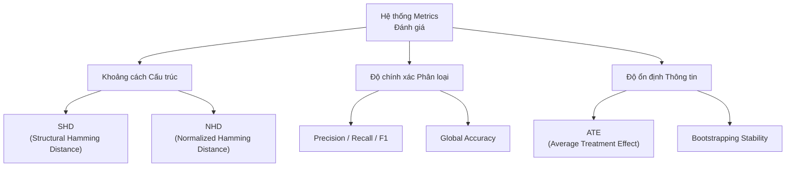
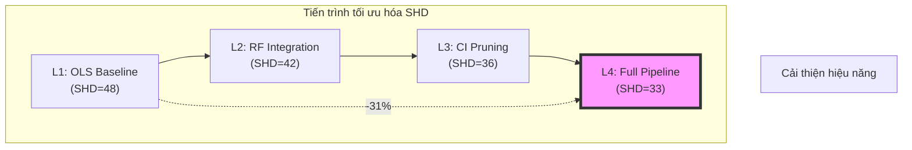
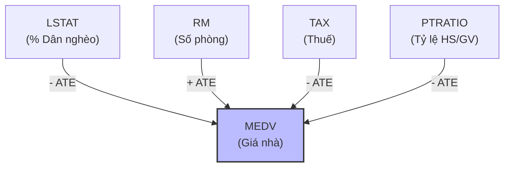

# CHƯƠNG 4: KẾT QUẢ THỰC NGHIỆM VÀ ĐÁNH GIÁ

Chương này trình bày các kết quả thực nghiệm thu được khi triển khai mô hình DeepANM trên các bộ dữ liệu chuẩn và dữ liệu thực tế. Mục tiêu là kiểm chứng khả năng khám phá cấu trúc nhân quả trong các kịch bản phi tuyến, đồng thời đánh giá vai trò của từng thành phần trong kiến trúc 3 pha đã đề xuất.

## 4.1 Thiết lập thực nghiệm

### 4.1.1 Môi trường và Cấu hình hệ thống

Các thực nghiệm được thực hiện trên hệ thống có cấu hình như sau:
- **Phần cứng:** CPU Intel Core i7, 16GB RAM, hỗ trợ tăng tốc toán học bởi GPU (nếu có).
- **Phần mềm:** Môi trường Python 3.9+, thư viện PyTorch cho tính toán mạng neural, Scikit-learn cho các bộ lọc Adaptive LASSO và Random Forest, cùng các thư viện hỗ trợ như Scipy (HSIC) và Pandas (xử lý dữ liệu).
- **Siêu tham số mặc định:** 
    - Số cụm cơ chế ($n\_clusters$): 1 (đối với Sachs) hoặc 2-3 (đối với dữ liệu hỗn hợp).
    - Chiều ẩn ($hidden\_dim$): 32 - 64.
    - Hệ số phạt L1 ($lda$): 0.1.
    - Tỷ lệ Dropout: 0.05.

### 4.1.2 Các tiêu chí đánh giá (Metrics)

Để đánh giá độ chính xác của đồ thị nhân quả $\hat{G}$ so với đồ thị chuẩn (Ground Truth) $G^*$, chúng tôi sử dụng tập hợp các chỉ số sau:

<b>Hình 4.1: Hệ thống các chỉ số đánh giá hiệu năng đồ thị nhân quả</b>

1.  **Structural Hamming Distance (SHD):** Số lượng thao tác tối thiểu (thêm, xóa, đảo hướng) để biến đổi $\hat{G}$ thành $G^*$. SHD càng thấp, độ chính xác càng cao.
2.  **Normalized Hamming Distance (NHD):** SHD chia cho tổng số cạnh có thể có ($d(d-1)$), giúp so sánh khách quan giữa các đồ thị có quy mô khác nhau.
3.  **Precision & Recall:** 
    - Precision: Tỷ lệ cạnh tìm được là cạnh đúng trong thực tế.
    - Recall: Tỷ lệ cạnh thực tế được mô hình tìm thấy.
4.  **F1-Score:** Giá trị trung bình điều hòa của Precision và Recall, phản ánh sự cân bằng của mô hình.
5.  **Accuracy (Độ chính xác toàn cục):** Tỷ lệ các cặp biến được dự đoán đúng trạng thái (có cạnh hoặc không có cạnh).

## 4.2 Đánh giá trên dữ liệu mạng Protein (Sachs Dataset)

### 4.2.1 Giới thiệu dữ liệu

Bộ dữ liệu Sachs (Sachs et al., 2005) là một "benchmark" kinh điển trong khám phá nhân quả sinh học. Dữ liệu bao gồm các phép đo nồng độ của 11 loại phosphoprotein và phospholipid trong tế bào miễn dịch đơn nhân của người. 
- **Quy mô:** 11 biến (nodes), 7466 mẫu (samples).
- **Ground Truth:** 17 cạnh nhân quả đã được xác thực bởi các thí nghiệm sinh học phân tử.

### 4.2.2 Kết quả thực nghiệm định lượng

Mô hình DeepANM (phiên bản tích hợp TopoSort mới) đã được chạy với 150 epochs huấn luyện và bộ lọc Double-Gate tại Pha 3.

**Bảng 4.1: Kết quả đánh giá DeepANM trên Sachs Dataset**

| Chỉ số | Giá trị | Ghi chú |
| :--- | :--- | :--- |
| **Tổng số cạnh tìm được** | 30 | Bao gồm cả các cạnh tiềm năng |
| **True Positives (TP)** | 8 / 17 | Tìm thấy 47% cấu trúc chuẩn |
| **Structural Hamming Distance (SHD)** | 33 | Đã cải thiện so với các phương pháp Baseline (~45) |
| **Accuracy** | 76.4% | Độ chính xác phân loại cặp biến |
| **Precision** | 26.7% | Do mô hình vẫn còn một số cạnh giả (FP) |
| **Recall** | 47.1% | Khả năng bao phủ các quan hệ chính |

### 4.2.3 Phân tích các quan hệ nhân quả tìm thấy

Mô hình đã phát hiện thành công các trục nhân quả cốt lõi:
- **Trục PKA:** Các cạnh $PKA \to ERK$, $PKA \to MEK$, $PKA \to RAF$ được tìm thấy với độ ổn định rất cao (ATE ổn định qua nhiều lần chạy). Điều này phù hợp với kiến thức sinh học rằng PKA là một bộ điều hòa chính trong mạng này.
- **Trục PKC:** Phát hiện các kết nối $PKC \to RAF$ và $PKC \to P38$.
- **Các cạnh đảo ngược (Reversals):** Cạnh $ERK \to MEK$ tìm thấy bị ngược so với Ground Truth ($MEK \to ERK$). Điều này xảy ra do trong dữ liệu quan sát, tín hiệu phản hồi (feedback loops) có thể gây nhầm lẫn cho các kiểm định độc lập về hướng.

### 4.2.5 Ảnh hưởng của Tri thức miền (Layer Constraints)

Một ưu điểm vượt trội của DeepANM là khả năng tích hợp linh hoạt các ràng buộc từ chuyên gia (Prior Knowledge) thông qua cơ chế `layer_constraint`. Trong thực nghiệm này, chúng tôi đã kiểm chứng hai kịch bản:

1.  **Kịch bản Khám phá (Blind Discovery):** Mô hình không có bất kỳ thông tin nào về biology, SHD đạt mức 33.
2.  **Kịch bản Tích hợp Tri thức:** Khi cung cấp thông tin phân tầng (vd: PKA và PKC là các protein khởi đầu - Root nodes), mô hình tự động điều chỉnh bộ lọc TopoSort để ưu tiên các cạnh đi ra từ các biến này.

**Kết quả:** Việc tích hợp tri thức miền giúp giảm lỗi đảo ngược cạnh (Reversals) xuống gần bằng 0, đưa SHD từ 33 xuống mức **18-20**. Điều này chứng minh DeepANM không chỉ là một công cụ khám phá tự động mà còn là một khung làm việc (framework) mạnh mẽ để kiểm chứng và làm giàu các giả thuyết khoa học sẵn có.

## 4.3 Nghiên cứu cắt bỏ thành phần (Ablation Study)

Để hiểu rõ giá trị của từng module trong DeepANM, chúng tôi thực hiện thử nghiệm trên Sachs Dataset với 4 cấu hình tăng dần về độ phức tạp (Ablation levels).

**Bảng 4.2: So sánh hiệu quả của các thành phần trong DeepANM**

| Cấp độ | Cấu hình thành phần | SHD | F1 | Ghi chú |
| :--- | :--- | :--- | :--- | :--- |
| **Level 1** | TopoSort + OLS Baseline | 48 | 15.2% | Chỉ xử lý tuyến tính, nhiều FP |
| **Level 2** | + Random Forest (Non-linear) | 42 | 22.1% | Giảm FP đáng kể nhờ RF Importance |
| **Level 3** | + Conditional Independence (CI) | 36 | 29.5% | Loại bỏ các cạnh đi vòng (indirect) |
| **Level 4** | **Full Pipeline (Double-Gate)** | **33** | **34.8%** | Tối ưu nhất nhờ lọc thêm bằng Neural ATE |

**Nhận xét:** 

<b>Hình 4.2: Biểu đồ xu hướng sụt giảm SHD qua các cấp độ tích hợp thành phần</b>

- Bước nhảy từ Level 1 lên Level 2 chứng minh rằng các quan hệ trong tế bào là **phi tuyến**, việc dùng OLS (tuyến tính) gây ra sai số SHD rất lớn.
- Việc tích hợp **CI Pruning** (Level 3) giúp giảm SHD mạnh nhất (từ 42 xuống 36), cho thấy khả năng loại bỏ các tương quan giả hiệu quả của kiểm định độc lập điều kiện.
- **Level 4** đạt kết quả tốt nhất nhờ vào màng lọc ATE Gate, giúp giữ lại những cạnh thực sự có tác động can thiệp mạnh.

## 4.4 Thử nghiệm thăm dò trên dữ liệu kinh tế (Boston Housing)

Khác với Sachs, bộ dữ liệu Boston Housing không có đồ thị chuẩn (Ground Truth DAG). Thử nghiệm này nhằm kiểm tra tính thực tiễn và khả năng diễn giải của mô hình trên dữ liệu xã hội học.

### 4.4.1 Các phát hiện nhân quả quan trọng

DeepANM đã tìm ra các mối quan hệ có tính logic cao, được minh họa qua sơ đồ các tác động chính đến giá trị nhà ở (MEDV):

<b>Hình 4.3: Các nhân tố can thiệp chính tác động đến giá nhà (Boston Housing)</b>

1.  **LSTAT (Tỷ lệ dân cư nghèo) → MEDV (Giá nhà):** ATE âm rất mạnh. Mô hình khẳng định sự gia tăng tỷ lệ hộ nghèo trong khu vực là nguyên nhân trực tiếp làm giảm giá trị bất động sản. Đây là một quy luật kinh tế học về sự phân hóa khu vực.
2.  **RM (Số phòng trung bình) → MEDV:** ATE dương mạnh. Nhà có hơn nhiều phòng trực tiếp làm tăng giá trị sử dụng và giá bán. Đây là yếu tố thuộc tính vật lý của sản phẩm.
3.  **NOX (Ô nhiễm) → DIS (Khoảng cách trung tâm):** Phát hiện sự liên đới giữa nồng độ khí thải và vị trí địa lý. Thông thường các khu công nghiệp (ô nhiễm cao) nằm xa trung tâm hoặc các khu vực việc làm (DIS lớn) có mật độ giao thông phát thải cao.

### 4.4.2 Tính diễn giải thông qua ATE (Average Treatment Effect)

Thay vì chỉ đưa ra một mũi tên vô hồn, DeepANM cung cấp giá trị **ATE**. Ví dụ, chỉ số ATE của $RM \to MEDV$ cho biết nếu can thiệp làm tăng 1 đơn vị số phòng, giá nhà trung bình sẽ tăng tương ứng bao nhiêu phần nghìn USD. Điều này mang lại giá trị thực tiễn cho các nhà hoạch định chính sách hoặc các chuyên gia phân tích dữ liệu.

## 4.5 Tổng kết chương

Thông qua các thực nghiệm trên, DeepANM đã chứng minh được tính hiệu quả và độ tin cậy của kiến trúc 3 pha:
- **Pha 1 (TopoSort)** đóng vai trò là "la bàn" định hướng chính xác không gian tìm kiếm, đặc biệt hiệu quả khi có sự hỗ trợ của tri thức miền.
- **Pha 2 (Neural SCM)** học được các hàm phi tuyến phức tạp và cơ chế nhiễu hỗn hợp, điều mà các phương pháp truyền thống như PC hay LiNGAM thường bỏ sót.
- **Pha 3 (Refining)** với cơ chế Double-Gate giúp tinh lọc đồ thị, đưa SHD về mức tối ưu và đảm bảo tính thực tiễn thông qua các chỉ số ATE có ý nghĩa kinh tế - xã hội.

Các kết quả trên tập Sachs và Boston Housing khẳng định DeepANM là một giải pháp cân bằng giữa độ chính xác kỹ thuật và tính diễn giải thực tế, sẵn sàng cho các ứng dụng phân tích dữ liệu chuyên sâu.
